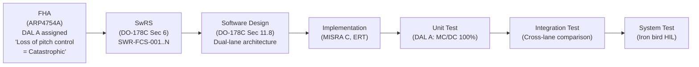

# :material-airplane: Aerospace — Flight Control System

!!! abstract "Domain Overview"
    The Aerospace domain is governed by **DO-178C** (software) and **DO-254** (hardware) for airborne systems, with **ARP4754A** for system-level development and **ARP4761** for safety assessment. The running example is a **Flight Control System (FCS)** — a DAL A embedded system managing primary flight surfaces (elevator, aileron, rudder).

## :material-lightbulb-on: Why Flight Control?

The FCS represents the most demanding verification environment:

- **DAL A**: catastrophic failure consequence (loss of aircraft)
- **Full MC/DC coverage**: 100% required by DO-178C
- **Object code verification**: required for DAL A
- **Dual/triple redundancy**: cross-lane comparison and voting logic
- **Deterministic real-time**: hard deadlines, no exceptions

## :material-book: Key Standards

!!! info "DO-178C — Software Considerations in Airborne Systems"
    - **Section 6**: Software verification — reviews, testing, coverage
    - **Section 6.4**: Testing requirements — normal range, robustness, back-to-back
    - **Section 6.4.4**: Structural coverage — statement (DAL C), decision (DAL B), MC/DC (DAL A)
    - **Section 11**: Software lifecycle data — plans, standards, requirements, code, tests
    - **Section 12**: Additional considerations — tool qualification, alternative methods

!!! info "ARP4754A — System Development"
    - Functional Hazard Assessment (FHA): classify functions by failure effect severity
    - Preliminary System Safety Assessment (PSSA): derive safety requirements for subsystems
    - System Safety Assessment (SSA): demonstrate all safety requirements are met

!!! info "Development Assurance Levels (DAL)"
    | DAL | Failure Condition | Coverage Required |
    |-----|------------------|-------------------|
    | A | Catastrophic | MC/DC (100%) |
    | B | Hazardous | Decision (100%) |
    | C | Major | Statement (100%) |
    | D | Minor | None |
    | E | No Safety Effect | None |

## :material-vector-polyline: FCS V-Model

## :material-code-tags: Domain Example Scenarios

=== "Nominal — Normal Flight Envelope"
    **GIVEN**: Aircraft in cruise, altitude 35,000 ft, airspeed 450 KTAS, FCS active in normal law

    **WHEN**: Pilot inputs 15-degree bank angle command

    **THEN**: Aileron deflection follows command with settling time < 2 s, overshoot < 10%, steady-state error < 0.5 degrees

=== "Boundary — Approach to Stall"
    **GIVEN**: Aircraft decelerating during approach, angle of attack approaching 14 degrees (stall AOA = 16 degrees)

    **WHEN**: FCS alpha protection mode activates

    **THEN**: Nose-down pitch command applied within 200 ms, AOA stabilizes below 15 degrees, flight envelope protection active

=== "Fault — Dual Lane Disagreement"
    **GIVEN**: Both FCC-A and FCC-B active, processing identical sensor inputs

    **WHEN**: FCC-A produces elevator command 5 degrees different from FCC-B (cross-lane monitor threshold = 2 degrees)

    **THEN**: DISAGREE alarm within 100 ms, crew alerted, switch to degraded mode (single lane), event logged with timestamps and command values

## :material-alert: Aerospace-Specific Pitfalls

!!! warning "Aerospace Pitfalls"
    - **Independence violation in DO-178C**: DO-178C requires that the person reviewing a software artifact is different from the person who produced it. This independence must be demonstrable to the DER.
    - **Tool qualification gaps**: Every tool in the development toolchain that could affect the final airborne software must have a qualified justification under DO-178C Section 12.2.
    - **MC/DC on compiler-generated code**: If DO-178C coverage is measured on source code but the compiler generates structurally different code, structural coverage at object level may also be required (DAL A).
    - **Insufficient robustness testing**: DO-178C Section 6.4.3 requires testing beyond normal range — inputs outside specified limits must be tested to verify error handling.

## :material-help-circle: Flashcards

???+ question "What is the difference between DO-178C and DO-254?"
    **DO-178C** covers airborne software (FPGA firmware, microprocessor software). **DO-254** covers airborne electronic hardware (custom ASICs, complex FPGAs used as hardware components). Both have Design Assurance Levels (DAL A through E), but different life cycle processes.

???+ question "What is a DER and what role do they play?"
    A **DER (Designated Engineering Representative)** is an FAA-authorized individual who acts on behalf of the FAA to approve software by reviewing plans, standards, and evidence packages. For DO-178C, DER approval is required before the software can be installed in a certified aircraft.

???+ question "Why does DO-178C require MC/DC for DAL A?"
    MC/DC provides the strongest structural coverage guarantee: every condition in every decision is shown to independently affect the decision outcome. For DAL A (catastrophic failure consequence), there must be high confidence that no safety-critical decision logic path is untested.

## :material-check-circle: Summary

- DO-178C governs airborne software development from DAL A (catastrophic) to DAL E (no effect)
- DAL A requires 100% MC/DC coverage, object code verification, and tool qualification
- Independence (reviewer different from author) is a key DO-178C principle
- ARP4754A/4761 govern system-level safety assessment, defining DAL for each software function
- The iron bird HIL rig (full aircraft hydraulic and electrical simulation) is the aerospace equivalent of automotive HIL
