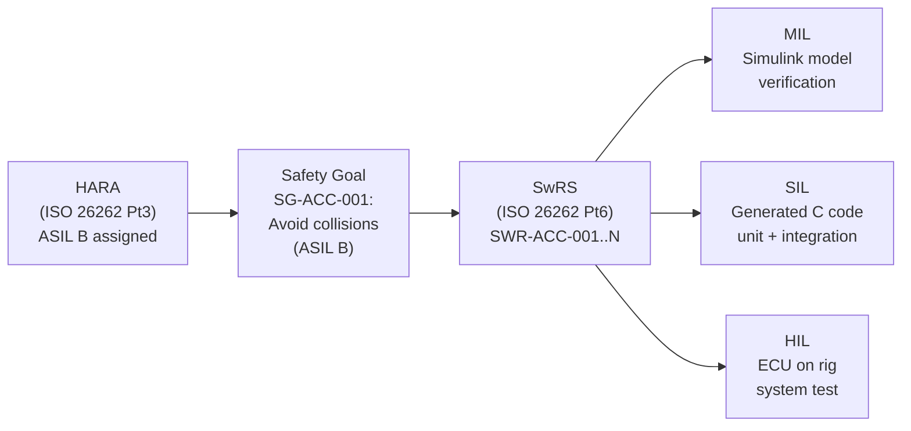

# :material-car: Automotive — Adaptive Cruise Control (ACC)

!!! abstract "Domain Overview"
    The Automotive domain uses **ISO 26262** (functional safety) and **ASPICE** (process capability) as its governing standards. The running example throughout this course is an **Adaptive Cruise Control (ACC)** system — a highly representative ASIL B embedded control system with CAN bus, radar sensors, and longitudinal vehicle dynamics.

## :material-lightbulb-on: Why ACC?

ACC is an excellent teaching system because it has:

- **Sensor fusion**: radar (range, relative speed) + vehicle speed + driver inputs
- **Control algorithm**: PID-like headway control + mode management state machine
- **Safety requirements**: ASIL B per ISO 26262 HARA (collision is Controllable = ASIL B)
- **Communication**: CAN bus interface to chassis ECUs (brake, engine)
- **Fault handling**: sensor dropout, actuator failure, driver override

## :material-book: Key Standards

!!! info "ISO 26262 — Road Vehicles Functional Safety"
    - **Part 3**: Concept phase — HARA, safety goals, ASIL determination
    - **Part 4**: Product development at system level — system design, TSR
    - **Part 6**: Product development at software level — SwRS, design, testing, coverage
    - **Part 8**: Supporting processes — tool qualification, configuration management
    - **Part 9**: ASIL-oriented analyses — FMEDA, PMHF, diagnostic coverage

!!! info "ASPICE — Automotive SPICE"
    - **SWE.1**: Software requirements analysis
    - **SWE.3**: Software detailed design and unit construction
    - **SWE.4**: Software unit verification
    - **SWE.5**: Software integration and integration test
    - **SWE.6**: Software qualification test

## :material-vector-polyline: ACC V-Model

## :material-code-tags: Domain Example Scenarios

=== "Nominal — Highway Cruise"
    **GIVEN**: ACC engaged, ego_speed=120 km/h, lead vehicle at 120 km/h, headway=2.8 s, dry highway

    **WHEN**: System runs for 60 s in steady-state follow mode

    **THEN**: Headway remains in [2.0, 4.0] s, no brake jerk > 0.3 g, no driver alert

=== "Boundary — Stop-and-Go Traffic"
    **GIVEN**: Dense urban traffic, lead vehicle decelerates 60 km/h → 5 km/h in 3 s, headway starts at 2.2 s

    **WHEN**: ACC responds to emergency deceleration of lead vehicle

    **THEN**: Headway never drops below 1.8 s, braking response < 200 ms, deceleration < 0.6 g

=== "Fault — Radar Sensor Dropout"
    **GIVEN**: ACC active at 80 km/h, lead vehicle at 80 km/h, headway=2.5 s

    **WHEN**: Radar signal drops (range_valid=FALSE) at t=10 s for 5 s

    **THEN**: ACC transitions to DEGRADED within 500 ms, driver alert activates, ego speed decreases safely, fault logged with code 0x05

## :material-alert: Automotive-Specific Pitfalls

!!! warning "Automotive Pitfalls"
    - **Under-testing stop-and-go scenarios**: Most ACC-related accidents involve stop-and-go traffic, not highway cruise. Boundary scenarios must include deceleration rates of 0.8 g.
    - **ASIL decomposition errors**: Decomposing ASIL B into ASIL A + ASIL A requires independence between the two paths. If they share hardware, decomposition is invalid.
    - **Missing CAN timeout handling**: If the engine ECU CAN message is delayed by 50 ms, the ACC may use stale throttle feedback. CAN timeout faults must be explicitly tested.
    - **Ignoring supply voltage variation**: Automotive systems must function during cranking (6V for 200 ms) and load dump (up to 40V transient). HIL testing must include these scenarios.

## :material-help-circle: Flashcards

???+ question "What is ASIL and how is it determined?"
    **ASIL (Automotive Safety Integrity Level)** has four levels: A (lowest), B, C, D (highest). Determined by the HARA (Hazard Analysis and Risk Assessment) using three parameters: Severity (S0-S3), Exposure (E0-E4), Controllability (C0-C3). The combination determines ASIL or QM (no safety requirement).

???+ question "What coverage is required for ASIL D software?"
    ISO 26262 Part 6 Table 15 recommends **MC/DC (Modified Condition/Decision Coverage)** for ASIL C and D. For ASIL D, MC/DC is a "highly recommended" method (++). Statement and branch coverage are insufficient.

???+ question "What is the diagnostic coverage target for ASIL B?"
    ISO 26262 Part 5/9 requires PMHF (Probabilistic Metric for random Hardware Failures) to meet targets: ASIL B ≤ 10^-7 /hour (per single-point fault metric). Diagnostic coverage of at least 60% (Low) is required for ASIL A, 90% (Medium) for ASIL B-C, 99% (High) for ASIL D.

## :material-check-circle: Summary

- ISO 26262 governs automotive functional safety from concept through operation
- ASIL is determined by HARA (Severity × Exposure × Controllability)
- ACC is an ASIL B system with challenging boundary scenarios in stop-and-go traffic
- ASPICE SWE.1 through SWE.6 define the process requirements for software development
- CAN bus timeout handling, supply voltage variation, and ASIL decomposition are key automotive-specific considerations
