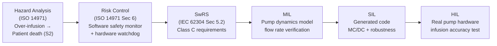

# :material-hospital-box: Medical — Infusion Pump Controller

!!! abstract "Domain Overview"
    The Medical domain is governed by **IEC 62304** (software lifecycle) and **ISO 14971** (risk management) for medical device software, within the broader context of **IEC 60601** electrical safety and **FDA 21 CFR Part 820** quality system regulations. The running example is an **Infusion Pump Controller** — a Class C (IEC 62304) embedded system managing IV drug delivery rates.

## :material-lightbulb-on: Why Infusion Pump?

The infusion pump represents the medical domain challenges:

- **Life-critical**: over-infusion can cause death; under-infusion can fail treatment
- **Software Safety Class C**: highest risk level under IEC 62304 (full lifecycle traceability)
- **Risk-based design**: ISO 14971 risk management drives every design decision
- **Watchdog critical**: hardware watchdog is a mandatory safety mechanism
- **Human factors**: user interface errors are the leading cause of infusion pump incidents

## :material-book: Key Standards

!!! info "IEC 62304 — Medical Device Software Lifecycle"
    - **Section 5**: Software development (requirements, architecture, unit, integration, system testing)
    - **Section 7**: Software risk management (link to ISO 14971)
    - **Section 8**: Software configuration management
    - **Section 9**: Software problem resolution
    - **Safety Class C**: requires full traceability through all lifecycle phases

!!! info "ISO 14971 — Risk Management for Medical Devices"
    - **Risk Analysis**: identify hazards, estimate probability and severity
    - **Risk Evaluation**: compare to acceptability criteria
    - **Risk Control**: apply measures to reduce risk to acceptable level
    - **Residual Risk**: document and obtain benefit/risk acceptance

!!! info "Software Safety Classes"
    | Class | No injury possible | Non-serious injury possible | Death or serious injury possible |
    |-------|--------------------|-----------------------------|----------------------------------|
    | A | Yes | - | - |
    | B | - | Yes | - |
    | C | - | - | Yes |

## :material-vector-polyline: Infusion Pump V-Model

## :material-code-tags: Domain Example Scenarios

=== "Nominal — Prescribed Dose Delivery"
    **GIVEN**: Infusion pump programmed for 50 mg/hour morphine, patient weight 70 kg, pump primed and running

    **WHEN**: System runs at prescribed rate for 4 hours

    **THEN**: Total delivered dose within ±5% of prescribed (within FDA accuracy requirement), no over/under delivery alarms, flow rate stable within ±2%

=== "Boundary — Maximum Safe Rate"
    **GIVEN**: Clinician programs rate at exactly the maximum defined safe rate for the patient weight and drug type

    **WHEN**: Pump executes at maximum rate for 1 hour

    **THEN**: Safety monitor active but no alarm triggered, flow rate within ±5% of maximum, total delivered dose within FDA bounds

=== "Fault — Flow Sensor Obstruction"
    **GIVEN**: Pump running at 50 mg/hour, flow sensor functioning normally

    **WHEN**: Downstream tubing partially occludes (resistance increases 3x) at t=30 s

    **THEN**: Occlusion alarm within 60 s, pump stops within 5 s of alarm, alarm logged with timestamp, drug delivery safe state activated

## :material-alert: Medical-Specific Pitfalls

!!! warning "Medical Pitfalls"
    - **Unit confusion (mg vs. mL, mcg vs. mg)**: Drug concentration units must be verified in the software — a 10x unit error in dose calculation is a fatal risk. Traceability from requirements to implementation is critical.
    - **Missing human factors analysis**: IEC 62366 requires use error analysis. The most common infusion pump hazard is not a software bug — it is a programming error by the clinician.
    - **Watchdog not tested in system context**: The hardware watchdog may be tested in isolation but not verified to activate during the system-level scenario where the software actually hangs.
    - **Risk control measures not traced to test cases**: ISO 14971 requires each risk control measure to have verification evidence. A risk control without a test case is an unverified safety claim.

## :material-help-circle: Flashcards

???+ question "What is IEC 62304 Software Safety Class C?"
    Class C applies when a software failure could result in **death or serious injury** — the highest risk class. Class C requires full lifecycle documentation: software requirements specification, architectural design, detailed design, unit testing, integration testing, system testing, and full traceability through all phases.

???+ question "What is the ISO 14971 risk management process?"
    A four-step process: (1) **Risk Analysis** — identify hazards and estimate probability × severity; (2) **Risk Evaluation** — compare to acceptability criteria; (3) **Risk Control** — apply measures (design change, protective measure, information for safety); (4) **Residual Risk Assessment** — verify remaining risk is acceptable.

???+ question "Why is traceability from risk control measures to test cases critical?"
    Each risk control measure is a design decision made to reduce a specific hazard. Without a test case that verifies the measure works, you cannot demonstrate that the hazard is controlled. ISO 14971 and IEC 62304 both require this link — and regulatory bodies (FDA, notified bodies) specifically look for it.

## :material-check-circle: Summary

- IEC 62304 Class C requires full lifecycle traceability for software that can cause death
- ISO 14971 is the backbone: every safety requirement traces to a hazard and a risk control measure
- Drug unit verification (mg vs. mL vs. mcg/kg) is a critical safety point requiring dedicated testing
- Human factors (use error analysis per IEC 62366) are as important as software defects in medical
- Every risk control measure must have a linked test case providing verification evidence
