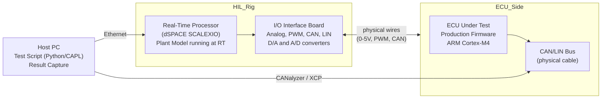

# :material-chip: Day 21 — HIL Concepts

!!! abstract "Learning Objectives"
    - Understand HIL simulator architecture and its role in the V-Model
    - Identify the key components of a HIL rig (real-time processor, I/O interfaces, ECU)
    - Understand the HIL-SAFE mnemonic for HIL verification completeness
    - Compare HIL advantages and limitations vs. SIL
    - Explain how HIL satisfies ISO 26262, DO-178C, and IEC 62304 system test requirements

## :material-lightbulb-on: Intuition

HIL testing replaces software simulation with real hardware — a real ECU running production firmware, connected to a real-time simulator that replaces the physical world (vehicle, aircraft, or medical device). The ECU thinks it is connected to the real plant; the HIL rig knows it is simulated.

This catches an entire class of defects that SIL cannot: hardware-specific timing behavior, actuator driver signal conditioning, ADC quantization effects, interrupt latency, and real bus communication characteristics.

## :material-book: Core Concepts

!!! info "Definition — HIL Simulator"
    A **HIL (Hardware-in-Loop) simulator** is a real-time computer that runs a plant model and interfaces with a real ECU via physical I/O connections (analog voltage, PWM, CAN bus). The simulator replaces the physical environment while the ECU under test runs its production software.

!!! info "Definition — Real-Time Execution"
    **Real-time execution** means the simulation runs faster-than- or exactly-as-fast-as wall clock time, so the ECU receives signals at the correct timing. A 10 ms simulation step must complete in less than 10 ms of real time — otherwise timing assumptions in the ECU software are violated.

!!! info "Definition — HIL-SAFE Mnemonic"
    - **H** — Hardware representation (real ECU, real I/O)
    - **I** — Integration confidence (SIL-to-HIL transition verified)
    - **L** — Linked requirements (all HIL tests trace to SwRS)
    - **S** — Safety impact assessment (fault scenarios from FMEA)
    - **A** — Acceptance criteria (defined before execution)
    - **F** — Fault tolerance (fault injection results verified)
    - **E** — Evidence completeness (all artifacts captured)

## :material-vector-polyline: Diagram

## :material-code-tags: Worked Example — HIL Rig Architecture for ACC

=== "Step 1 — Identify I/O Requirements"
    List all ECU signals and determine their HIL interface type:

    | Signal | Direction | Type | HIL Interface |
    |--------|-----------|------|---------------|
    | radar_range | ECU input | Analog 0-5V | D/A converter |
    | ego_speed | ECU input | Frequency/PWM | PWM generator |
    | CAN bus (chassis) | Bidirectional | CAN 2.0B | CAN interface |
    | brake_demand | ECU output | Analog 0-5V | A/D converter |
    | driver_alert | ECU output | Digital 0/5V | DIO input |

=== "Step 2 — Real-Time Model Requirements"
    Plant model requirements for HIL:

    - Execution time: model step must complete in < 5 ms (half of 10 ms ECU cycle)
    - Interface: Simulink model with I/O blocks mapped to HIL board channels
    - Determinism: fixed-step solver, no variable-step blocks
    - Overrun detection: alarm if any step overruns the timing budget

=== "Step 3 — HIL Rig Qualification"
    Before using the HIL rig for certification evidence:

    1. Calibrate all D/A and A/D channels (voltage accuracy ±1%)
    2. Verify CAN timing accuracy (message jitter < 0.1 ms)
    3. Verify RT model overrun is detected and alarmed
    4. Document rig configuration in HIL Rig Qualification Record

=== "Step 4 — Test Environment Verification"
    Before executing test suite:

    - [ ] Rig calibration within validity period
    - [ ] ECU firmware version matches build under test
    - [ ] CAN baudrate configured correctly (500 kbps)
    - [ ] Plant model version matches configuration baseline
    - [ ] Test script version controlled and reviewed

## :material-alert: Pitfalls

!!! warning "HIL Concept Pitfalls"
    - **Plant model not real-time capable**: If your Simulink plant model was designed for MIL accuracy (variable step), it may not run within the HIL time budget. Profile execution time early.
    - **I/O signal conditioning errors**: A 0-5V analog signal that represents 0-200 km/h has a scaling factor. If the HIL rig applies a different scale than the ECU expects, all tests will fail with mysterious offsets.
    - **Not verifying rig calibration**: An uncalibrated rig produces unreliable results. Calibration records are part of the certification evidence.
    - **ECU debug firmware vs. production firmware**: Always verify with production firmware on the HIL rig — debug firmware may have additional logging overhead that changes timing behavior.

## :material-help-circle: Flashcards

???+ question "What is the key difference between SIL and HIL testing?"
    **SIL**: generated C code runs on a PC in a software harness — no real hardware, no real I/O, no real timing. **HIL**: production firmware runs on the real ECU, connected via physical I/O to a real-time simulator. HIL catches hardware-specific issues (timing, interrupts, ADC accuracy, bus behavior) that SIL cannot.

???+ question "What does real-time execution mean for a HIL rig?"
    The plant model simulation step must complete within the physical time interval it represents. A 10 ms model step must complete in less than 10 ms of wall clock time. If it overruns, the ECU receives signals late — violating its timing assumptions and potentially triggering watchdog resets.

???+ question "What is the HIL-SAFE mnemonic?"
    H-ardware representation, I-ntegration confidence, L-inked requirements, S-afety impact, A-cceptance criteria, F-ault tolerance, E-vidence completeness. Use it as a pre-execution checklist for every HIL test session.

## :material-clipboard-check: Self Test

=== "Question"
    Your HIL plant model step takes 12 ms to execute, but your ECU runs at a 10 ms control cycle. What is the problem and how do you fix it?

=== "Answer"
    **Problem**: The plant model overruns the HIL time budget. The ECU will receive stale sensor data — the rig runs slower than real-time, making all timing-dependent behavior incorrect.

    **Fix options**:
    1. Optimize the plant model: reduce solver order, simplify aerodynamic model, vectorize MATLAB code
    2. Reduce HIL step size: allow more time per step (but this changes ECU sample rate relationship)
    3. Use faster HIL hardware with more CPU cores
    4. Profile which subsystem is the bottleneck and simplify that specific part

## :material-check-circle: Summary

- HIL replaces the physical world with a real-time simulator while keeping the real ECU
- Real-time execution is non-negotiable — overruns corrupt timing-dependent test results
- The HIL-SAFE mnemonic is your completeness checklist for HIL verification
- Rig calibration and ECU firmware verification are prerequisites, not afterthoughts
- HIL catches hardware-specific defects that SIL cannot: ADC accuracy, interrupt latency, bus timing
