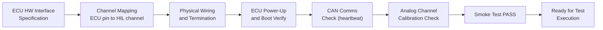

# :material-lan-connect: Day 22 — Hardware Setup

!!! abstract "Learning Objectives"
    - Configure a HIL rig for the target ECU and domain
    - Wire ECU I/O interfaces to HIL board channels correctly
    - Verify rig setup with a smoke test before executing test cases
    - Document HIL rig configuration in a Rig Configuration Record
    - Apply ASPICE SWE.6 requirements for test environment setup

## :material-lightbulb-on: Intuition

Hardware setup is the foundation that everything else sits on. A wrong wire, a miscalibrated channel, or an incorrect firmware image means your test results are invalid — but may look plausible. The smoke test at the end of setup is your sanity check before investing hours in test execution.

## :material-book: Core Concepts

!!! info "Definition — HIL Rig Configuration Record"
    A documented record of all HIL hardware components, firmware versions, cable connections, channel mappings, and calibration status. Required as part of the test environment qualification evidence.

!!! info "Definition — Channel Mapping"
    The mapping between ECU connector pins and HIL I/O board channels. Must be documented and verified against the ECU hardware interface specification.

!!! info "Definition — Smoke Test"
    A minimal test run verifying the rig setup is correct: ECU boots, CAN communication is established, analog channels read expected values in the plant neutral state.

## :material-vector-polyline: Diagram



## :material-code-tags: Worked Example — ACC HIL Setup

=== "Step 1 — Channel Mapping Table"
    | ECU Pin | Signal | HIL Board | Channel | Type | Scale |
    |---------|--------|-----------|---------|------|-------|
    | CN1-A3 | radar_range | IO Board 1 | DA_01 | 0-5V | 0-250m |
    | CN1-A5 | ego_speed | IO Board 1 | PWM_01 | Freq | 0-200km/h |
    | CN2-A1 | brake_demand | IO Board 1 | AD_01 | 0-5V | 0-100% |
    | OBD-CN | CAN chassis | CAN Card 1 | CAN_01 | 500kbps | - |

=== "Step 2 — Power Up Sequence"
    1. Apply 12V ECU supply (use dedicated lab supply, not from rig)
    2. Verify ECU boot indicator (CAN heartbeat appears within 500 ms)
    3. Apply plant model neutral state signals
    4. Verify ECU is not in fault state (check DTC via UDS)

=== "Step 3 — Smoke Test Script"
    ```python
    def smoke_test():
        rig.set_signal("ego_speed", 0.0)
        rig.set_signal("radar_range", 100.0)
        rig.set_signal("driver_enable", 0)
        time.sleep(1.0)
        mode = rig.get_can_signal("ACC_Mode")
        assert mode == ACC_STANDBY, f"Expected STANDBY, got {mode}"
        print("Smoke test PASS")
    ```

=== "Step 4 — Rig Config Record"
    Document in Rig Configuration Record v1.0:

    - HIL processor: dSPACE SCALEXIO, serial DS_12345
    - IO board: DS2211 (analog/digital), calibration date 2024-03-15
    - CAN card: DS2202, channels 1-4
    - ECU firmware: acc_controller_v1.2_prod.hex, checksum 0xABCD1234
    - Plant model: acc_plant_hil_v1.0.slx, git tag v1.0

## :material-alert: Pitfalls

!!! warning "Hardware Setup Pitfalls"
    - **Wrong CAN termination**: CAN bus requires exactly two 120-ohm terminators. Missing or double termination causes bus errors.
    - **Ground loops**: ECU and HIL rig grounds not connected at single point introduces analog channel noise.
    - **Debug firmware on ECU**: Verify production firmware is flashed — debug builds may have different timing behavior.

## :material-help-circle: Flashcards

???+ question "What is a channel mapping document?"
    A document specifying the connection between each ECU signal (connector pin) and HIL board channel, including type, direction, scale factor, and offset. Required as test environment qualification evidence.

???+ question "What is the purpose of the HIL smoke test?"
    To verify basic rig setup before executing the full test suite. Checks ECU boot, CAN communication, and analog channel response. Prevents wasting hours on an incorrectly configured rig.

## :material-clipboard-check: Self Test

=== "Question"
    Your CAN bus shows intermittent bus-off errors during the smoke test. List three possible causes.

=== "Answer"
    1. **Missing termination**: CAN needs exactly two 120-ohm terminators. Check both ends.
    2. **Bit rate mismatch**: ECU at 500 kbps, HIL card at 250 kbps. Verify baudrate settings match.
    3. **Ground loop**: Different ground reference between ECU and HIL rig corrupts bit voltage levels.

## :material-check-circle: Summary

- Hardware setup requires documented channel mapping, wiring verification, and calibration records
- Smoke test verifies the complete signal path before executing test cases
- CAN termination, ground loops, and firmware version are the most common setup pitfalls
- Rig Configuration Record is a mandatory evidence artifact for certification audits
