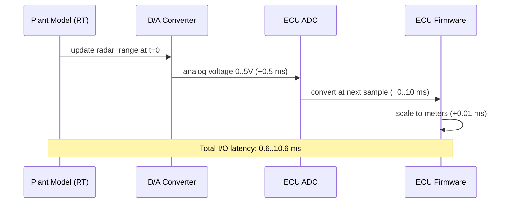

# :material-timer-cog: Day 23 — Real-Time I/O

!!! abstract "Learning Objectives"
    - Understand real-time I/O signal conditioning between HIL rig and ECU
    - Verify analog and digital signal accuracy against specifications
    - Understand overrun detection and time budget management
    - Apply I/O latency analysis to timing-critical signals
    - Verify interrupt-driven signal handling on the target ECU

## :material-lightbulb-on: Intuition

Real-time I/O is where physics meets software. A 0-5V analog signal representing 0-250 m of radar range passes through D/A conversion, signal conditioning, ECU ADC, and firmware scaling before it becomes a floating-point value in the control algorithm. Each step introduces latency and quantization error.

Understanding these effects allows you to write test criteria that account for realistic signal imperfections — not idealized software-only values.

## :material-book: Core Concepts

!!! info "Definition — I/O Latency"
    The end-to-end delay from the moment a plant model changes a signal value to the moment the ECU firmware reads the updated value. Composed of D/A conversion time + cable propagation + A/D conversion time + firmware read cycle. Typically 1-5 ms for automotive HIL rigs.

!!! info "Definition — ADC Quantization"
    The ECU ADC has finite resolution (e.g., 12-bit over 0-5V = 4096 steps = 1.22 mV/step). For radar range (0-5V = 0-250 m), this gives resolution of 250/4096 = 0.061 m/step. Test criteria must account for quantization.

!!! info "Definition — Real-Time Budget"
    The maximum execution time allowed per plant model step on the HIL rig. Typically step_size minus safety margin (e.g., 10 ms step, 8 ms budget, 2 ms margin).

## :material-vector-polyline: Diagram



## :material-code-tags: Worked Example — I/O Latency Measurement

=== "Step 1 — Measure Round-Trip Latency"
    ```python
    t_inject = rig.get_time()
    rig.set_signal("radar_range", 50.0)  # step from 100m to 50m

    while True:
        ecu_range = rig.get_can_signal("ACC_RadarRange_Filtered")
        if abs(ecu_range - 50.0) < 2.0:
            t_reflected = rig.get_time()
            break

    latency_ms = (t_reflected - t_inject) * 1000
    assert latency_ms < 20.0, f"I/O latency {latency_ms:.1f} ms exceeds 20 ms limit"
    ```

=== "Step 2 — ADC Quantization in Test Criteria"
    For radar range (0-250 m, 12-bit ADC):

    - ADC resolution: 250/4096 = 0.061 m/step
    - Test criterion tolerance must be >= 0.1 m (2 ADC steps)
    - Do NOT use tolerance < 0.061 m — unachievable with physical hardware

=== "Step 3 — Monitor RT Overruns"
    ```python
    overruns_before = rig.get_overrun_count()
    run_test_scenario("TC_HIL_001")
    overruns_after = rig.get_overrun_count()
    assert overruns_after == overruns_before, "RT overruns occurred!"
    ```

=== "Step 4 — Interrupt Latency Verification"
    Measure time from CAN message arrival to ECU interrupt handler execution:

    - Inject CAN message at known timestamp
    - Measure ECU response CAN message timestamp
    - Verify interrupt latency < specified maximum (e.g., 1 ms)

## :material-alert: Pitfalls

!!! warning "Real-Time I/O Pitfalls"
    - **Test criteria tighter than ADC resolution**: A criterion of ±0.01 m on a signal with 0.061 m/step ADC resolution will always fail.
    - **Ignoring I/O latency in timing tests**: A 50 ms detection requirement with 20 ms I/O latency leaves only 30 ms for the software to respond.
    - **RT overruns not monitored**: A single overrun during a test makes all timing results in that test invalid.

## :material-help-circle: Flashcards

???+ question "How does ADC quantization affect test criteria design?"
    ADC quantization sets minimum achievable precision. For 12-bit over 0-250 m = 0.061 m/step. Test criteria must use tolerances of at least 2 quantization steps (0.12 m) to avoid false failures due to ADC rounding.

???+ question "What happens if the HIL plant model overruns its time budget?"
    The simulator delivers stale signal updates to the ECU, violating timing assumptions. All timing-dependent test results from that run are invalid and cannot be used as certification evidence.

## :material-clipboard-check: Self Test

=== "Question"
    Your detection requirement is 500 ms. I/O latency is 45 ms. What should your test assertion measure?

=== "Answer"
    Measure from the plant model signal change (time zero in the test). Assert response within 500 ms from that reference. The 500 ms is the end-to-end system requirement and includes the I/O latency inherently.

## :material-check-circle: Summary

- I/O latency is the end-to-end delay from model signal change to ECU firmware value
- ADC quantization sets the minimum precision — criteria must be coarser than one quantization step
- RT overruns invalidate timing test results — monitor the overrun counter for every test
- Real-time budget management requires profiling plant model execution time against step size
