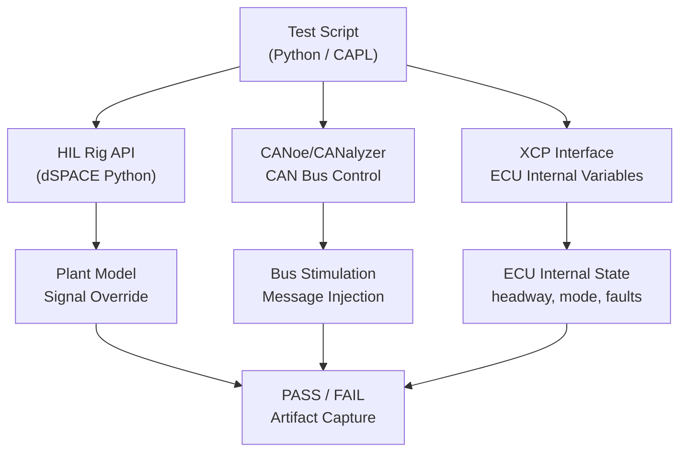

# :material-script-text: Day 24 — HIL Scripting

!!! abstract "Learning Objectives"
    - Write automated HIL test scripts in Python or CAPL
    - Implement GIVEN/WHEN/THEN scenario structure in test scripts
    - Interface with HIL rig APIs (dSPACE, NI VeriStand, CANalyzer)
    - Manage test data, pass/fail results, and artifact capture programmatically
    - Integrate HIL scripts with a test management system

## :material-lightbulb-on: Intuition

Manual HIL testing is slow, error-prone, and non-reproducible. A human operator who sets up the same scenario twice will introduce subtle variations — different timing, slightly different initial conditions, inconsistent artifact capture. Scripted automation eliminates these variables and enables overnight regression.

## :material-book: Core Concepts

!!! info "Definition — HIL Test Script"
    A program (Python or CAPL) that configures HIL rig state, executes a scenario by applying stimuli over time, monitors ECU outputs with assertions, and captures artifacts (logs, CAN traces).

!!! info "Definition — CAPL"
    **CAPL (Communication Access Programming Language)** is a C-like language for Vector CANalyzer/CANoe, used to script CAN/LIN/Ethernet bus scenarios, inject messages, and verify ECU responses.

!!! info "Definition — XCP Protocol"
    XCP (Universal Measurement and Calibration Protocol) provides direct access to ECU internal variables via CAN or Ethernet, enabling measurement of internal state without modifying production firmware.

## :material-vector-polyline: Diagram



## :material-code-tags: Worked Example — Python HIL Script

=== "Step 1 — GIVEN: Setup"
    ```python
    def test_headway_nominal():
        rig = HILRig.connect("HIL_RIG_01")
        # GIVEN: ACC active, lead at 80 km/h, headway=3.0 s
        rig.set_signal("ego_speed", 80.0)
        rig.set_signal("radar_range", 200.0 * 80.0/3.6)
        rig.set_signal("driver_enable", 1)
        wait_for(lambda: rig.get_can_signal("ACC_Mode") == ACC_ACTIVE, timeout=2.0)
    ```

=== "Step 2 — WHEN: Execute"
    ```python
        # WHEN: system runs for 60 s in steady-state follow mode
        start_time = rig.get_time()
        headway_log = []
        while rig.get_time() - start_time < 60.0:
            headway_log.append(rig.get_can_signal("ACC_Headway"))
            time.sleep(0.01)
    ```

=== "Step 3 — THEN: Assert"
    ```python
        # THEN: headway remains in [2.0, 4.0] s
        hw_min, hw_max = min(headway_log), max(headway_log)
        assert hw_min >= 2.0, f"Headway dropped to {hw_min:.2f} s"
        assert hw_max <= 4.0, f"Headway exceeded {hw_max:.2f} s"
        print(f"TC_HIL_001 PASS: headway [{hw_min:.2f}, {hw_max:.2f}] s")
    ```

=== "Step 4 — Artifact Capture"
    ```python
        rig.save_mdf_log(f"logs/TC_HIL_001_{rig.get_timestamp()}.mf4")
        rig.take_screenshot(f"screenshots/TC_HIL_001.png")
        rig.export_can_trace(f"traces/TC_HIL_001.asc")
    ```

## :material-alert: Pitfalls

!!! warning "HIL Scripting Pitfalls"
    - **No timeout handling**: Scripts waiting indefinitely for ECU response will hang if ECU is stuck. Add timeouts to all wait loops.
    - **Hard-coded delays**: `time.sleep(2.0)` is fragile. Use polling with timeout instead.
    - **Not capturing artifacts on failure**: Use try/finally to ensure artifact capture even when assertions fail.
    - **Race conditions**: Setting multiple signals sequentially takes non-zero time — ECU may see inconsistent intermediate state.

## :material-help-circle: Flashcards

???+ question "Why use scripts instead of manual HIL testing?"
    Scripts provide: (1) reproducibility — every run is identical, (2) speed — suite runs overnight, (3) consistency — no human variation, (4) traceability — results and artifacts captured automatically with requirement links.

???+ question "What is XCP and why is it useful?"
    XCP allows direct read/write access to ECU internal variables without modifying firmware. Enables HIL tests to verify internal state (controller mode, integrator values, fault flags) not visible on the CAN bus.

## :material-clipboard-check: Self Test

=== "Question"
    Your script sets driver_enable=1 and immediately checks ACC_Mode. Test fails because mode is still STANDBY. Fix?

=== "Answer"
    Replace the immediate check with polling with timeout:
    ```python
    deadline = time.time() + 1.0
    while time.time() < deadline:
        if rig.get_can_signal("ACC_Mode") == ACC_ACTIVE:
            break
        time.sleep(0.01)
    else:
        raise AssertionError("ACC did not engage within 1 s")
    ```

## :material-check-circle: Summary

- HIL scripts automate setup, execution, assertion, and artifact capture
- GIVEN/WHEN/THEN maps to script phases: setup, stimulate, assert
- Use polling with timeout instead of fixed delays for robust synchronization
- XCP provides access to ECU internal variables not visible on the CAN bus
- Capture artifacts on both PASS and FAIL using try/finally
