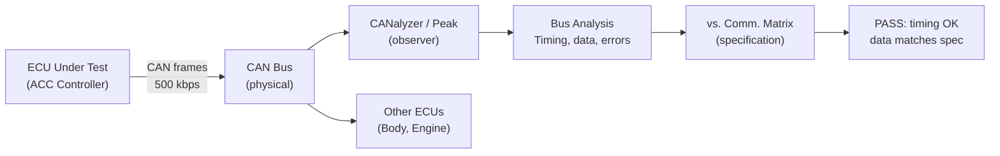

# :material-bus: Day 25 — Bus & Network Analysis

!!! abstract "Learning Objectives"
    - Analyze CAN and LIN bus traffic to verify communication behavior
    - Validate message timing, periodicity, and data content
    - Detect bus errors (CAN error frames, LIN checksum errors)
    - Use CANalyzer/CANoe and Vector tools for bus analysis
    - Map bus analysis results to communication specification requirements

## :material-lightbulb-on: Intuition

Modern ECUs communicate via CAN, LIN, or automotive Ethernet. A sensor signal that looks correct at the application level may be arriving late, with incorrect DLC, or on the wrong message ID. Bus analysis catches these protocol-level defects that higher-level tests cannot see.

For safety-critical systems, the bus behavior IS part of the specification — message timing, data encoding, and error handling are all requirements that must be verified.

## :material-book: Core Concepts

!!! info "Definition — CAN Bus Analysis"
    Analyzing the physical and data link layer of the CAN bus: frame structure (ID, DLC, data, CRC), message timing (periodicity, latency), and error frames (error active, error passive, bus-off). Tools: Vector CANalyzer, Peak PCAN-Explorer.

!!! info "Definition — Communication Matrix"
    A specification document (often Excel or ARXML) that defines all CAN/LIN messages: message ID, DLC, periodicity, signals, encoding (factor, offset, min, max), and producer/consumer ECUs. Test criteria for bus analysis derive from this document.

!!! info "Definition — J1939 / AUTOSAR COM"
    **J1939** is a higher-layer CAN protocol for commercial vehicles. **AUTOSAR COM** is the middleware communication stack used in most modern automotive ECUs, implementing PDUs, signals, and COM callbacks defined in the ARXML configuration.

## :material-vector-polyline: Diagram



## :material-code-tags: Worked Example — CAN Bus Verification

=== "Step 1 — Verify Message Periodicity"
    For message ACC_Status (0x201, period=20 ms):

    ```python
    timestamps = capture_can_timestamps(msg_id=0x201, duration_s=10.0)
    periods = [timestamps[i+1] - timestamps[i] for i in range(len(timestamps)-1)]
    avg_period = sum(periods) / len(periods)
    max_jitter = max(abs(p - 20.0) for p in periods)

    assert 18.0 <= avg_period <= 22.0, f"Period {avg_period:.1f} ms out of range"
    assert max_jitter <= 2.0, f"Jitter {max_jitter:.1f} ms exceeds 2 ms limit"
    ```

=== "Step 2 — Decode Signal Values"
    Using DBC file for signal decoding:

    ```python
    db = cantools.database.load_file("acc_messages.dbc")
    msg = db.get_message_by_name("ACC_Status")
    frame = capture_single_frame(0x201)
    signals = msg.decode(frame.data)
    assert signals["ACC_Headway"] >= 2.0  # headway in seconds
    assert signals["ACC_Mode"] in [0, 1, 2, 3]  # valid mode values
    ```

=== "Step 3 — Verify Error Handling"
    Inject a CAN error frame and verify ECU response:

    ```python
    # Inject error frame by temporarily corrupting DLC
    inject_can_error_frame(0x201)
    time.sleep(0.1)
    # Verify ECU recovered (not in bus-off state)
    assert not is_ecu_bus_off()
    error_count = get_can_error_counter()
    assert error_count < 128  # below error passive threshold
    ```

=== "Step 4 — LIN Bus Verification"
    For LIN slave ECUs (e.g., seat actuator):

    - Verify LIN frame header/response timing within LIN spec
    - Verify checksum type (classic vs. enhanced)
    - Verify all slave responses arrive within LIN slot time

## :material-alert: Pitfalls

!!! warning "Bus Analysis Pitfalls"
    - **Analyzing bus without load**: Bus behavior under normal load differs from isolated ECU testing. Always analyze bus with all normal ECUs connected (proper bus load).
    - **Missing signal encoding verification**: A message arriving on time with correct length but with wrong factor/offset means incorrect data. Decode signals against the communication matrix.
    - **Ignoring early messages after power-on**: ECUs may send incorrect or incomplete messages during initialization. The communication specification should define valid message window after power-on.

## :material-help-circle: Flashcards

???+ question "What is a communication matrix and what does it specify?"
    A communication matrix (ComMatrix) defines all bus messages in the system: message ID, DLC, periodicity, direction, signals (name, bit position, length, encoding factor, offset, min, max). It is the specification that bus analysis tests verify against.

???+ question "What is CAN bus-off state and why is it a safety concern?"
    Bus-off occurs when a CAN node detects too many errors (transmit error counter > 255). The node disconnects from the bus and stops transmitting and receiving. For an ECU, bus-off means loss of all sensor and command signals — potentially a safety-critical loss of control.

## :material-clipboard-check: Self Test

=== "Question"
    CAN message ACC_Status (0x201) has a specified period of 20 ms. You measure periods of 15 ms, 25 ms, 18 ms, 22 ms, 16 ms over 10 seconds. Is this acceptable if the spec allows ±2 ms jitter?

=== "Answer"
    **No** — the 15 ms and 25 ms periods exceed the ±2 ms jitter limit (acceptable range: 18-22 ms). These are failures.

    Investigate: Is the ECU task running at irregular intervals? Is there CAN bus arbitration delay causing message delay? Is the test tool timestamp resolution sufficient?

## :material-check-circle: Summary

- Bus analysis verifies protocol-level behavior: timing, data encoding, error handling
- The communication matrix is the specification — test criteria derive from it
- Signal decoding (factor, offset) must be verified, not just message arrival
- CAN bus-off is a safety-critical failure mode that must be tested and recovered
- Always analyze bus under realistic load conditions (all ECUs connected)
