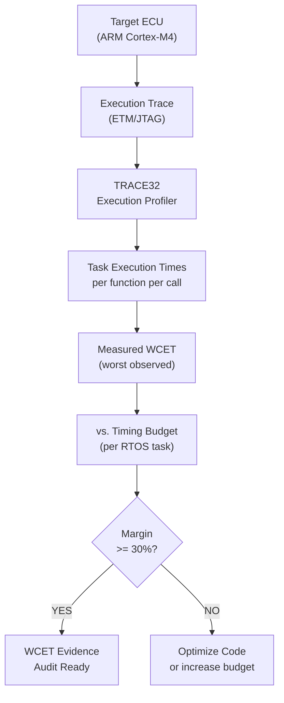

# :material-timer-play: Day 26 — Execution Trace & WCET

!!! abstract "Learning Objectives"
    - Understand Worst-Case Execution Time (WCET) and why it matters for real-time systems
    - Use execution trace tools (JTAG trace, ETM, Lauterbach TRACE32) for WCET measurement
    - Apply measurement-based WCET analysis vs. static WCET analysis
    - Verify that all task WCET values fit within their timing budgets
    - Map WCET evidence to DO-178C Section 6.4.4 and ISO 26262 timing requirements

## :material-lightbulb-on: Intuition

A real-time embedded system must complete its control cycle within a strict time budget. If the ACC controller task takes 12 ms to execute but is scheduled every 10 ms, it will miss deadlines — causing watchdog resets, stale outputs, or system faults.

WCET analysis answers the question: "In the worst case, how long does this function take to execute?" And: "Is that worst case within the timing budget with sufficient margin?"

## :material-book: Core Concepts

!!! info "Definition — WCET (Worst-Case Execution Time)"
    The maximum execution time of a software task or function across all possible input conditions and system states. For safety-critical systems, WCET must be bounded and verified to ensure real-time deadlines are met.

!!! info "Definition — Measurement-Based WCET"
    WCET measured by running the software under a diverse set of inputs and recording execution times. The maximum observed value is the measured WCET. Does not guarantee absolute worst case but is practical and required evidence.

!!! info "Definition — Static WCET Analysis"
    Analyzes the control flow graph and instruction timing to calculate an upper bound on execution time without running the software. Tools: AbsInt aiT, Rapita RVS. More conservative but provides a provable upper bound.

!!! info "Definition — HIL-VVACE Mnemonic"
    For HIL timing verification:
    - **V**alid timing budget defined per task
    - **V**erified by measurement on target hardware
    - **A**dequate margin (typically >= 30%)
    - **C**ycle-accurate trace captured as evidence
    - **E**vidence linked to requirement in RTM

## :material-vector-polyline: Diagram



## :material-code-tags: Worked Example — WCET Measurement

=== "Step 1 — Define Timing Budget"
    For the ACC controller task (10 ms period):

    | Task | Period | Budget | Required Margin |
    |------|--------|--------|-----------------|
    | ACC_Task | 10 ms | 7 ms | >= 30% (3 ms margin) |
    | CAN_Rx_Task | 5 ms | 3 ms | >= 40% |
    | Safety_Monitor | 20 ms | 12 ms | >= 40% |

=== "Step 2 — Instrument for WCET"
    Using GPIO toggle method (no JTAG required):

    ```c
    /* In acc_controller_step(): */
    GPIOA->BSRR = GPIO_PIN_0;  /* Set GPIO high at task start */

    /* ... task body ... */

    GPIOA->BRR = GPIO_PIN_0;   /* Set GPIO low at task end */
    /* Measure pulse width with oscilloscope or logic analyzer */
    ```

=== "Step 3 — Collect WCET Samples"
    Run test suite covering all input conditions:

    ```python
    # Capture 10,000 samples across all test scenarios
    wcet_samples = []
    for scenario in all_test_scenarios:
        run_scenario(scenario)
        samples = capture_execution_times("ACC_Task", count=1000)
        wcet_samples.extend(samples)

    wcet_measured = max(wcet_samples)
    print(f"Measured WCET: {wcet_measured:.2f} ms")
    print(f"Budget: 7.0 ms")
    print(f"Margin: {(7.0 - wcet_measured)/7.0 * 100:.1f}%")
    assert wcet_measured <= 7.0, "WCET exceeds budget!"
    ```

=== "Step 4 — Document Evidence"
    WCET Evidence Record:

    ```
    Task:        ACC_Task
    Period:      10 ms
    Budget:      7 ms (70% of period)
    Measured WCET: 4.8 ms (from 50,000 samples)
    Margin:      31.4%  -- PASS (> 30%)
    Worst inputs: fault_injection scenario TC_HIL_027
    Trace file:  wcet_acc_task_v1.0.trc
    Tool:        TRACE32 v2024.03 + ARM ETM
    Hardware:    STM32F4 @ 168 MHz
    Date:        2024-04-26
    ```

## :material-alert: Pitfalls

!!! warning "WCET Pitfalls"
    - **WCET measured on debug build**: Debug builds include additional logging and disable optimization — measured WCET will be too pessimistic. Measure on production build with production compiler settings.
    - **Not testing fault scenarios**: Fault handling code often has longer execution paths. The WCET may occur during a fault, not during nominal operation. Include fault injection scenarios in WCET measurement.
    - **Insufficient sample count**: 100 samples may not reveal the worst-case path. Aim for at least 10,000 samples covering all major test scenarios.
    - **Cache effects not considered**: ARM Cortex processors have instruction and data caches. First execution (cold cache) may take longer than steady-state. Measure cold-start scenarios.

## :material-help-circle: Flashcards

???+ question "Why must WCET be measured on production firmware, not debug firmware?"
    Debug firmware includes additional logging, assertions, and often disables compiler optimization. This makes execution time significantly longer than production. WCET evidence must reflect the actual timing behavior of the software that will be deployed.

???+ question "What is the difference between measurement-based and static WCET analysis?"
    **Measurement-based**: run software with diverse inputs, record maximum observed execution time. Practical but cannot guarantee coverage of all worst-case paths. **Static**: analyze control flow graph and instruction timing analytically. Provides a provable upper bound but may be overly conservative. Both have value; DO-178C DAL A typically requires both.

???+ question "What margin is typically required between measured WCET and timing budget?"
    A minimum of **20-30% margin** is typical in automotive and aerospace practice. This accommodates manufacturing variations in processor speed, temperature effects on timing, and future software updates that may increase execution time slightly.

## :material-clipboard-check: Self Test

=== "Question"
    Your WCET measurement of the ACC_Task shows 9.2 ms against a 10 ms period and 7 ms budget. What must you do?

=== "Answer"
    9.2 ms exceeds both the 7 ms budget (by 31%) AND is dangerously close to the 10 ms period (only 0.8 ms margin — 8%).

    Actions:
    1. **Immediate**: Profile the task to identify the longest code path contributing to 9.2 ms
    2. **Optimize**: Look for O(n) loops with large n, repeated calculations that can be cached, or library functions with unexpected timing
    3. **Architectural options**: Move non-critical operations to a lower-priority task, increase CPU clock if possible
    4. Do NOT accept this with "it usually runs in 5 ms" — the WORST case is the safety case

## :material-check-circle: Summary

- WCET must be measured on production firmware at the production CPU frequency
- Include fault injection scenarios in WCET measurement — worst case often occurs in error handling
- Aim for >= 30% margin between measured WCET and timing budget
- Use the HIL-VVACE mnemonic as a completeness checklist for timing evidence
- TRACE32/ETM trace provides cycle-accurate timing evidence for DO-178C and ISO 26262
