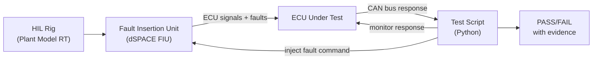

# :material-lightning-bolt: Day 27 — HIL Fault Injection

!!! abstract "Learning Objectives"
    - Apply hardware-level fault injection in the HIL environment
    - Compare HIL fault injection results with SIL fault injection verdicts
    - Verify hardware-specific fault responses: supply voltage drops, ECU reset, bus-off
    - Use HIL fault injection tools (dSPACE FIU, Vector CANoe fault injection)
    - Map HIL fault injection evidence to ISO 26262 Part 9 hardware random failure targets

## :material-lightbulb-on: Intuition

At SIL, you injected software-level faults (NULL pointers, allocation failures). At HIL, you inject hardware-level faults: power supply sags, ECU resets caused by watchdog expiry, short circuits on sensor lines, electromagnetic interference on CAN bus.

These faults can only be tested at HIL because they require real hardware. And they often reveal behavior that the software model did not predict — making HIL fault injection the most valuable and the most surprising phase.

## :material-book: Core Concepts

!!! info "Definition — Hardware Fault Injection"
    **Hardware fault injection** introduces physical failure conditions in the HIL environment: voltage drops, open/short circuits, CAN error injection, supply interruptions, or EMI. It verifies that the ECU hardware and firmware together respond correctly.

!!! info "Definition — Fault Insertion Unit (FIU)"
    A hardware module (e.g., dSPACE FIU) that sits between the HIL rig and the ECU, allowing controlled insertion of open circuits, short circuits, and resistive loads on any ECU pin or bus line.

!!! info "Definition — Supply Voltage Variation"
    ECUs must operate within a specified supply voltage range (e.g., 9-16V for automotive). Testing at minimum (9V), maximum (16V), and during supply dips (cranking 6V) verifies correct behavior under realistic power scenarios.

## :material-vector-polyline: Diagram



## :material-code-tags: Worked Example — HIL Fault Injection Scenarios

=== "Step 1 — Sensor Line Short Circuit"
    ```python
    def test_radar_wire_short_to_gnd():
        # GIVEN: ACC active at 80 km/h
        setup_acc_active_nominal()

        # WHEN: Short radar_range wire to GND at t=0
        fiu.set_fault("radar_range", FAULT_SHORT_TO_GND)
        t_inject = rig.get_time()

        # THEN: ECU detects fault within 500 ms
        wait_for(lambda: rig.get_can_signal("ACC_FaultCode") != 0, timeout=1.0)
        t_detect = rig.get_time()
        assert (t_detect - t_inject) <= 0.5, "Fault detection too slow"

        # AND: Safe state activated
        assert rig.get_can_signal("ACC_Mode") == ACC_DEGRADED
        fiu.clear_fault("radar_range")
    ```

=== "Step 2 — Supply Voltage Drop (Cranking)"
    ```python
    def test_cranking_voltage_dip():
        # GIVEN: ACC active
        setup_acc_active_nominal()

        # WHEN: Simulate engine cranking (voltage drop to 6V for 200 ms)
        power_supply.set_voltage(6.0)
        time.sleep(0.2)
        power_supply.set_voltage(12.0)

        # THEN: ECU recovers within 1 s without data corruption
        time.sleep(1.0)
        assert rig.get_can_signal("ACC_Mode") in [ACC_STANDBY, ACC_ACTIVE]
        assert rig.get_can_signal("ACC_FaultCode") == 0  # clean recovery
    ```

=== "Step 3 — CAN Bus Disruption"
    ```python
    def test_can_bus_disruption():
        # GIVEN: ACC active, CAN messages flowing normally
        setup_acc_active_nominal()

        # WHEN: Disrupt CAN bus for 500 ms (CANoe fault injection)
        canoe.inject_bus_off(duration_ms=500)

        # THEN: ECU enters DEGRADED mode within 600 ms (100 ms margin)
        wait_for(lambda: rig.get_can_signal("ACC_Mode") == ACC_DEGRADED,
                 timeout=0.6)

        # AND: ECU reconnects to bus after disruption ends
        time.sleep(0.6)  # wait for bus recovery
        assert is_ecu_on_bus()
    ```

=== "Step 4 — ECU Watchdog Reset"
    Verify ECU behavior after watchdog-triggered reset:

    1. Block the watchdog refresh code path (software fault injection via XCP)
    2. Wait for watchdog timeout (expected: ~100 ms)
    3. Verify ECU resets and reinitializes correctly
    4. Verify all outputs go to safe state during reset
    5. Verify ECU logs the watchdog reset event in non-volatile memory

## :material-alert: Pitfalls

!!! warning "HIL Fault Injection Pitfalls"
    - **Injecting faults that destroy the ECU**: Some fault types (reverse polarity, over-voltage) can permanently damage the ECU. Always check the ECU specification before injecting a new fault type.
    - **Not verifying recovery**: Testing that a fault is detected is half the job. Also verify that after fault clearance, the system recovers correctly to a known state.
    - **Comparing HIL and SIL results superficially**: The same fault may produce subtly different responses in HIL vs. SIL due to hardware timing effects. Document and justify any differences.

## :material-help-circle: Flashcards

???+ question "What is a Fault Insertion Unit (FIU) and what faults can it inject?"
    A hardware module that inserts controlled physical faults between the HIL rig and the ECU. Typical fault types: open circuit (wire break), short to GND, short to battery, resistive load insertion, and supply voltage variation. The FIU is controlled by test scripts.

???+ question "Why must HIL fault injection also verify recovery?"
    A system that detects a fault and enters DEGRADED mode but cannot recover when the fault clears is operationally problematic. Recovery paths must be tested just as rigorously as detection paths. Incomplete recovery is a real-world maintenance and safety issue.

## :material-clipboard-check: Self Test

=== "Question"
    You inject a sensor open-circuit fault and the ECU takes 850 ms to enter DEGRADED mode against a 500 ms requirement. The SIL fault injection test for the same fault passed at 380 ms. How do you explain the discrepancy?

=== "Answer"
    Hardware timing effects cause the discrepancy:

    1. **I/O latency**: The HIL signal path adds latency between the plant model fault and the ECU detecting it. SIL has no I/O latency.
    2. **Hardware debouncing**: The ECU ADC may debounce the open-circuit signal (ignoring brief dropouts) before declaring a fault. This adds detection delay not present in SIL software simulation.
    3. **Interrupt vs. polling**: In SIL, the fault was detected in the next execution step. In HIL, the ADC polling rate or CAN message rate may delay detection.

    Action: Root cause the extra 370 ms delay. If it is hardware debouncing, verify it is correctly specified in the FMEA. If it violates the system requirement, raise a defect.

## :material-check-circle: Summary

- HIL fault injection tests hardware-level failures that SIL cannot simulate
- A Fault Insertion Unit (FIU) controls physical fault insertion on ECU pins
- Always test recovery after fault clearance — not just detection
- Supply voltage variation (cranking, load dump) must be part of the HIL fault injection suite
- Compare HIL and SIL fault injection results to understand hardware-specific timing effects
