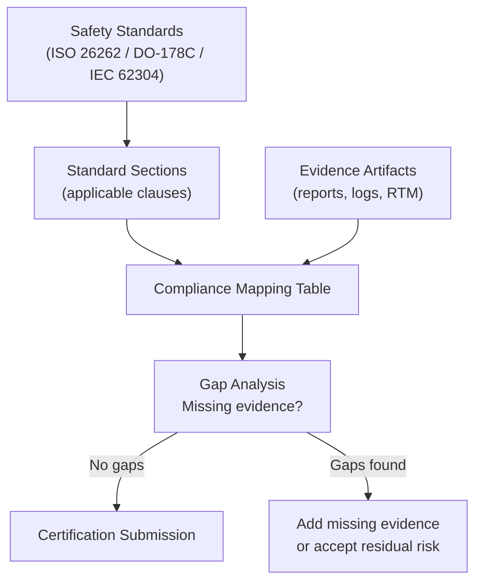

# :material-certificate: Day 28 — Compliance Mapping

!!! abstract "Learning Objectives"
    - Build a compliance mapping table linking evidence to standard sections
    - Understand the structure of ISO 26262, DO-178C, and IEC 62304 compliance arguments
    - Identify coverage gaps in the evidence package before certification audit
    - Write compliance statements that satisfy safety assessor expectations
    - Understand the difference between compliance mapping and safety case

## :material-lightbulb-on: Intuition

Compliance mapping is the translation layer between your engineering work and the language of certification standards. You have produced hundreds of artifacts — requirements, models, test results, analysis reports. The compliance map proves that collectively these artifacts satisfy every relevant section of every applicable standard.

An auditor does not review all your artifacts — they review your compliance map. It must be complete, accurate, and traceable.

## :material-book: Core Concepts

!!! info "Definition — Compliance Mapping Table"
    A table that maps each applicable standard section to the evidence artifact(s) that demonstrate compliance. Columns: Standard | Section | Requirement Text | Evidence Artifact | Verdict | Comments.

!!! info "Definition — Safety Case"
    A structured argument (often using GSN — Goal Structuring Notation) that provides a reasoned case for why a system is acceptably safe. A compliance table is part of the safety case evidence but is not itself the safety case argument.

!!! info "Definition — Gap Analysis"
    A systematic comparison of what the standard requires against what evidence exists. Gaps = required activities with no evidence. Gap analysis is the last check before submitting to a certification authority.

## :material-vector-polyline: Diagram

## :material-code-tags: Worked Example — Compliance Mapping

=== "ISO 26262 Mapping (Automotive)"
    | Standard | Section | Requirement | Evidence | Status |
    |----------|---------|-------------|----------|--------|
    | ISO 26262-6 | Sec 7.4.1 | Software requirements specification | SwRS v1.2 | OK |
    | ISO 26262-6 | Sec 9.4.2 | Requirements-based tests | RTM + MIL/SIL/HIL test reports | OK |
    | ISO 26262-6 | Sec 9.4.3 | Interface tests | SIL integration test report | OK |
    | ISO 26262-6 | Sec 9.4.4 | Fault injection tests | MIL + SIL + HIL fault injection reports | OK |
    | ISO 26262-6 | Sec 9.4.7 | Back-to-back tests (MIL/SIL) | MIL-SIL equivalence report | OK |
    | ISO 26262-6 | Sec 10.4.2 | Structural coverage (ASIL D: MC/DC) | Coverage report v1.0 | OK |

=== "DO-178C Mapping (Aerospace)"
    | Section | Objective | Evidence | Status |
    |---------|-----------|----------|--------|
    | 6.3.1 | Software requirements review | SwRS review record | OK |
    | 6.4.2 | Normal range tests | SIL test report (nominal) | OK |
    | 6.4.3 | Robustness tests | SIL robustness test report | OK |
    | 6.4.4 (DAL A) | Structural coverage MC/DC | Coverage report (100% MC/DC) | OK |
    | 6.4.4 (DAL A) | Object code verification | OCV report | OK |
    | 11.4 | Software lifecycle data | All lifecycle documents | OK |
    | 12.2 | Tool qualification | Embedded Coder TQP | OK |

=== "IEC 62304 Mapping (Medical)"
    | Section | Activity | Evidence | Status |
    |---------|----------|----------|--------|
    | 5.2 | Software requirements analysis | SwRS v1.0 | OK |
    | 5.5 | Software unit implementation | Code review records | OK |
    | 5.6.3 | Integration testing | SIL integration report | OK |
    | 5.7 | Software system testing | HIL test report | OK |
    | 5.8 | Software release | Release checklist + sign-off | OPEN |
    | 9.8 | Problem resolution | Defect log | OK |

=== "Gap Analysis"
    Identify any OPEN or MISSING items:

    - IEC 62304 5.8 Software release: release checklist not yet completed — planned for Day 30
    - All other items: COMPLETE

## :material-alert: Pitfalls

!!! warning "Compliance Mapping Pitfalls"
    - **Mapping evidence to wrong standard section**: Putting the unit test report under the wrong ISO 26262 section misleads auditors and creates confusion in the review. Map carefully.
    - **Using placeholder evidence**: "Test report TBD" is not evidence — it is a gap. Do not submit compliance tables with TBDs.
    - **Missing applicable sections**: Some projects map only the sections they know about and miss applicable clauses. Use the standard index thoroughly.
    - **Compliance table not under version control**: The compliance map must be version-controlled alongside the evidence artifacts it references.

## :material-help-circle: Flashcards

???+ question "What is the difference between a compliance table and a safety case?"
    A **compliance table** maps evidence to standard sections — proving each clause is addressed. A **safety case** is a structured argument that the system is acceptably safe — using the evidence to build a logical case. The compliance table is evidence that feeds the safety case argument.

???+ question "What is a gap in a compliance mapping?"
    A gap is a standard section with a required activity for which no evidence artifact exists. Gaps must be resolved before certification submission: either produce the missing evidence or formally accept the gap with a documented rationale and risk assessment.

## :material-clipboard-check: Self Test

=== "Question"
    ISO 26262-6 Section 9.4.6 requires "error guessing" testing. Your compliance table shows this section as "N/A — not applicable." Under what conditions is N/A justified, and what documentation is required?

=== "Answer"
    "N/A" is justified if the tailoring agreement with the customer or the project safety plan explicitly excludes this activity with documented rationale (e.g., "covered by requirements-based fault injection testing" or "ASIL A — not required at this integrity level").

    Required documentation: (1) reference to the tailoring decision in the Safety Plan, (2) justification that the safety goals are met without this activity, (3) approval by the functional safety manager.

## :material-check-circle: Summary

- Compliance mapping translates engineering evidence into certification language
- Every applicable standard section must have at least one evidence artifact
- Gap analysis before submission prevents surprises in the certification audit
- The compliance table must be version-controlled and reviewed like any other artifact
- "N/A" requires documented justification — it is not a free pass
