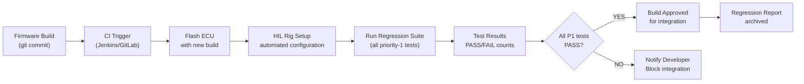

# :material-refresh-auto: Day 29 — HIL Regression & Automation

!!! abstract "Learning Objectives"
    - Design a HIL regression test suite that runs overnight without supervision
    - Manage test suite maintenance: adding, retiring, and prioritizing test cases
    - Integrate HIL regression with CI/CD for firmware releases
    - Implement regression result analysis and trend tracking
    - Apply ASPICE SWE.5 requirements for regression test management

## :material-lightbulb-on: Intuition

Every firmware change — even a one-line bug fix — risks breaking something that worked before. HIL regression automation means you find that breakage in the overnight run, not in a production field return six months later.

The discipline of regression testing is not just running the old tests; it is maintaining a living test suite that evolves with the system, retiring obsolete tests, and adding new tests for every defect found.

## :material-book: Core Concepts

!!! info "Definition — Regression Test Suite"
    A curated set of test cases that verify previously-working functionality has not been broken by a change. A good regression suite is: fast to run, reliable (no flaky tests), comprehensive (covers all critical functions), and maintainable.

!!! info "Definition — Test Suite Maintenance"
    The ongoing process of: adding new tests for new requirements and discovered defects, retiring tests that are no longer relevant, tuning flaky tests to be reliable, and reviewing coverage as the system evolves.

!!! info "Definition — Flaky Test"
    A test that sometimes passes and sometimes fails for the same code, without any change. Flaky tests erode confidence in the test suite and cause engineers to ignore failures. Root causes: timing dependencies, hardware variability, uninitialized state.

## :material-vector-polyline: Diagram



## :material-code-tags: Worked Example — Regression Suite Structure

=== "Step 1 — Test Priority Classification"
    | Priority | Criteria | Run Time | Run When |
    |----------|----------|----------|----------|
    | P1 (smoke) | Critical safety functions | < 30 min | Every commit |
    | P2 (regression) | All functional requirements | < 4 hours | Nightly |
    | P3 (extended) | Robustness, stress, long-duration | < 24 hours | Weekly |

=== "Step 2 — CI Integration"
    ```yaml
    # .gitlab-ci.yml
    hil_smoke_test:
      stage: hardware_test
      script:
        - python3 scripts/flash_ecu.py $FIRMWARE_HEX
        - python3 scripts/run_hil_suite.py --priority P1 --rig HIL_RIG_01
      artifacts:
        paths:
          - hil_results/smoke_report.html
        expire_in: 90 days
      allow_failure: false  # P1 failures block merge
    ```

=== "Step 3 — Trend Analysis"
    Track test results over time:

    - Plot PASS/FAIL counts per day
    - Alert if flaky test rate > 2% (sign of unreliable tests)
    - Track coverage trend (should be non-decreasing)
    - Plot defect escape rate (defects found post-regression / total defects)

=== "Step 4 — Test Suite Review"
    Quarterly review checklist:

    - [ ] Are there test cases for every defect found in the field?
    - [ ] Are there flaky tests? Root cause and fix.
    - [ ] Are retired tests documented in the change log?
    - [ ] Is P1 suite still < 30 min? If not, optimize or reclassify.
    - [ ] Does the suite cover all new requirements added since last review?

## :material-alert: Pitfalls

!!! warning "Regression Automation Pitfalls"
    - **Treating all failures as acceptable**: If you have 5 known-failing tests and consider them OK, you lose the ability to detect new failures. Fix known failures before adding them to regression.
    - **Not flashing fresh firmware each run**: If the ECU retains state from the previous run (in non-volatile memory), test results may depend on test order. Always start from a clean state.
    - **Regression suite never reviewed**: A test suite that grows to 5,000 tests with 20% obsolete tests becomes a maintenance burden. Review quarterly.

## :material-help-circle: Flashcards

???+ question "What makes a regression test suite effective?"
    A good regression suite is: (1) **reliable** — no flaky tests, same result every time, (2) **fast** — P1 suite runs in < 30 minutes, (3) **comprehensive** — covers all critical requirements, (4) **maintained** — updated with every defect found and every new requirement.

???+ question "What is the defect escape rate and why does it matter?"
    Defect escape rate = defects discovered post-regression / total defects. A high escape rate means the regression suite is not catching defects before release. This metric drives regression suite improvement and tracks the ROI of automation investment.

## :material-clipboard-check: Self Test

=== "Question"
    Your overnight HIL regression shows 3 failures. Two are the same test that failed last week (known issue, defect ticket open). One is new. What do you do?

=== "Answer"
    1. **Known failures**: Verify they are covered by open defect tickets. If the defect has a committed fix date, note this in the run report. Do not re-investigate — they are known.
    2. **New failure**: Immediately investigate. Is this a regression caused by this week commit? Run the failed test in isolation to confirm it is reproducible. If confirmed: raise a new defect ticket, link it to the firmware change that introduced it, and notify the developer.
    3. **CI gate**: If the new failure covers a P1 requirement, block the firmware integration until the defect is fixed.

## :material-check-circle: Summary

- HIL regression catches regressions before they reach production or field deployment
- P1 (smoke) tests must run on every commit; P2/P3 run nightly/weekly
- Flaky tests erode confidence — fix them aggressively or retire them
- Always start from clean ECU state (fresh firmware flash) for reproducible results
- Quarterly test suite review keeps the suite lean, accurate, and maintainable
