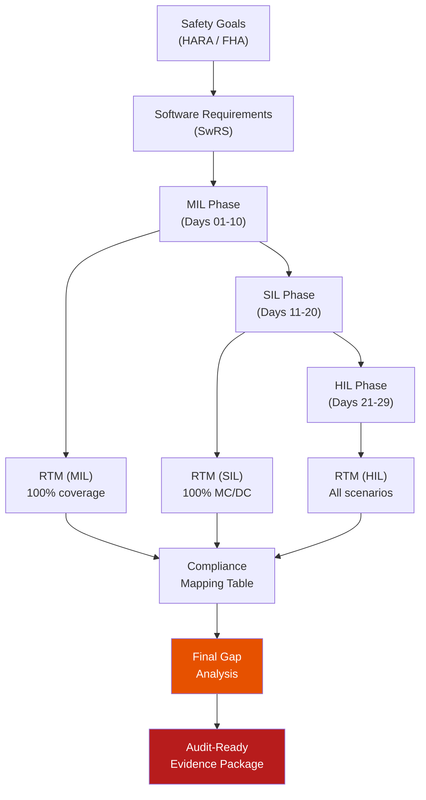

# :material-trophy: Day 30 — Final Capstone

!!! abstract "Learning Objectives"
    - Assemble a complete, audit-ready evidence package across all three V&V phases
    - Perform final gap analysis against applicable safety standards
    - Present the compliance argument clearly and concisely
    - Identify lessons learned and improvement areas for the next project cycle
    - Understand what a certification authority (DER, TÜV, Notified Body) expects to see

## :material-lightbulb-on: Intuition

The capstone is where everything comes together. You have been building artifacts for 29 days — requirements, models, test cases, execution results, coverage reports, static analysis records, compliance maps. Day 30 is about organizing these artifacts into a coherent package that tells a story: "We built this system safely, we verified it rigorously, and here is the proof."

The measure of success is not just that the tests passed — it is that any independent auditor can pick up your package and be convinced, without asking you a single question.

## :material-book: Core Concepts

!!! info "Final Evidence Package Contents"
    | Category | Documents |
    |----------|-----------|
    | Requirements | SwRS v1.x, System Safety Goals, FMEA/FMEDA |
    | MIL Phase | RTM (MIL), MIL Test Report, Model Config Baseline |
    | SIL Phase | RTM (SIL), SIL Test Report, Coverage Report, Static Analysis Report, MIL-SIL Equivalence, Stack Analysis |
    | HIL Phase | RTM (HIL), HIL Test Report, WCET Evidence, Bus Analysis, Fault Injection Report, Compliance Mapping Table |
    | Project | Defect Log (all resolved/accepted), Tool Qualification Records, Change Control Log |

!!! info "Definition — Audit Trail"
    An audit trail is the chain of evidence that allows any artifact to be traced: from a system safety goal → to a software requirement → to a test case → to a test result → to an artifact. Every link in this chain must be explicit and reviewable.

!!! info "Definition — Residual Risk Register"
    A formal register of all risks that were identified but not fully mitigated, including: risk description, FMEA reference, mitigation applied, residual risk level, owner, and acceptance rationale. Required for ISO 26262 and IEC 62304 sign-off.

## :material-vector-polyline: Diagram

## :material-code-tags: Worked Example — Capstone Checklist

=== "Phase 1 — Requirements & RTM"
    - [ ] SwRS complete with ASIL assignments for all requirements
    - [ ] FMEA/FMEDA complete with diagnostic coverage rates
    - [ ] RTM 100% forward and backward coverage (all phases)
    - [ ] All orphan tests investigated and resolved

=== "Phase 2 — MIL Evidence"
    - [ ] Model configuration baseline tagged in git (v1.0)
    - [ ] Plant model validation report complete
    - [ ] MIL test report: all nominal/boundary/fault scenarios with verdicts
    - [ ] Fault injection evidence linked to FMEA items
    - [ ] MIL defect log: all defects closed or accepted as residual risk

=== "Phase 3 — SIL Evidence"
    - [ ] Code generation qualification kit report
    - [ ] MIL-SIL equivalence report (max diff within tolerance)
    - [ ] Static analysis report: zero Mandatory/Required violations or all deviated
    - [ ] Coverage report: 100% MC/DC (or per project target)
    - [ ] Object code analysis: stack depth within budget + no recursion
    - [ ] SIL defect log: all defects closed or accepted

=== "Phase 4 — HIL Evidence"
    - [ ] Rig Configuration Record current and signed
    - [ ] HIL test report: all scenarios with verdicts
    - [ ] WCET evidence: all tasks within budget with >= 30% margin
    - [ ] Bus analysis: all messages within communication matrix spec
    - [ ] HIL fault injection: all FMEA faults exercised
    - [ ] Compliance mapping table complete (no gaps)
    - [ ] Residual risk register reviewed and signed by safety manager

## :material-alert: Pitfalls

!!! warning "Capstone Pitfalls"
    - **Assembling the package just before the audit**: Evidence package gaps are painful to fill under time pressure. Maintain the compliance table incrementally throughout the project.
    - **Artifacts with no clear version**: An artifact with filename "test_report_final_v3_REAL.pdf" is a red flag for auditors. Use clean versioning: "hil_test_report_v1.0.pdf" with a change log.
    - **Unresolved ownership for residual risks**: A risk registered with "TBD" as owner will not be accepted by a safety assessor. Every risk needs a named owner, acceptance date, and next review date.

## :material-help-circle: Flashcards

???+ question "What does an independent safety assessor look for first in a V&V evidence package?"
    Typically: (1) **traceability** — can every requirement be traced to test evidence? (2) **completeness** — is every applicable standard section addressed? (3) **independence** — were verification activities performed by someone other than the developer? (4) **objectivity** — were pass/fail criteria defined before execution?

???+ question "What is the Residual Risk Register?"
    A formal register listing all identified risks that were not fully mitigated, including: risk description, FMEA reference, mitigation measures applied, residual risk level, owner, acceptance justification, and next review date. Required for ISO 26262 and IEC 62304 safety case closure.

???+ question "What is the audit trail requirement for certification?"
    Every artifact must be traceable: from safety goal to requirement to design to test case to test result to verdict. Any break in this chain is a compliance gap. The RTM is the central tool for maintaining this trail.

## :material-clipboard-check: Self Test

=== "Question"
    An auditor asks: "Show me the evidence that requirement SWR-ACC-003 (radar fault detection within 500 ms) is verified." Walk through the complete audit trail.

=== "Answer"
    Complete audit trail for SWR-ACC-003:

    1. **System safety goal**: HARA-HAZ-003 (loss of ACC monitoring → ASIL B)
    2. **Software requirement**: SwRS SWR-ACC-003 v1.2, Section 4.3.2
    3. **MIL evidence**: TC_MIL_003 in RTM, verdict PASS, log_TC003_20240408.mat
    4. **SIL evidence**: TC_SIL_003 in RTM, verdict PASS, detection at 380 ms, sil_run_20240415.xml
    5. **HIL evidence**: TC_HIL_003 in RTM, verdict PASS, detection at 447 ms (< 500 ms), hil_run_20240426.mf4
    6. **Fault injection**: HIL fault injection report section 3.1, radar wire short + open tested
    7. **Compliance map**: ISO 26262-6 Section 9.4.4 row points to HIL fault injection report

## :material-check-circle: Summary

- The capstone assembles 30 days of evidence into one coherent, traceable package
- Every artifact needs clean versioning, a clear owner, and a review record
- The compliance mapping table is the auditor front door — complete it throughout the project
- The residual risk register formalizes accepted risks with ownership and review dates
- The measure of success: any independent auditor can reconstruct the full audit trail without asking questions

---

!!! success "Congratulations — 30-Day V&V Journey Complete"
    You have covered the complete embedded V&V lifecycle:

    **Phase 1 (MIL)**: Requirements → Traceability → Modeling → Simulation → Fault Injection → Automation

    **Phase 2 (SIL)**: Code Generation → Test Harness → Coverage → Static Analysis → Object Code Verification

    **Phase 3 (HIL)**: Real Hardware → Real-Time I/O → Bus Analysis → WCET → Compliance Mapping → Capstone

    The standards you now understand: **ISO 26262** (automotive) | **DO-178C** (aerospace) | **IEC 62304** (medical)
