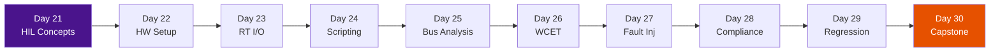

# :material-cpu-64-bit: Phase 3 — Hardware-in-Loop (HIL)

!!! abstract "Phase Overview"
    **Days 21–30** close the V-Model with real hardware. You configure HIL rigs (dSPACE, NI VeriStand, SCALEXIO), connect real ECUs, drive real-time I/O, analyze CAN/LIN bus traffic, measure WCET, inject hardware-level faults, map results to compliance requirements, and produce the Final Capstone — an audit-ready evidence package for ISO 26262, DO-178C, or IEC 62304.

## :material-map-marker-path: Learning Path

## :material-list-box: Days at a Glance

| Day | Topic | Key Skill | Standards Hook |
|-----|-------|-----------|----------------|
| 21 | HIL Concepts | HIL architecture, rig components | ISO 26262 Pt4, DO-178C Sec6 |
| 22 | Hardware Setup | ECU connection, I/O wiring, rig cal | ASPICE SWE.6 |
| 23 | Real-Time I/O | RT simulation, I/O signal conditioning | ISO 26262 Pt6 Sec9 |
| 24 | HIL Scripting | Automate test scenarios with Python/CAPL | ASPICE SWE.4 |
| 25 | Bus & Network Analysis | CAN/LIN/Ethernet frame analysis | ISO 11898, AUTOSAR |
| 26 | Execution Trace & WCET | WCET measurement and analysis | DO-178C Sec6.4.4 |
| 27 | HIL Fault Injection | Hardware-level fault injection | ISO 26262 Pt9 |
| 28 | Compliance Mapping | Map evidence to standard sections | All HIL standards |
| 29 | HIL Regression & Automation | Nightly regression suite | ASPICE SWE.5 |
| 30 | Final Capstone | Complete audit-ready package | All standards |

## :material-check-circle: HIL Phase Exit Criteria

- [ ] All HIL test cases executed with verdicts (nominal, boundary, fault)
- [ ] WCET measured and within timing budget for all critical tasks
- [ ] CAN/LIN bus analysis complete (all messages decoded and validated)
- [ ] HIL fault injection results match SIL fault injection verdicts
- [ ] Compliance mapping table complete (each requirement to evidence artifact)
- [ ] Regression suite passing 100% for all release-blocking tests
- [ ] Final Capstone package assembled and reviewed
