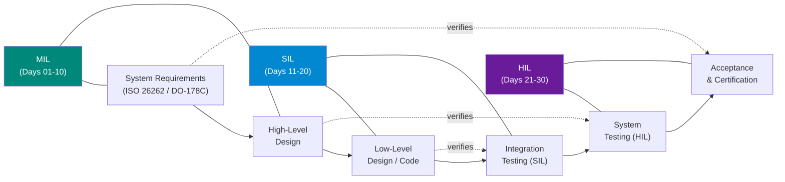

# :material-chip: Embedded V&V Deep Dive

-   :material-cube-outline: **Phase 1 — Model-in-Loop (MIL)**

    ---

    Days 01–10: Build confidence in model-level verification. Understand the V-Model, requirements traceability, plant/controller modeling, closed-loop simulation, and fault injection — all before any compiled code.

    [:octicons-arrow-right-24: Start Phase 1](mil/index.md)

-   :material-code-braces: **Phase 2 — Software-in-Loop (SIL)**

    ---

    Days 11–20: Translate Simulink models to production C code. Verify code generation quality, run unit/integration tests, apply static analysis, measure MC/DC coverage, and achieve DO-178C/ISO 26262 compliance.

    [:octicons-arrow-right-24: Start Phase 2](sil/index.md)

-   :material-cpu-64-bit: **Phase 3 — Hardware-in-Loop (HIL)**

    ---

    Days 21–30: Close the loop with real hardware targets. Configure HIL rigs, drive real-time I/O, analyze CAN/LIN buses, measure WCET, inject hardware-level faults, and produce an audit-ready compliance package.

    [:octicons-arrow-right-24: Start Phase 3](hil/index.md)

---

## The V-Model at a Glance

---

## Standards Covered

-   :material-car: **ISO 26262**

    Functional Safety for Road Vehicles — ASIL A through D. Covers automotive software and hardware safety lifecycle.

-   :material-airplane: **DO-178C**

    Software Considerations in Airborne Systems — DAL A through E. The gold standard for aerospace software verification.

-   :material-hospital-box: **IEC 62304**

    Medical Device Software Lifecycle Processes — Safety Class A, B, and C. Governs software for life-critical medical devices.

-   :material-cog: **ASPICE**

    Automotive SPICE — Process capability model for automotive software development, SWE.1 through SWE.6.

---

## How to Use This Site

!!! tip "Learning Strategy"
    Each day page follows the same **cognitive-science-optimized template**:

    1. **Intuition** — The "why" before the "what"
    2. **Core Concepts** — Precise definitions with color-coded admonitions
    3. **Diagram** — Mermaid flowcharts for spatial memory
    4. **Worked Example** — Step-by-step procedure tabs
    5. **Pitfalls** — Warning blocks to prevent common mistakes
    6. **Flashcards** — Active-recall collapsible Q&A
    7. **Self-Test** — Tabbed quiz to verify understanding
    8. **Summary** — Condensed key takeaways

!!! abstract "Three Domains"
    Every topic is illustrated with scenarios from three safety-critical domains:

    - :material-car: **Automotive** — Adaptive Cruise Control (ACC)
    - :material-airplane: **Aerospace** — Flight Control System
    - :material-hospital-box: **Medical** — Infusion Pump Controller
