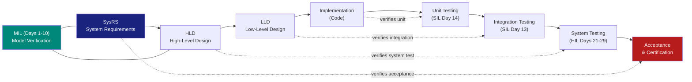

# :material-vector-polyline: Day 01 — V-Model & Requirements

!!! abstract "Learning Objectives"
    - Understand the V-Model lifecycle and how each arm maps to a verification activity
    - Distinguish between system requirements (SysRS) and software requirements (SwRS)
    - Write traceable requirements using the SMART-V pattern
    - Identify the entry/exit criteria for each V-Model phase
    - Map requirements to verification activities per ISO 26262 and DO-178C

## :material-lightbulb-on: Intuition

Think of the V-Model like a **quality contract signed twice**: once when you write a requirement ("the ACC shall maintain headway ≥ 2 s"), and once when you verify it ("the HIL test at 120 km/h confirms headway = 2.1 s"). Every requirement creates an obligation — and every test fulfils that obligation.

Without this structure, you are just running simulations hoping they prove something. With it, every artifact is **traceable evidence** that a specific requirement is satisfied.

## :material-book: Core Concepts

!!! info "Definition — V-Model"
    The **V-Model** is a systems engineering lifecycle where the left arm represents decomposition (requirements → design → implementation) and the right arm represents integration (unit test → integration test → system test → acceptance). Each right-arm activity directly verifies the corresponding left-arm artifact.

!!! info "Definition — Requirement"
    A **requirement** states **what** a system must do, not how. It must be:
    - **Specific** — no ambiguity
    - **Measurable** — a pass/fail criterion can be derived
    - **Achievable** — physically realizable
    - **Relevant** — linked to a system-level need
    - **Traceable** — tagged with a unique ID (e.g., SWR-ACC-001)

!!! success "SMART-V Pattern"
    Every requirement should be: **S**pecific · **M**easurable · **A**chievable · **R**elevant · **T**raceable · **V**erifiable

## :material-vector-polyline: Diagram



## :material-code-tags: Worked Example — Writing a Traceable Requirement

=== "Step 1 — Identify Need"
    Start from the system-level hazard or operational need.

    **Example (Automotive ACC):**
    > The vehicle shall not collide with a lead vehicle during automated cruise control operation.

    This is a **system safety goal**, not yet a software requirement.

=== "Step 2 — Decompose to SwRS"
    Decompose into a testable software requirement:

    ```
    ID:      SWR-ACC-001
    Title:   Headway Maintenance
    Text:    The ACC controller SHALL maintain a time headway of
             ≥ 2.0 s to the lead vehicle when engaged and
             lead vehicle speed ≥ 5 km/h.
    ASIL:    B
    Parent:  SysRS-ACC-HAZ-003
    Source:  ISO 26262-6 Table 9
    ```

=== "Step 3 — Define Verification"
    For every requirement, define how it will be verified:

    | Level | Method | Tool |
    |-------|--------|------|
    | MIL   | Simulation | Simulink Test / MATLAB |
    | SIL   | Unit test | VectorCAST / GoogleTest |
    | HIL   | System test | dSPACE ControlDesk |

=== "Step 4 — Link RTM"
    Add to the Requirement Traceability Matrix (RTM):

    | Req ID | Description | MIL Test | SIL Test | HIL Test | Status |
    |--------|-------------|----------|----------|----------|--------|
    | SWR-ACC-001 | Headway ≥ 2 s | TC_MIL_001 | TC_SIL_001 | TC_HIL_001 | OPEN |

## :material-alert: Pitfalls

!!! warning "Top Pitfalls"
    - **Mixing requirement intent with implementation**: Requirements say **what**, designs say **how**. Never put a Simulink block name inside a SwRS.
    - **Ambiguous quantifiers**: "The system shall respond quickly" — how quickly? Specify units and thresholds.
    - **Missing traceability links**: A requirement without a parent SysRS entry and a child test case is an orphan. Orphan requirements fail audits.
    - **Untestable requirements**: "The system shall be safe" cannot be tested directly. Decompose until each leaf is testable.
    - **Configuration drift**: If the model changes but the SwRS does not, your RTM is stale and your evidence is invalid.

## :material-help-circle: Flashcards

???+ question "What does the left arm of the V-Model represent?"
    The left arm represents **decomposition and development**: System Requirements → High-Level Design → Low-Level Design → Implementation. Each level becomes more concrete.

???+ question "What does the right arm verify?"
    Each right-arm activity verifies its **left-arm counterpart**: Unit Test verifies Low-Level Design, Integration Test verifies High-Level Design, System Test verifies System Requirements.

???+ question "What is a Requirement Traceability Matrix (RTM)?"
    An RTM is a table that links each requirement to: its parent (system goal), its implementation artifact (design/code), and its verification artifact (test case). It proves **bidirectional traceability**.

???+ question "What standard governs software requirements for ISO 26262?"
    **ISO 26262 Part 6 (Software Level)**, specifically Section 7 (Software Requirements Specification) and Table 9 (Methods for software unit design and implementation).

???+ question "What is ASIL decomposition?"
    ASIL decomposition splits a high-ASIL requirement (e.g., ASIL D) into two independent lower-ASIL requirements (e.g., ASIL B + ASIL B) that together provide equivalent safety. Governed by ISO 26262 Part 9.

## :material-clipboard-check: Self Test

=== "Question 1"
    A software requirement states: "The braking response shall be fast." What is wrong with this requirement, and how would you fix it?

=== "Answer 1"
    **Problem**: "Fast" is ambiguous — no measurable threshold is given.

    **Fix**: "The ACC controller SHALL apply ≥ 50% braking torque within 150 ms of detecting a collision threat (TTC ≤ 0.8 s)."

    This is now **specific**, **measurable**, and **testable**.

=== "Question 2"
    Which V-Model arm does MIL verification sit on, and what does it verify?

=== "Answer 2"
    MIL sits on the **left arm / transition zone** — it verifies the **High-Level Design** (Simulink model) against **System Requirements**, before any code is generated. It is early defect detection.

## :material-check-circle: Summary

- The V-Model creates a **1-to-1 contract** between requirements and tests
- Requirements must be **SMART-V**: Specific, Measurable, Achievable, Relevant, Traceable, Verifiable
- The RTM is the **central artifact** linking everything together
- MIL verifies models against requirements — before a single line of C code
- ISO 26262 Part 6 and DO-178C Section 6 both mandate requirement traceability
