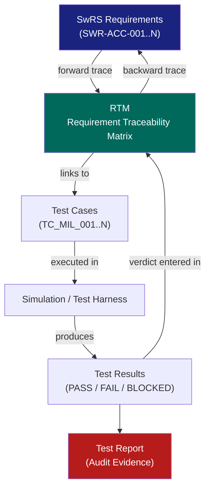

# :material-link-variant: Day 02 — Traceability & Test Design

!!! abstract "Learning Objectives"
    - Build a bidirectional Requirement Traceability Matrix (RTM)
    - Write structured test cases using GIVEN / WHEN / THEN notation
    - Design nominal, boundary, and fault test scenarios for each requirement
    - Understand coverage obligations under ISO 26262 and DO-178C
    - Recognize the mnemonic **TRACE** as the universal V&V principle

## :material-lightbulb-on: Intuition

Traceability is the **audit trail** of your verification effort. Imagine a certification auditor asking: "Prove that requirement SWR-ACC-001 is tested." Without an RTM, you are searching through folders hoping to find something relevant. With an RTM, you point to a single row that links requirement → test case → execution result → verdict.

Good test design is not about writing *many* tests — it is about writing *the right* tests: one nominal, one boundary, one fault scenario per requirement, with explicit pass/fail criteria before execution begins.

## :material-book: Core Concepts

!!! info "Definition — Traceability"
    **Bidirectional traceability** means:

    - **Forward**: From requirement → test case (proves coverage)
    - **Backward**: From test case → requirement (proves no orphan tests)

    Both directions must be maintained throughout the project lifecycle.

!!! info "Definition — GIVEN / WHEN / THEN"
    A structured scenario template that forces explicit definition of:

    - **GIVEN**: Pre-conditions and system state at test start
    - **WHEN**: The stimulus or event under test
    - **THEN**: The expected observable outcome with measurable threshold

!!! abstract "TRACE Mnemonic"
    **T** — Test scenarios must be **Traceable** to requirements

    **R** — **Robustness** under edge conditions must be evaluated

    **A** — **Artifacts** must be complete and timestamped

    **C** — **Criteria** for pass/fail must be explicit before execution

    **E** — **Evidence** must support defect triage and risk assessment

## :material-vector-polyline: Diagram



## :material-code-tags: Worked Example — RTM + Test Case

=== "Step 1 — Populate RTM Row"
    ```
    Req ID:      SWR-ACC-001
    Title:       Headway Maintenance ≥ 2.0 s
    ASIL:        B
    Test Cases:  TC_MIL_001 (nominal), TC_MIL_002 (boundary), TC_MIL_003 (fault)
    Coverage:    Scenario-based (ISO 26262-6 Table 10)
    Status:      OPEN
    ```

=== "Step 2 — Nominal Scenario"
    ```
    ID:     TC_MIL_001
    Req:    SWR-ACC-001
    Type:   Nominal (Green)
    GIVEN:  ACC engaged, lead vehicle at 80 km/h, initial headway = 3.0 s,
            road: straight dry highway
    WHEN:   System runs for 60 s in steady-state follow mode
    THEN:   Measured headway remains in range [2.0 s, 4.0 s]
            No braking jerk > 0.3 g
    Verdict criteria: ALL assertions pass for full 60 s window
    ```

=== "Step 3 — Boundary Scenario"
    ```
    ID:     TC_MIL_002
    Req:    SWR-ACC-001
    Type:   Boundary (Yellow)
    GIVEN:  Dense stop-and-go traffic, lead vehicle decelerates
            from 60 km/h to 5 km/h in 3 s
    WHEN:   ACC active throughout deceleration event
    THEN:   Headway never drops below 1.8 s (10% margin allowed)
            Braking response < 200 ms from threat detection
    Verdict criteria: headway_min >= 1.8 AND response_time <= 200 ms
    ```

=== "Step 4 — Fault Scenario"
    ```
    ID:     TC_MIL_003
    Req:    SWR-ACC-001
    Type:   Fault (Red)
    GIVEN:  ACC engaged, radar sensor drops out at t=10 s
            (simulated by zeroing the range signal)
    WHEN:   Sensor dropout persists for 2 s
    THEN:   ACC transitions to degraded mode within 500 ms
            Driver alert activated
            Vehicle decelerates safely (< 0.5 g)
    Verdict criteria: mode == DEGRADED within 500 ms AND alert == TRUE
    ```

## :material-alert: Pitfalls

!!! warning "Traceability Pitfalls"
    - **Orphan test cases**: Test cases that do not trace back to any requirement are wasted effort — and may mislead auditors about coverage.
    - **Orphan requirements**: Requirements with no test cases will fail completeness checks in DO-178C and ISO 26262 audits.
    - **"Pass" claims without evidence**: A test verdict of PASS with no attached log/plot is not evidence — it is an assertion.
    - **Hidden model drift**: If the Simulink model is updated after tests are written, the test assumptions may be invalid. Always re-baseline.
    - **Missing boundary/fault depth for high-ASIL functions**: Low-ASIL functions may have nominal-only coverage; high-ASIL (B/C/D or DAL A/B) require boundary and fault tests.

## :material-help-circle: Flashcards

???+ question "What is bidirectional traceability?"
    It means you can trace **forward** from requirement to test case (proving every requirement is tested) AND **backward** from test case to requirement (proving every test has a reason to exist). Both directions required for ISO 26262 and DO-178C.

???+ question "What are the three scenario types every requirement should have?"
    **Nominal** (green) — normal operating conditions; **Boundary** (yellow) — edge of operating envelope; **Fault** (red) — injected failure or invalid input. Together they provide scenario-based coverage.

???+ question "What does the TRACE mnemonic stand for?"
    **T**raceable · **R**obust · **A**rtifacts-complete · **C**riteria-explicit · **E**vidence-based. It is the universal checklist for any V&V phase.

???+ question "What standard section governs test case design for automotive software?"
    ISO 26262 Part 6 (Sec 9 — Software integration testing) and Section 10 (Software testing). Scenario-based testing, requirements-based testing, and equivalence classes are all listed methods.

## :material-clipboard-check: Self Test

=== "Question"
    You have 50 software requirements and 45 test cases. What two RTM checks must you perform, and what might they reveal?

=== "Answer"
    **Check 1 — Forward coverage**: Do all 50 requirements have at least one test case? If 5 requirements have no test cases, those are **untested requirements** — a compliance gap.

    **Check 2 — Backward orphan check**: Do all 45 test cases trace to a requirement? If some do not, they are **orphan tests** — wasted effort or mislabeled requirements.

    A complete RTM has 100% forward and backward coverage.

## :material-check-circle: Summary

- **Bidirectional traceability** is mandatory under ISO 26262 and DO-178C
- The RTM is the **single source of truth** for verification coverage
- Every requirement needs **three scenario types**: nominal, boundary, fault
- GIVEN/WHEN/THEN forces explicit pre-conditions and measurable outcomes
- The **TRACE mnemonic** is your checklist before any V&V activity begins
