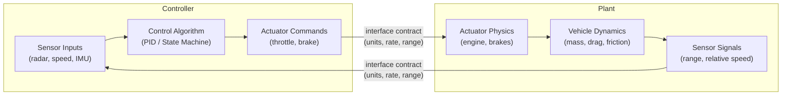

# :material-sine-wave: Day 03 — Plant & Controller Modeling

!!! abstract "Learning Objectives"
    - Distinguish plant models from controller models in a closed-loop architecture
    - Apply the SMART-V pattern to model fidelity requirements
    - Identify signal interfaces, units, and sampling rates between plant and controller
    - Understand model validation versus model verification
    - Map plant model parameters to real-world physical constants

## :material-lightbulb-on: Intuition

The **plant** is the physical world your controller is trying to regulate: a vehicle longitudinal dynamics model, an aircraft pitch/roll behavior, or an infusion pump flow rate. The **controller** is the algorithm that reads sensor signals and outputs actuator commands.

In MIL, you simulate *both* together. If your plant model is wrong (e.g., wrong inertia values), your controller tests are testing against a fiction — and the faults you miss at MIL will cost 10x more to find at HIL.

## :material-book: Core Concepts

!!! info "Definition — Plant Model"
    A **plant model** is a mathematical representation of the physical system (actuators + dynamics + environment). For automotive ACC: vehicle mass, drag, road friction. For aerospace: airframe aerodynamics, propulsion, atmosphere model.

!!! info "Definition — Controller Model"
    A **controller model** is the algorithmic representation of the embedded software: state machines, PID loops, safety monitors, mode management. In Simulink this is typically a subsystem that will be auto-coded via Embedded Coder.

!!! info "Definition — Interface Contract"
    The boundary between plant and controller is an **interface contract**: defined signal names, units (SI preferred), data types, sample rates, and range limits. This contract must appear in the SwRS.

!!! success "SMART-V Applied to Models"
    Model fidelity requirements should also be SMART-V. Example: "The longitudinal vehicle dynamics model SHALL reproduce measured acceleration within plus or minus 5% across 10 to 130 km/h range."

## :material-vector-polyline: Diagram



## :material-code-tags: Worked Example — ACC Plant + Controller Interface

=== "Step 1 — Define Plant Inputs/Outputs"
    Plant Model Interface (Simulink Bus Object):

    - Input: `throttle_pct` [0..100 %], 10 ms sample
    - Input: `brake_pct` [0..100 %], 10 ms sample
    - Output: `ego_speed` [0..200 km/h], 10 ms sample
    - Output: `lead_range` [0..250 m], 50 ms sample (radar)
    - Output: `lead_speed` [0..200 km/h], 50 ms sample (radar)

=== "Step 2 — Parameterize Vehicle Dynamics"
    Vehicle parameters (Simulink Model Workspace):

    | Parameter | Value | Unit | Description |
    |-----------|-------|------|-------------|
    | m_vehicle | 1600 | kg | Curb weight |
    | Cd | 0.29 | - | Aero drag coefficient |
    | A_frontal | 2.3 | m^2 | Frontal area |
    | mu_road | 0.85 | - | Road friction (nominal) |
    | tau_engine | 0.15 | s | Engine torque lag |
    | tau_brake | 0.08 | s | Hydraulic brake lag |

=== "Step 3 — Validate Plant Model"
    Model validation procedure:

    1. Run nominal maneuver: 0 to 100 km/h full throttle
    2. Measured from vehicle test data: 8.2 s ± 0.5 s
    3. Simulation must reproduce within ±5%
    4. If sim result is outside tolerance → fix parameters before proceeding
    5. Document in MDL-REQ-001 evidence field

=== "Step 4 — Document in RTM"
    ```
    Req ID:  MDL-REQ-001
    Title:   Plant model longitudinal accuracy
    Text:    The plant model SHALL reproduce 0-100 km/h
             acceleration time within ±5% of measured data
    Method:  Simulation + comparison script
    Evidence: plant_validation_report_v1.0.pdf
    Status:  OPEN
    ```

## :material-alert: Pitfalls

!!! warning "Modeling Pitfalls"
    - **Over-simplified plant**: Missing actuator lags makes the controller look more responsive than it is — masking timing faults until HIL.
    - **Unit mismatches at interface**: Plant outputs km/h but controller expects m/s — a factor-of-3.6 error that is easy to overlook.
    - **Confusing model validation with verification**: Validation = "right model?" (compare to measured data). Verification = "model built right?" (check against requirements).
    - **Hardcoded parameters in model**: Vehicle mass hardcoded in 10 places instead of a single model workspace parameter — leads to inconsistent variant configurations.

## :material-help-circle: Flashcards

???+ question "What is the difference between plant and controller in a closed-loop model?"
    The **plant** models the physical world (vehicle, actuators, environment). The **controller** models the embedded algorithm (software). They communicate via the **interface contract** specifying signal names, units, rates, and ranges.

???+ question "What is model validation versus model verification?"
    **Validation** = confirm the model represents the real physical system by comparing to measured test data (are we building the right model?). **Verification** = confirm the model meets its specification (is the model built correctly per its requirements?).

???+ question "Why are actuator lags important in a plant model?"
    Actuator lags (engine torque ~150 ms, brake hydraulic ~80 ms) determine timing margins in control loops. Without them, the controller assumes instantaneous response — leading to overly aggressive tuning that may be unstable on real hardware.

## :material-clipboard-check: Self Test

=== "Question"
    Your plant model shows 0-100 km/h in 6.8 s but measured vehicle data shows 8.2 s. What does this mean and what must you do?

=== "Answer"
    The plant model is **too optimistic** — it underestimates real-world inertia or drag. This is a **model validation failure**.

    Required actions: (1) identify source of error (wrong mass? missing drag term?), (2) correct the parameter, (3) re-run validation, (4) document in MDL-REQ-001 evidence. Do NOT proceed with controller testing against an invalid plant.

## :material-check-circle: Summary

- Plant = physical world model; Controller = algorithm model; Interface = signed contract
- **Model validation** (vs. measured data) must precede controller verification
- Interface contracts must specify units, sample rates, and data ranges
- Actuator and sensor lags must be included — they affect timing margins
- Plant model fidelity requirements belong in the RTM like any software requirement
