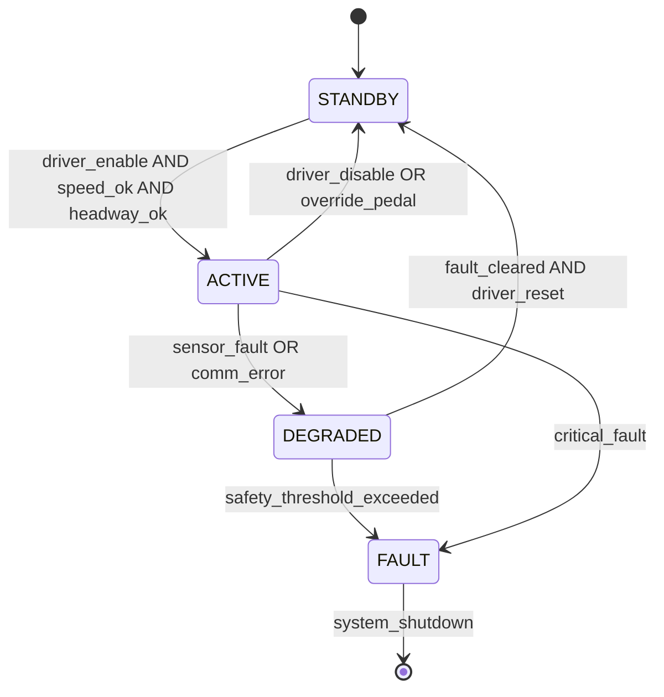

# :material-shape-polygon-plus: Day 04 — Domain Modeling Patterns

!!! abstract "Learning Objectives"
    - Apply domain-specific modeling patterns for automotive, aerospace, and medical domains
    - Recognize when to use data-flow vs. state-machine vs. hybrid modeling approaches
    - Understand mode management and safety monitor patterns
    - Map domain patterns to ARP4754A and ISO 26262 design requirements
    - Avoid anti-patterns that lead to untestable models

## :material-lightbulb-on: Intuition

Different safety-critical domains have evolved **proven modeling patterns** for their most common problems. Automotive engineers use state-machine mode managers for ACC engagement. Aerospace engineers use dual-channel redundancy for flight control. Medical device engineers use watchdog monitors for infusion pump control.

Learning these patterns means you are not reinventing the wheel — and your model structure is **recognizable to auditors** who have reviewed hundreds of similar designs.

## :material-book: Core Concepts

!!! info "Definition — Modeling Pattern"
    A **modeling pattern** is a reusable solution to a recurring design problem within a specific domain. It captures structure, interfaces, and behavioral constraints validated across multiple projects.

!!! info "Definition — Mode Management"
    **Mode management** is the control of discrete operating states (STANDBY, ACTIVE, DEGRADED, FAULT) and the transitions between them. Every safety-critical system needs explicit mode management with defined transition guards and invariants.

!!! info "Definition — Safety Monitor Pattern"
    A **safety monitor** runs in parallel with the main function, checks output plausibility against independent criteria, and triggers a safe state if the main function produces an out-of-range result.

## :material-vector-polyline: Diagram

## :material-code-tags: Worked Example — Three Domain Patterns

=== "Automotive — Mode Manager"
    ACC Mode Manager State Machine pattern:

    - **States**: STANDBY, ACTIVE, DEGRADED, FAULT
    - **Transition guard** (STANDBY to ACTIVE): speed_ego >= 30 km/h AND lead_range_valid == TRUE AND driver_enable == TRUE AND no_active_fault == TRUE
    - **Safety invariant** (must hold in ACTIVE): headway >= 1.5 s (absolute minimum), brake_demand <= 0.8g
    - **Test requirement**: All 4 transitions must have explicit test cases in RTM

=== "Aerospace — Dual-Channel Redundancy"
    Dual-Lane Flight Control pattern:

    - **Lane A**: Primary flight computer (FCC-A)
    - **Lane B**: Redundant flight computer (FCC-B)
    - **Monitor**: Cross-lane comparison

    If |FCC_A_output - FCC_B_output| > threshold: activate DISAGREE alarm, switch to single-lane degraded mode, log disagreement event.

    Standard requirement: DO-178C DAL A requires independent verification of both lanes. ARP4761 FHA classifies "Loss of pitch control" as Catastrophic.

=== "Medical — Watchdog + Plausibility Monitor"
    Infusion Pump Safety Monitor pattern:

    - **Main function**: Compute target_flow_rate from prescription parameters
    - **Monitor**: Independent plausibility check runs every 50 ms
    - **Guard**: IF target_flow_rate > max_safe_rate → immediately set pump_enable = FALSE, raise OVER_INFUSION_ALARM, log event with timestamp
    - **Watchdog**: Software watchdog timer reset every 100 ms; if not reset, hardware forces pump OFF

    Compliance: IEC 62304 Class C requires full traceability. ISO 14971 requires risk control measure documented in risk file.

## :material-alert: Pitfalls

!!! warning "Domain Pattern Pitfalls"
    - **Missing safe state**: Every state machine must have a defined safe state reachable from any mode under any fault condition.
    - **Untested transitions**: State transitions that only occur under rare fault conditions are often skipped — exactly the cases that matter for safety.
    - **Safety monitor sharing resources with main function**: If they share a timer or memory region, a fault in one can corrupt the other. Independence is the key principle.
    - **Over-complex state machines**: More than 20 flat states usually signals missing abstraction hierarchy. Auditors struggle to review it; designers struggle to maintain it.

## :material-help-circle: Flashcards

???+ question "What is the purpose of a safety monitor pattern?"
    A safety monitor runs **independently** of the main function, checks outputs for plausibility, and forces a safe state if the main function produces an out-of-range or hazardous result. It provides a second protection layer that does not depend on the main function being correct.

???+ question "What must every state machine have for safety-critical applications?"
    Clearly defined **safe state** reachable from any mode; explicit **transition guards** (no ambiguous transitions); defined **invariants** that must hold in each state; and **fault transitions** to degraded or fault mode.

???+ question "Why does aerospace use dual-channel redundancy?"
    For DAL A functions (catastrophic failure consequence), DO-178C and ARP4754A require **independence between verification activities** and often redundant hardware channels. If one channel fails, the other maintains control authority independently.

## :material-clipboard-check: Self Test

=== "Question"
    Your ACC mode manager transitions from ACTIVE to STANDBY when the driver presses the brake pedal. List at least two additional transitions you must test.

=== "Answer"
    1. **ACTIVE to DEGRADED on sensor dropout**: Radar loss at highway speed is a realistic fault scenario — verify safe deceleration and driver alert.
    2. **ACTIVE to FAULT on critical fault** (e.g., brake actuator unresponsive): Must verify the system reaches safe state and fault is logged.
    3. **DEGRADED to STANDBY on fault cleared**: The recovery path must be tested — systems stuck in DEGRADED create usability and safety issues.
    4. **STANDBY to ACTIVE with all guards satisfied**: Ensure all preconditions are correctly checked before engagement.

## :material-check-circle: Summary

- Domain patterns encode **proven solutions** to recurring safety design problems
- Mode management must define all states, transitions, guards, and invariants explicitly
- The safety monitor pattern provides **independent plausibility checking**
- Aerospace uses dual-channel redundancy for catastrophic-consequence functions
- Every state machine needs a **safe state** reachable from any mode under any fault
- Over-complex models should be refactored into hierarchy for reviewability
