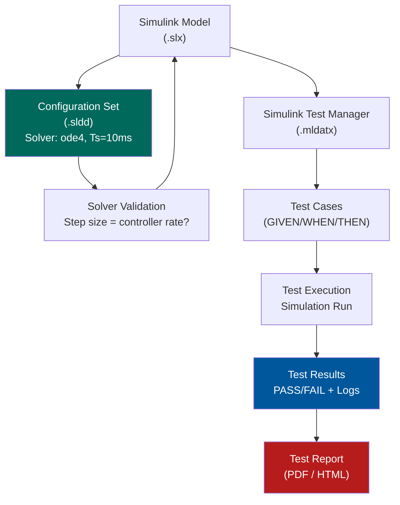

# :material-tools: Day 05 — Simulation Tools Setup

!!! abstract "Learning Objectives"
    - Configure MATLAB/Simulink for safety-critical MIL verification
    - Set up model configuration parameters for deterministic simulation
    - Understand solver selection and fixed-step vs. variable-step trade-offs
    - Install and configure Simulink Test and Simulink Coverage tools
    - Apply version control to models and configuration baselines

## :material-lightbulb-on: Intuition

A simulation tool is only as good as its configuration. Running a safety-critical MIL test with an auto-selecting variable-step solver is like using an uncalibrated measurement instrument — the results may look plausible but are not repeatable or defensible.

Simulation tool setup is a one-time investment that pays dividends: every run is reproducible, every configuration is version-controlled, and every result can be independently re-run by an auditor.

## :material-book: Core Concepts

!!! info "Definition — Solver Configuration"
    The **solver** determines how differential equations in the plant model are integrated over time. For safety-critical MIL: use a **fixed-step** solver (e.g., ode4/Runge-Kutta) with a step size matching the controller sample rate. Variable-step solvers can miss timing-dependent behavior.

!!! info "Definition — Model Configuration Baseline"
    A **model configuration baseline** is a saved Simulink Configuration Set (`.sldd`) that captures all simulation parameters: solver type, step size, data type settings, diagnostic levels, and code generation options. It must be version-controlled alongside the model.

!!! info "Definition — Simulink Test Manager"
    **Simulink Test** is a toolbox for creating, managing, and running test cases against Simulink models. Test cases capture inputs, expected outputs, and pass/fail criteria in a structured format that integrates with the RTM.

## :material-vector-polyline: Diagram



## :material-code-tags: Worked Example — MIL Tool Configuration

=== "Step 1 — Solver Setup"
    Recommended Simulink Configuration for safety-critical MIL:

    | Parameter | Value | Reason |
    |-----------|-------|--------|
    | Solver type | Fixed-step | Deterministic, reproducible |
    | Solver algorithm | ode4 (Runge-Kutta) | Good accuracy/speed balance |
    | Fixed step size | 0.01 s (10 ms) | Match controller sample rate |
    | Stop time | Scenario-dependent | e.g., 60 s for highway test |
    | Data import/export | Enabled (timeseries) | For automated comparison |

=== "Step 2 — Diagnostic Settings"
    Set these diagnostics to ERROR (not Warning) for safety-critical models:

    - Sample time mismatch: ERROR
    - Division by zero: ERROR
    - Integer overflow: ERROR
    - Signal out of range: ERROR
    - Unconnected block outputs: WARNING

=== "Step 3 — Create Test Case in Simulink Test"
    Test case structure:

    - **Name**: TC_MIL_001_HeadwayNominal
    - **Requirement link**: SWR-ACC-001 (via Requirements Toolbox)
    - **Input signal**: lead_range = 60 m at t=0, ego_speed = 80 km/h
    - **Simulation duration**: 60 s
    - **Pass/fail criteria**: headway_measured >= 2.0 s for t in [5 s, 60 s]

=== "Step 4 — Version Control"
    Files to commit together as a baseline:

    ```
    model_baseline_v1.0/
      acc_controller.slx         # Simulink model
      acc_plant.slx              # Plant model
      acc_config.sldd            # Configuration set
      test_suite_mil.mldatx      # Test suite
      requirements.slreqx        # Requirements links
      model_params.m             # Parameter script
    ```

## :material-alert: Pitfalls

!!! warning "Tool Setup Pitfalls"
    - **Variable-step solver for timing tests**: Will not reproduce timing-dependent behavior consistently. Always fix the solver for safety-critical MIL.
    - **Uncontrolled model parameters**: Parameters defined as MATLAB base workspace variables (not version-controlled) can silently change between runs.
    - **Diagnostic warnings ignored**: A "Division by Zero: Warning" is a future runtime error. Treat all arithmetic diagnostics as errors during MIL.
    - **Missing tool qualification plan**: DO-178C and ISO 26262 require a tool qualification assessment if the tool output directly affects certification evidence.

## :material-help-circle: Flashcards

???+ question "Why use a fixed-step solver for safety-critical MIL?"
    Fixed-step solvers produce **deterministic, reproducible** results. Variable-step solvers adapt step size dynamically — meaning two runs with different initial conditions may take different time steps and produce slightly different timing results. This is unacceptable for timing-critical verification.

???+ question "What is a model configuration baseline?"
    A version-controlled snapshot of all Simulink Configuration Set parameters (solver type, step size, diagnostic levels, data type settings). It ensures that test results can be reproduced months later by an auditor using the exact same configuration.

???+ question "What is tool qualification and when is it required?"
    Tool qualification is the process of demonstrating that a software tool (e.g., MATLAB, Simulink, VectorCAST) correctly performs its intended function and that any errors in the tool output will not go undetected. Required when the tool eliminates or reduces a development or verification activity (DO-178C Section 12, ISO 26262 Part 8 Section 11).

## :material-clipboard-check: Self Test

=== "Question"
    You run the same Simulink test twice and get different results. What are the three most likely causes?

=== "Answer"
    1. **Variable-step solver**: Different runs may take different step sizes. Fix: switch to fixed-step ode4.
    2. **Uncontrolled workspace parameters**: A MATLAB variable in the base workspace was changed between runs. Fix: load parameters from a version-controlled script at test start.
    3. **Model has non-deterministic blocks**: Random sources or timing-dependent hardware interfaces without seed control. Fix: set random seeds explicitly and avoid wall-clock-dependent logic.

## :material-check-circle: Summary

- Always use a **fixed-step solver** for safety-critical MIL — determinism is mandatory
- Lock all parameters in a version-controlled **configuration baseline**
- Set arithmetic diagnostics to ERROR, not Warning, during MIL
- Simulink Test Manager links test cases to requirements for traceability
- Tool qualification assessment is required if tool output feeds certification evidence
