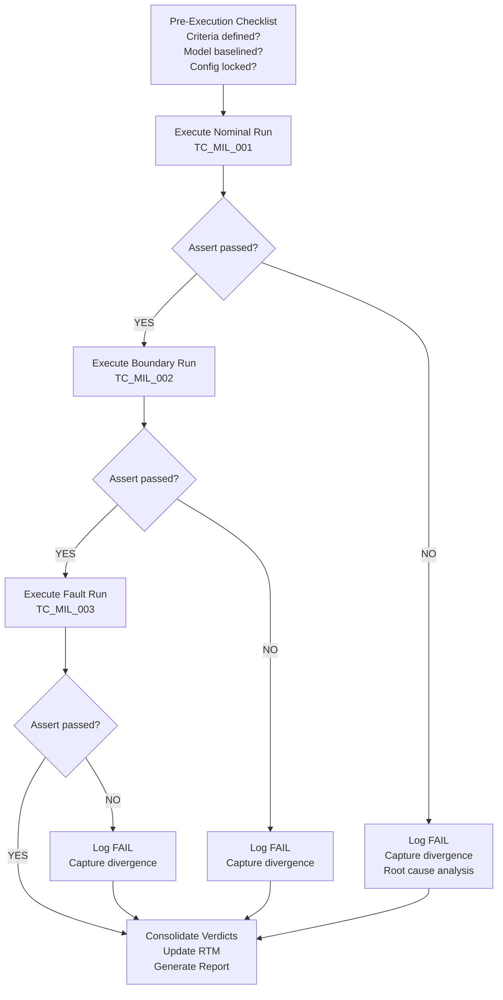

# :material-play-circle: Day 06 — MIL Execution

!!! abstract "Learning Objectives"
    - Execute a complete MIL test run following the TRACE workflow
    - Capture and analyze simulation artifacts (logs, plots, signal traces)
    - Apply pass/fail criteria to simulation results
    - Consolidate verdicts with requirement traceability links
    - Identify and document residual risks from MIL results

## :material-lightbulb-on: Intuition

MIL execution is where requirements become evidence. You have written requirements, built your model, set up your tools — now you run the simulation and find out if your model does what it is supposed to do.

The key discipline is: **decide pass/fail criteria BEFORE running**. If you decide after looking at the results, you have introduced confirmation bias into your verification process. Auditors will ask "when were the criteria written?" — the answer must be "before execution."

## :material-book: Core Concepts

!!! info "Definition — Test Execution Workflow"
    The standard MIL execution workflow follows five steps: (1) define criteria, (2) configure baseline, (3) execute nominal, (4) execute fault variants, (5) consolidate verdicts. This is the TRACE framework applied to execution.

!!! info "Definition — Simulation Artifacts"
    **Artifacts** that must be captured during MIL execution:

    - Time-series signal logs (input, output, internal states)
    - Pass/fail verdict for each assertion
    - Configuration snapshot (model version, parameter values)
    - Timestamp of test run
    - Observer/reviewer name

!!! info "Definition — Verdict"
    A **verdict** is a formal PASS / FAIL / BLOCKED / NOT_EXECUTED status assigned to a test case after execution. It must be linked to: the requirement ID, the test case ID, the artifact evidence, and the configuration baseline used.

## :material-vector-polyline: Diagram

## :material-code-tags: Worked Example — MIL Execution Procedure

=== "Step 1 — Pre-Execution Checklist"
    Before pressing Run, verify:

    - [ ] All pass/fail criteria documented in test cases
    - [ ] Model version matches RTM entry (check model properties)
    - [ ] Configuration set (.sldd) loaded and locked
    - [ ] Parameter script run and verified
    - [ ] Test duration set correctly for each scenario
    - [ ] Previous results cleared from workspace

=== "Step 2 — Run and Capture"
    During execution, capture:

    - Signal log with all interface signals (in/out/internal)
    - Screenshot of time-history plots for key signals
    - Assertion results (PASS/FAIL per criteria)
    - Simulation diagnostic output (warnings/errors)
    - Execution timestamp (auto-captured by Simulink Test)

=== "Step 3 — Analyze Results"
    For each assertion failure:

    1. Identify which requirement was violated
    2. Determine if failure is in controller logic, plant model, or test setup
    3. Check if failure is a real defect or a test setup error
    4. Document findings in defect tracker
    5. Decide: fix model, update requirement, or accept as residual risk

=== "Step 4 — Consolidate RTM"
    Update the RTM after each test session:

    | Req ID | Test Case | Verdict | Evidence File | Date | Config |
    |--------|-----------|---------|---------------|------|--------|
    | SWR-ACC-001 | TC_MIL_001 | PASS | log_TC001_20240401.mat | 2024-04-01 | v1.0 |
    | SWR-ACC-001 | TC_MIL_002 | PASS | log_TC002_20240401.mat | 2024-04-01 | v1.0 |
    | SWR-ACC-001 | TC_MIL_003 | FAIL | log_TC003_20240401.mat | 2024-04-01 | v1.0 |

## :material-alert: Pitfalls

!!! warning "Execution Pitfalls"
    - **Defining pass/fail after seeing results**: This invalidates the test as independent evidence — a major audit finding.
    - **Not capturing configuration with results**: If you cannot reproduce the exact conditions of a test run six months later, the evidence may be challenged.
    - **Accepting warnings as benign**: A simulation that completes with "Division by zero (warning)" has a hidden numerical bug. Investigate before claiming PASS.
    - **Single-scenario coverage for high-ASIL requirements**: ISO 26262 ASIL B and above requires nominal + boundary + fault for each requirement.
    - **Not documenting residual risks**: FAIL verdicts that are accepted as risks must be formally documented with owner and next action.

## :material-help-circle: Flashcards

???+ question "Why must pass/fail criteria be defined before test execution?"
    Defining criteria after seeing results introduces **confirmation bias** — you unconsciously adjust criteria to match what you observed. Standards like ISO 26262 and DO-178C require criteria to be established in the test plan **before execution** to ensure objectivity.

???+ question "What must a simulation artifact include to be audit-ready?"
    Signal logs with timestamps, assertion verdicts, configuration snapshot (model version + parameter values), execution date/time, and reviewer identification. Without all five, the evidence may be challenged in a certification audit.

???+ question "What is a BLOCKED test verdict?"
    BLOCKED means the test case could not be executed due to a prerequisite not being met (e.g., a dependent test failed, tool was unavailable, or the model had a compile error). BLOCKED tests must be investigated and resolved before the test phase is complete.

## :material-clipboard-check: Self Test

=== "Question"
    A test case fails with headway_min = 1.7 s against a criterion of >= 2.0 s. List the four investigative steps you should take before deciding what to do.

=== "Answer"
    1. **Reproduce the failure**: Re-run the test to confirm it is deterministic, not a random artifact.
    2. **Isolate the cause**: Is the failure in the controller algorithm (too slow to brake), the plant model (wrong dynamics), or the test setup (wrong initial conditions)?
    3. **Check boundary conditions**: Was the scenario parameter (e.g., lead vehicle deceleration rate) set correctly per the test specification?
    4. **Classify as defect or risk**: If the controller algorithm is wrong, raise a defect. If the scenario exceeds the system design envelope, document as a residual risk with owner and next action.

## :material-check-circle: Summary

- Define pass/fail criteria **before execution** — this is a fundamental objectivity requirement
- Capture all five artifact components: logs, verdicts, config, timestamp, reviewer
- The TRACE framework guides every execution session
- FAIL verdicts require root cause analysis, not just re-running the test
- Update the RTM after every test session to maintain traceability currency
