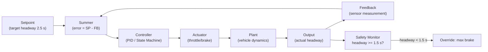

# :material-rotate-3d: Day 07 — Closed-Loop Simulation

!!! abstract "Learning Objectives"
    - Understand the closed-loop simulation architecture and signal flow
    - Verify control stability, steady-state accuracy, and transient response
    - Apply control-theoretic metrics (settling time, overshoot, steady-state error) to test criteria
    - Identify and test closed-loop failure modes: oscillation, windup, saturation
    - Map closed-loop tests to IEC 62304 and ISO 26262 verification requirements

## :material-lightbulb-on: Intuition

Open-loop testing tells you whether your controller output looks reasonable for a given input. Closed-loop testing tells you whether your controller and plant **cooperate** to achieve the desired system behavior — and whether they remain stable when disturbances occur.

A controller that looks perfect in open-loop can oscillate violently when connected to the plant, or wind up its integrators and saturate actuators. Closed-loop simulation catches these before you ever put hardware in the loop.

## :material-book: Core Concepts

!!! info "Definition — Closed-Loop Simulation"
    A **closed-loop** architecture connects the controller output back to the plant input and the plant output back to the controller input, creating a feedback loop. The system regulates the plant output toward a desired setpoint by continuously correcting errors.

!!! info "Definition — Control Performance Metrics"
    Key metrics for closed-loop verification:

    - **Settling time**: Time for output to reach and stay within ±2% of setpoint
    - **Overshoot**: Maximum excursion above setpoint (expressed as %)
    - **Steady-state error**: Difference between setpoint and final output after settling
    - **Rise time**: Time from 10% to 90% of setpoint
    - **Phase margin**: Stability margin measured in degrees (>30° is typically required)

!!! info "Definition — Integrator Windup"
    **Integrator windup** occurs when the controller integrator accumulates error while the actuator is saturated, causing overshoot and slow recovery when the actuator becomes unsaturated again. Anti-windup logic is a standard safety mitigation.

## :material-vector-polyline: Diagram



## :material-code-tags: Worked Example — Closed-Loop Verification

=== "Step 1 — Define Performance Requirements"
    Document as software requirements:

    ```
    SWR-ACC-010: Settling time <= 8 s after speed setpoint change
    SWR-ACC-011: Overshoot <= 15% of headway setpoint
    SWR-ACC-012: Steady-state headway error <= 0.1 s
    SWR-ACC-013: No sustained oscillation (period < 2 s AND amplitude > 0.3 s)
    ```

=== "Step 2 — Run Step Response Test"
    Procedure:

    1. Initialize system at ego_speed=80 km/h, headway=3.0 s (setpoint)
    2. At t=5 s: change setpoint from 3.0 s to 2.5 s (step change)
    3. Run for 30 s
    4. Measure: settling_time, overshoot_pct, steady_state_error
    5. Assert all values meet SWR-ACC-010 through SWR-ACC-012

=== "Step 3 — Test Disturbance Rejection"
    At t=15 s, inject a wind gust disturbance (drag increase 20%).
    Assert: headway recovers to within 0.1 s of setpoint within 10 s.

=== "Step 4 — Test Anti-Windup"
    Drive actuator to saturation (100% brake demand) for 3 s, then release.
    Assert: no headway overshoot > 20% after saturation release.
    This verifies anti-windup is functioning.

## :material-alert: Pitfalls

!!! warning "Closed-Loop Simulation Pitfalls"
    - **Testing only the nominal setpoint**: Control systems exhibit different behavior across their operating range. Test at min, nominal, and max setpoint values.
    - **Ignoring measurement noise**: A perfect sensor signal masks noise-induced instability. Add realistic sensor noise to the feedback path.
    - **Missing anti-windup verification**: Integrator windup is a common cause of post-saturation overshoot. Always test the recovery after saturation.
    - **Using continuous-time model for discrete controller**: Controllers execute at discrete sample intervals (e.g., 10 ms). Simulate the controller as discrete-time to capture zero-order hold effects and timing.

## :material-help-circle: Flashcards

???+ question "What is the difference between open-loop and closed-loop simulation?"
    **Open-loop**: controller output is computed but not fed back into the plant; you verify the controller logic in isolation. **Closed-loop**: controller and plant are connected in a feedback loop; you verify the combined system achieves and maintains the desired behavior. Safety-critical verification requires both.

???+ question "What is integrator windup and why is it dangerous?"
    When a controller integrator accumulates error while the actuator is saturated (cannot respond further), it builds up a large integrated error. When the actuator comes out of saturation, this causes large overshoot or oscillation. In a vehicle, this could cause a sudden harsh braking event.

???+ question "What stability margin is typically required for automotive control systems?"
    A **phase margin of at least 30 degrees** and a **gain margin of at least 6 dB** are typical requirements for automotive control loops. These margins ensure the system remains stable under parameter variations and modeling uncertainties.

## :material-clipboard-check: Self Test

=== "Question"
    Your closed-loop simulation shows the headway oscillates between 1.8 s and 3.2 s continuously without settling. List three possible root causes.

=== "Answer"
    1. **Controller gain too high**: Proportional gain causing overshoot and oscillation. Reduce Kp or retune the controller.
    2. **Phase margin too low**: The closed-loop system is near the stability boundary. Analyze the open-loop frequency response and add lead compensation.
    3. **Actuator saturation causing limit cycling**: Controller commands exceed actuator limits, causing the system to cycle at the saturation boundary. Add anti-windup and reduce gains.
    4. **Discrete-time aliasing**: Controller sample rate too slow for the plant dynamics. Increase sample rate or add anti-aliasing filter.

## :material-check-circle: Summary

- Closed-loop simulation verifies **combined** controller and plant behavior in feedback
- Define control performance metrics (settling time, overshoot, steady-state error) as testable requirements
- Test nominal setpoints, disturbance rejection, and saturation recovery
- Anti-windup, stability margins, and noise rejection must all be explicitly tested
- Discrete-time controller models capture sampling effects that continuous-time models miss
