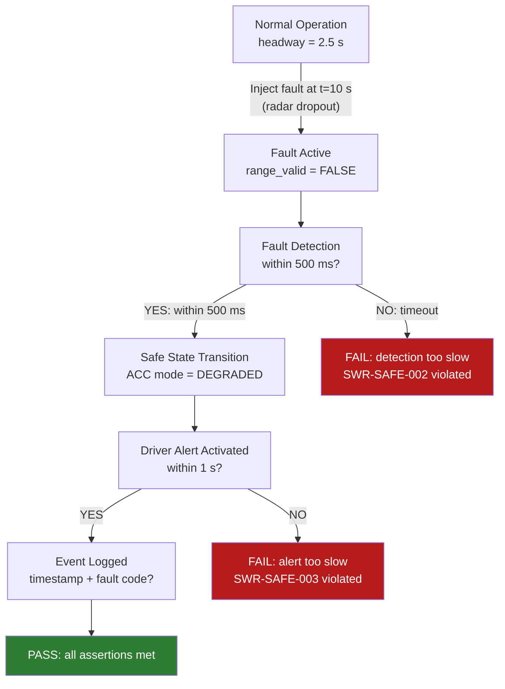

# :material-virus: Day 08 — Fault Injection in MIL

!!! abstract "Learning Objectives"
    - Understand fault injection as a verification technique for safety requirements
    - Design fault scenarios for sensor dropout, signal corruption, and actuator failure
    - Verify that fault detection, alarm activation, and safe-state transitions occur correctly
    - Map fault injection tests to FMEA/FMEDA and ISO 26262 Part 9 requirements
    - Document fault injection evidence in the RTM

## :material-lightbulb-on: Intuition

Safety requirements are not just about what the system does under normal conditions — they are about what the system does **when things go wrong**. Fault injection testing is the systematic way to verify that your safety mechanisms actually work.

The classic trap: every engineer says "our system handles sensor dropouts." Fault injection testing reveals whether it *actually* does, and exposes the difference between "we designed it to handle it" and "we verified that it handles it."

## :material-book: Core Concepts

!!! info "Definition — Fault Injection"
    **Fault injection** is the deliberate introduction of specific failure conditions into a system model to verify that the system responds correctly — detecting the fault, entering a safe state, alerting the operator, and logging the event.

!!! info "Definition — FMEA / FMEDA"
    **FMEA** (Failure Mode and Effects Analysis): systematically lists all failure modes of each component and their effects on the system. **FMEDA** (FMEA + Diagnostic coverage): extends FMEA with diagnostic detection rates. ISO 26262 Part 9 requires FMEDA for hardware random failure rate analysis.

!!! info "Definition — Diagnostic Coverage"
    **Diagnostic coverage (DC)** is the fraction of dangerous failure modes that are detected by the safety mechanism. ISO 26262 ASIL D requires >= 99% DC for hardware metrics (PMHF targets).

!!! success "Fault Injection Types"
    - **Sensor fault**: Signal dropout, stuck-at value, out-of-range injection
    - **Actuator fault**: Output stuck at min/max, response delayed, reversed polarity
    - **Communication fault**: Message loss (CAN timeout), bit error injection, ID spoofing
    - **Software fault**: Watchdog timeout, stack overflow simulation, RAM corruption pattern

## :material-vector-polyline: Diagram



## :material-code-tags: Worked Example — ACC Sensor Dropout

=== "Step 1 — Design Fault Test"
    ```
    ID:     TC_MIL_003
    Req:    SWR-SAFE-002 (Radar dropout response)
    Type:   Fault (Red)
    GIVEN:  ACC active, ego_speed=80 km/h, headway=2.5 s
    INJECT: radar_range_valid = FALSE at t=10 s, duration=5 s
    THEN:
      a) ACC mode transitions to DEGRADED within 500 ms of fault onset
      b) DRIVER_ALERT signal activated within 1 s of fault onset
      c) ego_speed decreases (safe deceleration < 0.5 g)
      d) Fault event logged with timestamp and fault_code=0x05
    ```

=== "Step 2 — Implement Fault Injection Block"
    In Simulink, add a fault injection subsystem to the radar signal path:

    ```
    Input:  radar_range (from plant output)
    Input:  fault_enable (test control signal)
    Input:  fault_time_start (e.g., 10.0 s)

    Logic:
      IF simulation_time >= fault_time_start AND fault_enable == 1:
        range_valid = 0   (dropout)
        range_output = 0  (zero range)
      ELSE:
        range_valid = 1
        range_output = radar_range
    ```

=== "Step 3 — Verify Response Timing"
    Assertions to check:

    ```
    Assert 1: time_to_DEGRADED = t_mode_change - fault_time_start <= 0.5 s
    Assert 2: time_to_ALERT = t_alert_active - fault_time_start <= 1.0 s
    Assert 3: max_deceleration <= 0.5 g during fault window
    Assert 4: fault_log_entry.fault_code == 0x05 AND fault_log_entry.timestamp != 0
    ```

=== "Step 4 — FMEA Link"
    ```
    FMEA Item:   Radar sensor (HW-RADAR-001)
    Failure Mode: Signal dropout (no output for > 200 ms)
    Effect:      ACC may fail to maintain headway
    Detection:   Software monitor (SW-MON-001) checks range_valid flag
    Diagnostic Coverage: 98.5% (target: >= 97% for ASIL B)
    MIL Evidence: TC_MIL_003 PASS
    ```

## :material-alert: Pitfalls

!!! warning "Fault Injection Pitfalls"
    - **Only testing sensor faults**: Actuator faults (brake stuck, throttle runaway) are often more dangerous than sensor faults. FMEA drives what must be tested.
    - **Fault too brief to trigger detection**: If your fault lasts only 1 ms but the detection timeout is 200 ms, the fault disappears before detection can fire. Match fault duration to the detection window.
    - **Not verifying recovery**: Testing that a fault is detected is only half the job. Also verify that after fault clearance, the system can recover correctly to normal operation.
    - **Missing fault logging verification**: Safety standards require that faults are logged in non-volatile memory with timestamp. Verify the log entry, not just the mode transition.

## :material-help-circle: Flashcards

???+ question "What is fault injection testing and why is it required?"
    Fault injection testing is the deliberate introduction of specific failure conditions to verify that safety mechanisms (detection, safe state transition, logging) work correctly. It is required by ISO 26262 (functional safety tests), DO-178C (robustness tests), and IEC 62304 (software safety testing) to demonstrate that the system meets its safety requirements under failure conditions.

???+ question "What is diagnostic coverage (DC) in ISO 26262?"
    Diagnostic coverage is the fraction of dangerous hardware random failure modes that are detected by the safety mechanism. ISO 26262 defines DC levels: Low (<60%), Medium (60-90%), High (90-99%). Higher ASIL targets require higher DC to meet PMHF (Probabilistic Metric for random Hardware Failures) targets.

???+ question "What is the difference between FMEA and FMEDA?"
    **FMEA**: lists failure modes and their system-level effects. **FMEDA**: extends FMEA with quantitative diagnostic coverage rates, failure rates (FIT), and safe/dangerous failure categorization. FMEDA is required for ISO 26262 hardware metric calculations (SPFM, LFM, PMHF).

## :material-clipboard-check: Self Test

=== "Question"
    You inject a CAN message dropout (CAN bus timeout = 10 ms) and the system takes 800 ms to enter DEGRADED mode. The requirement specifies detection within 500 ms. Is this a test PASS or FAIL, and what must happen next?

=== "Answer"
    This is a **FAIL** — the detection time (800 ms) exceeds the requirement (500 ms). Required next steps:

    1. Raise a **defect** linked to SWR-SAFE-002 (or equivalent)
    2. Root cause analysis: Is the CAN watchdog timer configured incorrectly? Is the mode manager checking the valid flag often enough?
    3. Fix the implementation (e.g., reduce CAN watchdog timeout or increase check frequency)
    4. Re-run TC_MIL_003 after fix and record new verdict
    5. Update RTM and defect tracker

## :material-check-circle: Summary

- Fault injection tests verify **safety mechanisms work**, not just normal behavior
- Design faults from the FMEA: sensor dropout, actuator stuck, CAN timeout
- Verify the complete response chain: detect → safe state → alert → log
- Diagnostic coverage rates (DC) are calculated from FMEDA and verified by fault injection
- **Recovery testing** is as important as detection testing
