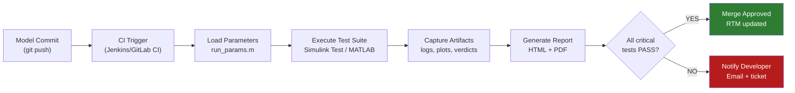

# :material-robot: Day 09 — MIL Automation

!!! abstract "Learning Objectives"
    - Design an automated MIL test execution pipeline
    - Use MATLAB scripts and Simulink Test Manager for batch test execution
    - Generate automated test reports with pass/fail summaries
    - Integrate MIL automation with CI/CD pipelines
    - Apply ASPICE SWE.4 traceability requirements to automated test artifacts

## :material-lightbulb-on: Intuition

Manual test execution is a bottleneck and a source of human error. Once you have written 50 test cases, running them manually, recording results, and generating reports takes days — and introduces transcription errors.

Automation means: run the full test suite overnight, wake up to a report with PASS/FAIL for every requirement, and know within minutes if a model change broke something. This is the foundation of **continuous verification**.

## :material-book: Core Concepts

!!! info "Definition — Test Automation Framework"
    A **test automation framework** for MIL consists of: (1) a test case library (inputs, criteria), (2) an execution engine (MATLAB/Python script or Simulink Test), (3) an artifact capture layer (logs, screenshots), and (4) a report generator (HTML/PDF with RTM links).

!!! info "Definition — Regression Testing"
    **Regression testing** is re-running the full test suite after any model change to verify that no previously passing tests now fail. Automated regression is essential when models are updated frequently.

!!! info "Definition — CI/CD for MIL"
    **Continuous Integration / Continuous Delivery** applied to model-based development: every commit to the model repository triggers an automated MIL test run, and the results gate the commit (merge only if all critical tests pass).

## :material-vector-polyline: Diagram



## :material-code-tags: Worked Example — MATLAB Automation Script

=== "Step 1 — Test Suite Runner"
    ```matlab
    % run_mil_suite.m — automated MIL test execution
    function results = run_mil_suite(config_file, output_dir)

        % Load configuration baseline
        load_system('acc_controller.slx');
        run(config_file);  % loads parameters

        % Get test suite
        ts = sltest.testmanager.TestSuite.load('test_suite_mil.mldatx');

        % Run all tests
        resultSet = ts.run();

        % Capture artifacts
        sltest.testmanager.exportResults(resultSet, ...
            fullfile(output_dir, 'mil_results.mldatx'));

        % Generate HTML report
        sltest.testmanager.report(resultSet, ...
            fullfile(output_dir, 'mil_report.html'), ...
            'IncludeSignalData', true);

        results = resultSet.totalResults();
        fprintf('PASS: %d / FAIL: %d / BLOCKED: %d\n', ...
            results.passed, results.failed, results.blocked);
    end
    ```

=== "Step 2 — CI Configuration (GitLab)"
    ```yaml
    # .gitlab-ci.yml
    mil_tests:
      stage: verify
      script:
        - matlab -batch "run_mil_suite('config_v1.0.m', 'artifacts/')"
      artifacts:
        paths:
          - artifacts/mil_report.html
          - artifacts/mil_results.mldatx
        expire_in: 90 days
      rules:
        - changes:
            - "*.slx"
            - "*.m"
    ```

=== "Step 3 — Automated RTM Update"
    After test execution, update the RTM programmatically:

    ```matlab
    % update_rtm.m — updates Excel RTM with latest verdicts
    rtm = readtable('rtm.xlsx');
    for i = 1:height(rtm)
        tc_id = rtm.TestCaseID{i};
        verdict = get_verdict_from_results(results, tc_id);
        rtm.Verdict{i} = verdict;
        rtm.LastRun{i} = datestr(now, 'yyyy-mm-dd');
        rtm.ConfigVersion{i} = '1.0';
    end
    writetable(rtm, 'rtm_updated.xlsx');
    ```

=== "Step 4 — Report Structure"
    Automated report must include:

    - Executive summary (total PASS/FAIL counts by phase)
    - RTM coverage table (requirements vs. test cases)
    - Per-test-case detail (verdict, signal plots, criteria values)
    - Configuration snapshot (model version, parameter hash)
    - Timestamp and tool version
    - Residual risk list (FAIL verdicts accepted as risk)

## :material-alert: Pitfalls

!!! warning "Automation Pitfalls"
    - **Hardcoded paths in scripts**: Scripts that reference absolute paths will fail on different machines. Use relative paths or environment variables.
    - **No isolation between tests**: If test 1 leaves state in the MATLAB workspace that affects test 2, you have test pollution. Always initialize a clean workspace at the start of each test.
    - **Automated report not reviewed**: An automated report showing 2 failures should not be silently accepted. Someone must review failures and make a go/no-go decision.
    - **Automating without traceability**: Automated tests that do not link to requirements provide execution statistics but not verification coverage. Maintain RTM links even in automated runs.

## :material-help-circle: Flashcards

???+ question "What is regression testing in MIL?"
    Regression testing is re-running the complete test suite after any model change to verify that no previously passing tests now fail. It is the safety net for continuous model development and is essential when multiple engineers modify the same model.

???+ question "What is the minimum set of artifacts an automated MIL report must include?"
    PASS/FAIL summary by requirement, per-test-case detail with signal plots, configuration snapshot (model version + parameter values), timestamp, and residual risk list. Without these, the report is not audit-ready.

???+ question "What is a CI gate in the context of MIL automation?"
    A CI gate is an automated quality check that blocks a code/model commit from being merged unless all critical tests pass. For MIL: if any ASIL B/C/D requirement test fails, the commit is rejected and the developer is notified.

## :material-clipboard-check: Self Test

=== "Question"
    Your automated test suite runs 100 tests and 3 fail. How do you decide whether to block the model commit or proceed?

=== "Answer"
    Decision criteria:

    1. **ASIL classification**: If any failing test covers an ASIL B/C/D requirement, **block the commit** — these must be resolved.
    2. **Known failures**: If the 3 failures are pre-existing known issues already in the defect tracker with accepted residual risk, they may be exempt from blocking.
    3. **Flaky tests**: If failures are due to test setup issues (not real model defects), fix the test and re-run.
    4. **Phase gate**: At a phase milestone, zero failing critical tests is required. Mid-development, a fix-forward plan with owner and date may be acceptable.

## :material-check-circle: Summary

- Automation eliminates manual execution errors and enables **overnight regression**
- A CI/CD pipeline gates model commits on test results — catching regressions immediately
- Automated reports must maintain **RTM traceability** links, not just pass/fail counts
- Test isolation (clean workspace per test) is essential for reproducible automated results
- ASPICE SWE.4 requires traceability from test cases to requirements, automated or not
