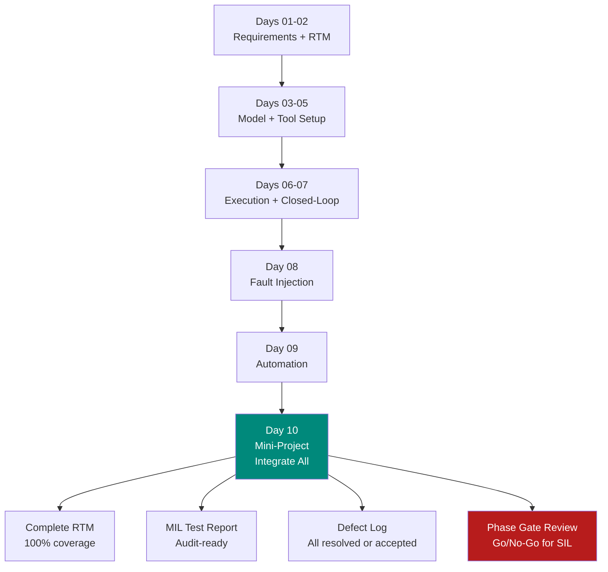

# :material-flag-checkered: Day 10 — MIL Mini-Project

!!! abstract "Learning Objectives"
    - Integrate all MIL phase skills into a complete, audit-ready deliverable package
    - Produce a Requirement Traceability Matrix with 100% forward and backward coverage
    - Execute nominal, boundary, and fault scenarios for the domain of your choice
    - Generate a MIL Test Report that meets phase exit criteria
    - Perform a self-review using the MIL Phase Exit Checklist

## :material-lightbulb-on: Intuition

The mini-project is your **dress rehearsal** before Phase 2. Everything you learned in Days 01–09 comes together: requirements, traceability, model setup, execution, fault injection, and automation. The deliverable you produce here should look like something an auditor could review — because in Phase 3, an auditor will.

Think of it as a "sprint review" where the sprint is the MIL phase and the stakeholder is a certification body.

## :material-book: Core Concepts

!!! info "MIL Phase Exit Criteria"
    A MIL phase is complete when:

    1. All SwRS requirements have at least one linked MIL test case (100% forward coverage)
    2. All MIL test cases trace to at least one requirement (0% orphan tests)
    3. Nominal, boundary, and fault scenarios executed for all ASIL B+ requirements
    4. All FAIL verdicts have a defect ticket OR accepted residual risk with owner
    5. Test report signed and placed under version control
    6. Phase review checklist completed

!!! info "Deliverable Package Contents"
    | Artifact | File | Description |
    |----------|------|-------------|
    | RTM | rtm_mil_v1.0.xlsx | Requirements × test cases × verdicts |
    | Test Cases | test_suite_mil.mldatx | Simulink Test Manager suite |
    | Simulation Logs | logs/ | .mat files per test case |
    | Test Report | mil_report_v1.0.html | Auto-generated with plots |
    | Defect Log | defects_mil.xlsx | Open/closed defects from MIL |
    | Residual Risk | residual_risk_mil.xlsx | Accepted risks with owner |
    | Config Baseline | config_v1.0.sldd | Model configuration snapshot |

## :material-vector-polyline: Diagram



## :material-code-tags: Worked Example — Mini-Project Scope (ACC Domain)

=== "Scope Definition"
    Choose scope carefully — a mini-project should be completable in one day.

    Recommended scope:
    - **System**: Automotive ACC (Adaptive Cruise Control)
    - **Requirements**: 5-8 software requirements (headway, speed limits, mode transitions, fault response)
    - **Test cases**: 3 per requirement = 15-24 test cases
    - **Scenarios**: Nominal + boundary + fault for each requirement
    - **Deliverable**: Complete RTM + test report + defect log

=== "RTM Template"
    | Req ID | Title | ASIL | MIL TC | Verdict | Evidence | Date |
    |--------|-------|------|--------|---------|----------|------|
    | SWR-ACC-001 | Headway >= 2 s | B | TC_001,002,003 | PASS | log_TC001.mat | 2024-04-10 |
    | SWR-ACC-002 | Speed limit compliance | A | TC_004,005 | PASS | log_TC004.mat | 2024-04-10 |
    | SWR-ACC-003 | ACTIVE to DEGRADED on radar fault | B | TC_006,007,008 | FAIL | log_TC006.mat | 2024-04-10 |

=== "Defect Template"
    ```
    ID:          DEF-MIL-001
    Title:       ACC mode transition to DEGRADED takes 820 ms (req: 500 ms)
    Requirement: SWR-ACC-003
    Test Case:   TC_MIL_006
    Severity:    HIGH (ASIL B safety requirement)
    Root Cause:  Mode manager check interval = 100 ms; with 8 checks needed = 800 ms
    Fix:         Reduce check interval to 10 ms
    Owner:       [Name]
    Due Date:    2024-04-12
    Status:      OPEN
    ```

=== "Phase Gate Checklist"
    Before handing off to SIL phase:

    - [ ] RTM 100% forward and backward coverage verified
    - [ ] All ASIL B+ requirements have nominal + boundary + fault coverage
    - [ ] All FAIL verdicts have defect tickets or accepted residual risk
    - [ ] Test report generated and placed in version control
    - [ ] All FAIL defects either fixed or approved for carry-forward
    - [ ] Model configuration baseline (.sldd) tagged in git
    - [ ] Reviewer sign-off obtained

## :material-alert: Pitfalls

!!! warning "Mini-Project Pitfalls"
    - **Scope creep**: Trying to cover all 50 requirements in one day. Pick 5-8 that represent the most important safety functions.
    - **Skipping the phase gate checklist**: The checklist is not bureaucracy — it is your quality gate that prevents carrying defects into SIL where they cost more to fix.
    - **Treating automation output as the final report**: Auto-generated reports need human review. A report that shows "2 FAIL" is not ready for sign-off without analysis.
    - **Not tagging the model in git**: If the model is not tagged at the phase boundary, you cannot reproduce the exact evidence months later.

## :material-help-circle: Flashcards

???+ question "What is the purpose of a phase gate in the V-Model?"
    A **phase gate** is a formal checkpoint where the team verifies that all exit criteria for the current phase are met before proceeding to the next phase. It prevents carrying defects and incomplete artifacts into phases where they are more expensive to fix (the defect cost multiplier increases from 1x at MIL to 10x at SIL to 100x at HIL).

???+ question "What does 100% RTM coverage mean?"
    **Forward coverage**: every requirement has at least one test case. **Backward coverage**: every test case has at least one requirement. 100% coverage means no orphan requirements (untested) and no orphan test cases (unreasonable). Both must be true for a complete RTM.

???+ question "What must happen to a FAIL verdict before the phase gate?"
    Each FAIL must either: (1) have a **defect ticket** created, root-caused, and fixed/retested, OR (2) be formally accepted as **residual risk** with an owner, justification, and next-action date. A FAIL with no ticket and no acceptance is an incomplete phase.

## :material-clipboard-check: Self Test

=== "Question"
    You are preparing for the MIL phase gate review. Your RTM shows 100% forward coverage but only 92% backward coverage. What does this mean and what must you do?

=== "Answer"
    **92% backward coverage** means 8% of test cases do not trace back to any requirement. These are **orphan test cases**.

    Required actions:
    1. Review each orphan test case and determine if it tests something not captured in the requirements
    2. If yes: add a new requirement to the SwRS, link it, and update the RTM
    3. If no: the test case is unnecessary — document why it exists or remove it
    4. After resolution, re-verify that both forward AND backward coverage are 100%

## :material-check-circle: Summary

- The MIL mini-project integrates all 9 days of MIL skills into one deliverable package
- Phase exit requires **100% RTM coverage** (forward and backward)
- All FAIL verdicts must be **triaged**: defect ticket or accepted residual risk
- The model must be **tagged in version control** at the phase boundary
- The **defect cost multiplier** is why phase gates matter: fix at MIL (1x), not at SIL (10x) or HIL (100x)
