# :material-cube-outline: Phase 1 — Model-in-Loop (MIL)

!!! abstract "Phase Overview"
    **Days 01–10** cover the left arm of the V-Model: requirements engineering, traceability, plant/controller modeling, and model-level verification. You will produce simulation logs, requirement traceability matrices, and fault-injection evidence — all at the **model layer**, before any C code is generated.

## :material-map-marker-path: Learning Path

```mermaid
flowchart LR
    D01["Day 01\nV-Model"] --> D02["Day 02\nTraceability"]
    D02 --> D03["Day 03\nPlant Modeling"]
    D03 --> D04["Day 04\nDomain Patterns"]
    D04 --> D05["Day 05\nSim Tools"]
    D05 --> D06["Day 06\nMIL Execution"]
    D06 --> D07["Day 07\nClosed-Loop"]
    D07 --> D08["Day 08\nFault Injection"]
    D08 --> D09["Day 09\nAutomation"]
    D09 --> D10["Day 10\nMini-Project"]

    style D01 fill:#00897b,color:#fff
    style D10 fill:#e65100,color:#fff
```

## :material-list-box: Days at a Glance

| Day | Topic | Key Skill | Standards Hook |
|-----|-------|-----------|----------------|
| 01 | V-Model & Requirements | Map requirements to test levels | ISO 26262 Pt3, ARP4754A |
| 02 | Traceability & Test Design | Build RTM, write GIVEN/WHEN/THEN | DO-178C Sec6, ISO 26262 Pt6 |
| 03 | Plant & Controller Modeling | Model plant dynamics in Simulink | ASPICE SWE.3 |
| 04 | Domain Modeling Patterns | Apply domain-specific patterns | ARP4754A Sec5 |
| 05 | Simulation Tools Setup | Configure MATLAB/Simulink | DO-178C Sec12 |
| 06 | MIL Execution | Run baseline simulation, capture artifacts | ISO 26262 Pt6 Sec9 |
| 07 | Closed-Loop Simulation | Verify control stability and response | IEC 62304 Sec5.7 |
| 08 | Fault Injection in MIL | Inject model-level faults | ISO 26262 Pt9 |
| 09 | MIL Automation | Automate test scenarios with scripts | ASPICE SWE.4 |
| 10 | MIL Mini-Project | Integrate everything into one deliverable | All MIL standards |

## :material-check-circle: MIL Phase Exit Criteria

- [ ] All requirements linked to at least one test scenario
- [ ] Requirement Traceability Matrix (RTM) complete
- [ ] Nominal, boundary, and fault scenarios executed for each feature
- [ ] Simulation artifacts (logs, plots) timestamped and version-controlled
- [ ] Fault injection results documented with recovery evidence
- [ ] Review checklist signed off
