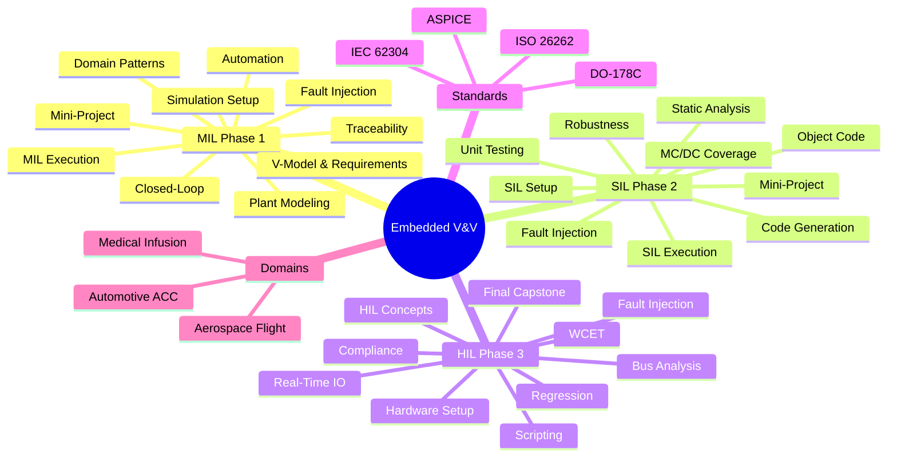
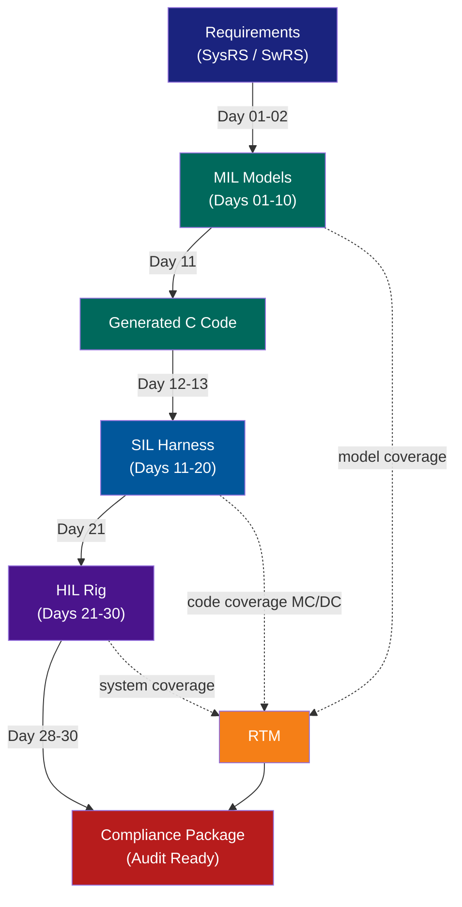

# :material-map: V&V Lifecycle Overview

!!! abstract "Purpose"
    This page gives you a **spatial mental model** of the entire 30-day journey before you dive in. Use it as your compass throughout the course.

## :material-brain: Mind Map of the V&V Lifecycle

---

## :material-timeline: Phase Progression

```mermaid
gantt
    title 30-Day Embedded V&V Learning Journey
    dateFormat  D
    axisFormat Day %d

    section Phase 1 MIL
    V-Model & Requirements        :done, d1, 1, 1d
    Traceability & Test Design    :done, d2, 2, 1d
    Plant & Controller Modeling   :done, d3, 3, 1d
    Domain Modeling Patterns      :done, d4, 4, 1d
    Simulation Tools Setup        :done, d5, 5, 1d
    MIL Execution                 :done, d6, 6, 1d
    Closed-Loop Simulation        :done, d7, 7, 1d
    Fault Injection in MIL        :done, d8, 8, 1d
    MIL Automation                :done, d9, 9, 1d
    MIL Mini-Project              :done, d10, 10, 1d

    section Phase 2 SIL
    Code Generation               :active, d11, 11, 1d
    SIL Setup                     :d12, 12, 1d
    SIL Execution                 :d13, 13, 1d
    Unit & Integration Testing    :d14, 14, 1d
    Static Analysis               :d15, 15, 1d
    SIL Fault Injection           :d16, 16, 1d
    Robustness Testing            :d17, 17, 1d
    Object Code Verification      :d18, 18, 1d
    MC/DC Coverage                :d19, 19, 1d
    SIL Mini-Project              :d20, 20, 1d

    section Phase 3 HIL
    HIL Concepts                  :d21, 21, 1d
    Hardware Setup                :d22, 22, 1d
    Real-Time IO                  :d23, 23, 1d
    HIL Scripting                 :d24, 24, 1d
    Bus & Network Analysis        :d25, 25, 1d
    Execution Trace & WCET        :d26, 26, 1d
    HIL Fault Injection           :d27, 27, 1d
    Compliance Mapping            :d28, 28, 1d
    HIL Regression                :d29, 29, 1d
    Final Capstone                :d30, 30, 1d
```

---

## :material-arrow-decision: Verification Strategy by Phase

| Phase | Environment | Fidelity | Key Artifact | Standards |
|-------|------------|----------|--------------|-----------|
| MIL | Simulink/Python | Model | Simulation log + RTM | ISO 26262 Pt6, DO-178C Sec6 |
| SIL | Native PC binary | Code | Test report + coverage | ISO 26262 Pt6, DO-178C Sec6 |
| HIL | Target ECU + rig | Hardware | HIL test report + WCET | ISO 26262 Pt4, DO-178C Sec6 |

---

## :material-check-all: TRACE Mnemonic — The Universal V&V Rule

!!! success "TRACE — The Core MIL/SIL/HIL Principle"
    **T** — Test scenarios must be **Traceable** to requirements

    **R** — **Robustness** under edge conditions must be evaluated

    **A** — **Artifacts** must be complete and timestamped

    **C** — **Criteria** for pass/fail must be explicit before execution

    **E** — **Evidence** must support defect triage and risk assessment

---

## :material-navigation: How the Phases Connect

