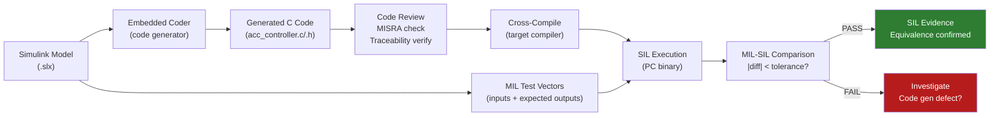

# :material-cog-sync: Day 11 — Code Generation

!!! abstract "Learning Objectives"
    - Understand automatic code generation from Simulink models via Embedded Coder
    - Configure production code generation settings for safety-critical applications
    - Verify generated code quality: readability, efficiency, and traceability
    - Understand the code generation qualification process under DO-178C and ISO 26262
    - Identify the key differences between prototype and production code generation

## :material-lightbulb-on: Intuition

Code generation turns your Simulink model into C code that will run on the target ECU. The key question is: **does the generated code faithfully implement the model?** If your model was verified at MIL but the generated code has subtle differences (different numeric behavior, different timing assumptions), your MIL evidence does not cover the actual production code.

This is why code generation qualification and MIL-SIL equivalence testing are critical — they close the gap between "the model is verified" and "the code is verified."

## :material-book: Core Concepts

!!! info "Definition — Automatic Code Generation"
    **Automatic code generation** (ACG) uses a model compiler (e.g., Embedded Coder) to transform a Simulink/Stateflow model into production C code. The generated code should be MISRA-C compliant, traceable to the model, and numerically equivalent to the simulation.

!!! info "Definition — MIL-SIL Equivalence"
    **MIL-SIL equivalence** testing re-runs the same test vectors used in MIL against the generated C code (compiled and run on PC) and compares outputs. Significant differences (beyond floating-point rounding) indicate code generation errors or model configuration issues.

!!! info "Definition — Code Generation Qualification"
    Under DO-178C Section 12.2 and ISO 26262 Part 8, the code generator tool (Embedded Coder) must be **qualified** if it replaces a development or verification activity. MathWorks provides a TÜV-certified qualification kit for this purpose.

!!! success "Production vs. Prototype Code Generation Settings"
    | Setting | Prototype | Production |
    |---------|-----------|------------|
    | Data types | auto/double | fixed-point or specific integer |
    | Optimization | off | on (but documented) |
    | Data initialization | implicit | explicit |
    | MISRA compliance | optional | mandatory |
    | Traceability comments | optional | required |

## :material-vector-polyline: Diagram



## :material-code-tags: Worked Example — Production Code Generation Setup

=== "Step 1 — Configure Embedded Coder"
    Key settings in Model Configuration > Code Generation:

    ```
    System target file:     ert.tlc  (Embedded Real-Time)
    Language:               C
    Interface:              Void/Void (no dynamic memory)
    Data initialization:    Explicit (all variables initialized)
    MISRA C:2012:           Enable all applicable checks
    Traceability:           Enable model-to-code comments
    Optimization:           Inline all subsystems
    Integer overflow:       Wrap (document in SWDD)
    ```

=== "Step 2 — Review Generated Code"
    Check the generated code for:

    - Function names match Simulink subsystem names
    - Signal ranges match defined data types (no implicit casts)
    - No dynamic memory allocation (malloc/free)
    - No recursion
    - All global variables initialized at startup
    - Traceability comments reference model block paths

=== "Step 3 — Run MIL-SIL Equivalence"
    ```matlab
    % mil_sil_equivalence.m
    % Run same test vectors through model and generated code
    mil_output = run_mil_test('acc_controller.slx', test_vectors);
    sil_output = run_sil_test('acc_controller_ert_rtw/acc_controller.c', test_vectors);

    % Compare outputs within tolerance
    tolerance = 1e-6;  % floating-point rounding tolerance
    diff = abs(mil_output - sil_output);
    assert(max(diff(:)) <= tolerance, ...
        sprintf('MIL-SIL max difference: %e exceeds tolerance', max(diff(:))));
    fprintf('MIL-SIL equivalence PASS: max_diff = %e\n', max(diff(:)));
    ```

=== "Step 4 — Code Generation Traceability"
    Generated code should contain traceability comments:

    ```c
    /* Block: '<Root>/ACC_ModeManager/ACTIVE_to_DEGRADED' */
    /* Requirement: SWR-ACC-003 */
    if ((rtDW.headway_valid == 0) && (rtDW.mode == ACC_ACTIVE)) {
        rtDW.mode = ACC_DEGRADED;
        rtDW.alert_active = 1U;
    }
    ```

## :material-alert: Pitfalls

!!! warning "Code Generation Pitfalls"
    - **Using 'grt.tlc' instead of 'ert.tlc'**: Generic Real-Time target includes file I/O and other host-specific code not suitable for embedded targets. Always use ERT for production.
    - **Floating-point model with fixed-point target**: If the model uses double precision but the target ECU has no FPU, the code will use software floating-point emulation — a major performance issue.
    - **Ignoring MISRA C violations in generated code**: The code generator may produce violations if the model contains constructs that cannot be generated in a MISRA-compliant way. These must be resolved at model level.
    - **MIL-SIL comparison tolerance too loose**: A tolerance of 0.01 on a headway signal in meters is fine for display but not for timing calculations where 0.01 s can mean the difference between PASS and FAIL.

## :material-help-circle: Flashcards

???+ question "What is MIL-SIL equivalence testing?"
    MIL-SIL equivalence testing re-runs the same test vectors from MIL against the generated C code compiled for PC execution and compares outputs within a defined tolerance. It verifies that the code generator faithfully transformed the model and that the generated code implements the same algorithm.

???+ question "Why must production code generation use 'ert.tlc' not 'grt.tlc'?"
    ERT (Embedded Real-Time) generates code without host-specific dependencies (no file I/O, no dynamic memory). GRT (Generic Real-Time) includes host I/O for simulation use. Production code deployed on an ECU must use ERT to avoid unexpected behavior from host-only code.

???+ question "What is the Embedded Coder qualification kit?"
    A MathWorks product (certified by TÜV Rheinland) that qualifies Embedded Coder as a DO-178C Tool Class T3 or ISO 26262 Part 8 tool. It provides test cases that verify the code generator produces correct output, satisfying the tool qualification requirement.

## :material-clipboard-check: Self Test

=== "Question"
    Your MIL-SIL comparison shows a maximum difference of 2.3e-4 on the headway_output signal. The tolerance is 1e-6. Is this a problem? How would you investigate?

=== "Answer"
    Yes, this **exceeds the tolerance** and must be investigated. Steps:

    1. Check if the model uses floating-point (double) but the generated code uses fixed-point — the difference may be quantization error
    2. Check if any Simulink blocks have different behavior in code vs. simulation (e.g., Division or Sqrt with different rounding)
    3. Check model configuration: are "simulation only" variant conditions that alter behavior at code generation?
    4. If the difference is explainable (e.g., known fixed-point quantization), update the tolerance and document the justification
    5. If unexplained, raise a code generation defect

## :material-check-circle: Summary

- Use **ERT target** and production settings for safety-critical code generation
- **MIL-SIL equivalence** testing verifies the generated code implements the model correctly
- Generated code must be **MISRA C:2012 compliant** and contain traceability comments
- The code generator tool (Embedded Coder) requires a **qualification kit** under DO-178C and ISO 26262
- Never deploy code generated with prototype settings (grt.tlc) to production targets
