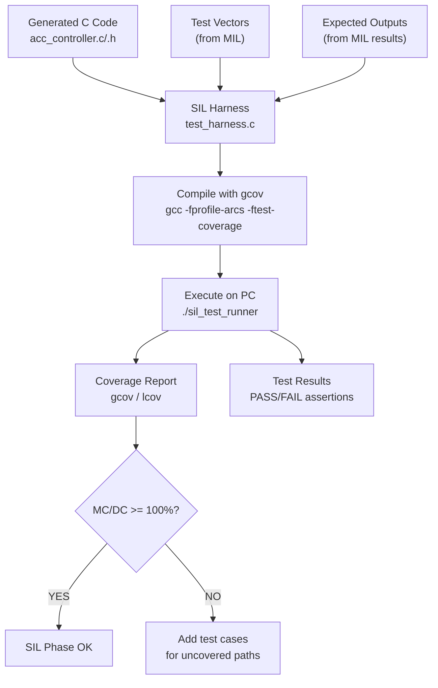

# :material-wrench-cog: Day 12 — SIL Setup

!!! abstract "Learning Objectives"
    - Build a SIL test harness for generated C code
    - Configure the SIL execution environment (cross-compiler, linker, test framework)
    - Port MIL test vectors to SIL format
    - Understand the difference between SIL on PC and PIL (Processor-in-Loop)
    - Set up code coverage measurement tooling

## :material-lightbulb-on: Intuition

The SIL harness is the infrastructure that allows you to run your production C code on a PC (or build server) with controlled inputs and measured outputs. Building it correctly means your test framework is reliable — and the measurements you collect (timing, coverage, outputs) are trustworthy.

Think of the harness as a virtual ECU: it provides the same interface as the real hardware (same function prototypes, same data types, same initialization) but runs on your laptop.

## :material-book: Core Concepts

!!! info "Definition — SIL Harness"
    A **SIL harness** is a test wrapper around the generated C code that: (1) initializes all data structures, (2) applies input stimuli from test vectors, (3) calls the production step function, (4) captures outputs, and (5) compares against expected values with assertions.

!!! info "Definition — SIL vs. PIL"
    **SIL** (Software-in-Loop): generated code compiled for PC execution. Fast, no real hardware needed. Cannot catch target-specific issues (data bus width, compiler optimization differences).

    **PIL** (Processor-in-Loop): generated code compiled for and executed on the target processor, with inputs/outputs exchanged via a serial or JTAG link. Catches target compiler differences.

!!! info "Definition — Code Coverage Instrumentation"
    Code coverage tools (gcov, LDRA, VectorCAST) insert instrumentation into the compiled code to record which lines, branches, and conditions are executed during testing. The coverage report identifies untested code paths.

## :material-vector-polyline: Diagram



## :material-code-tags: Worked Example — SIL Harness Structure

=== "Step 1 — Harness Main Loop"
    ```c
    /* test_harness.c — SIL test harness */
    #include "acc_controller.h"
    #include "test_framework.h"
    #include "test_vectors.h"

    int main(void) {
        /* Initialize model state */
        acc_controller_initialize();

        for (int i = 0; i < NUM_TEST_STEPS; i++) {
            /* Apply inputs from test vector */
            rtU.radar_range       = tv_inputs[i].radar_range;
            rtU.radar_range_valid = tv_inputs[i].radar_range_valid;
            rtU.ego_speed         = tv_inputs[i].ego_speed;
            rtU.driver_enable     = tv_inputs[i].driver_enable;

            /* Execute one step (10 ms) */
            acc_controller_step();

            /* Assert expected outputs */
            ASSERT_FLOAT_EQ(rtY.headway, tv_expected[i].headway, 1e-4f);
            ASSERT_UINT8_EQ(rtY.acc_mode, tv_expected[i].acc_mode);
            ASSERT_UINT8_EQ(rtY.alert_active, tv_expected[i].alert_active);
        }

        printf("All assertions passed.\n");
        return 0;
    }
    ```

=== "Step 2 — Test Vector Format"
    Convert MIL time-series data to C test vector arrays:

    ```c
    /* test_vectors.h */
    typedef struct {
        float  radar_range;       /* m */
        uint8_T radar_range_valid;
        float  ego_speed;         /* km/h */
        uint8_T driver_enable;
    } SIL_Input_T;

    typedef struct {
        float  headway;           /* s */
        uint8_T acc_mode;         /* 0=STANDBY, 1=ACTIVE, 2=DEGRADED */
        uint8_T alert_active;
    } SIL_Expected_T;

    #define NUM_TEST_STEPS 6000   /* 60 s at 10 ms step */
    extern const SIL_Input_T    tv_inputs[NUM_TEST_STEPS];
    extern const SIL_Expected_T tv_expected[NUM_TEST_STEPS];
    ```

=== "Step 3 — Compile with Coverage"
    ```makefile
    # Makefile
    CC = gcc
    CFLAGS = -Wall -Wextra -fprofile-arcs -ftest-coverage -O0
    SRCS = acc_controller.c test_harness.c test_vectors.c
    TARGET = sil_test_runner

    $(TARGET): $(SRCS)
        $(CC) $(CFLAGS) -o $(TARGET) $(SRCS)

    coverage: $(TARGET)
        ./$(TARGET)
        gcov acc_controller.c
        lcov --capture --directory . --output-file coverage.info
        genhtml coverage.info --output-directory coverage_html
    ```

=== "Step 4 — Verify Setup Works"
    Quick sanity check:

    1. Run the harness with the nominal test vector
    2. All assertions should pass (MIL-SIL equivalence confirmed in Day 11)
    3. Check that coverage instrumentation is recording (coverage.info file generated)
    4. Check that > 50% coverage achieved with just the nominal test — more tests to come

## :material-alert: Pitfalls

!!! warning "SIL Setup Pitfalls"
    - **Harness initialization mismatch**: If the harness does not call `acc_controller_initialize()` before the first step, global state is undefined — leading to random first-step behavior.
    - **Mismatched data types**: If the harness uses `float` for inputs but the generated code expects `double`, implicit conversions cause precision loss that looks like MIL-SIL differences.
    - **Coverage on optimized code**: Compiling with -O2 optimization can confuse coverage tools by moving code around. For coverage measurement, compile with -O0.
    - **Not resetting model state between test cases**: If test 2 starts with state left over from test 1, the results are polluted. Call `acc_controller_initialize()` between test cases.

## :material-help-circle: Flashcards

???+ question "What is the difference between SIL and PIL?"
    **SIL**: code compiled for and executed on the development PC. Fast, easy to debug, but does not catch target-compiler-specific differences. **PIL**: code compiled for and executed on the actual target processor (e.g., ARM Cortex-M), with I/O via JTAG. Catches target-specific numerical and timing issues but is slower to set up.

???+ question "Why must the SIL harness call the initialize function before the first step?"
    The generated code initializes all global state variables (mode, integrators, timers) in the initialize function. Without this call, variables contain undefined/garbage values from uninitialized memory — causing non-deterministic first-step behavior that is impossible to debug.

???+ question "Why compile with -O0 for coverage measurement?"
    High optimization levels (-O2, -O3) allow the compiler to merge, reorder, and eliminate code — making the coverage data unreliable (branches may appear covered when they are not, or vice versa). Coverage measurement requires -O0 to ensure instrumentation reflects actual source structure.

## :material-clipboard-check: Self Test

=== "Question"
    After setting up your SIL harness, you run the nominal test vector and get a FAIL on assertion `headway == 2.47 s (expected 2.50 s)`. The MIL result was PASS. List two possible causes.

=== "Answer"
    1. **Fixed-point quantization in generated code**: If the model uses float but the generated code has been reconfigured to use fixed-point (e.g., Q15 format), the quantization error may exceed 0.03 s. Check the data type configuration.
    2. **Tolerance in test harness assertion is too tight**: The assertion `ASSERT_FLOAT_EQ(headway, 2.50, 0.001)` has tolerance 1 mm headway — tighten or relax depending on specification. A difference of 0.03 s is 1.2% — is this within the 5% MIL-SIL tolerance? Check the equivalence specification.

## :material-check-circle: Summary

- The SIL harness provides a **virtual ECU** for running production code with controlled stimuli
- Initialization, input mapping, step execution, and output assertion are the four harness elements
- Compile with **-O0 and coverage flags** for coverage measurement
- Reset model state between test cases to prevent test pollution
- PIL extends SIL to the actual target processor — needed for DAL A and ASIL D
