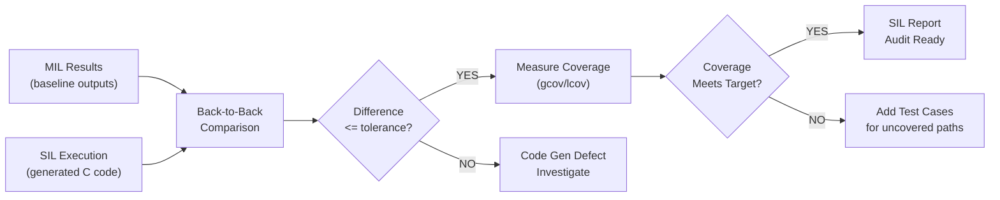

# :material-play-box-multiple: Day 13 — SIL Execution

!!! abstract "Learning Objectives"
    - Execute the SIL test suite and analyze results against MIL baseline
    - Verify MIL-SIL equivalence across all test scenarios
    - Understand and resolve common SIL execution failures
    - Generate a SIL execution report with requirement verdicts
    - Apply the TRACE framework to SIL execution sessions

## :material-lightbulb-on: Intuition

SIL execution is the first time your model algorithm runs as compiled C code. The MIL-SIL back-to-back comparison is your quality gate: if the generated code produces the same outputs as the model for the same inputs, you have high confidence the algorithm is correctly implemented. Differences reveal code generation issues, data type problems, or interface mismatches.

## :material-book: Core Concepts

!!! info "Definition — SIL Execution"
    **SIL execution** runs the generated C code (compiled for PC) against a comprehensive test suite, captures outputs, compares to expected values, and records verdicts. It bridges model verification (MIL) and hardware verification (HIL).

!!! info "Definition — MIL-SIL Back-to-Back Testing"
    **Back-to-back testing** runs identical test vectors through both the Simulink model and the generated C code, then compares outputs numerically. Significant differences (beyond floating-point tolerance) indicate a code generation error.

!!! success "TRACE for SIL Execution"
    - **T**raceable: every SIL test case links to a SwRS requirement
    - **R**obust: nominal + boundary + fault scenarios all executed
    - **A**rtifacts: coverage reports, signal logs, verdicts captured
    - **C**riteria: pass/fail thresholds defined before execution
    - **E**vidence: test report with RTM links ready for audit

## :material-vector-polyline: Diagram



## :material-code-tags: Worked Example — SIL Execution Procedure

=== "Step 1 — Run Full Suite"
    Execute all test cases in sequence:

    ```
    ./sil_test_runner --suite all --output results/sil_run_20240410.xml

    Expected output:
    TC_SIL_001 (Nominal headway):    PASS  diff=2.1e-7
    TC_SIL_002 (Boundary headway):   PASS  diff=3.4e-7
    TC_SIL_003 (Sensor dropout):     PASS  mode_transition_at=10.38s req_max=10.50s
    TC_SIL_004 (Speed limit):        FAIL  headway=1.73s expected>=2.0s
    ```

=== "Step 2 — Analyze Failures"
    For TC_SIL_004 failure:

    1. Re-run with verbose logging enabled
    2. Compare C code path to Simulink model for the speed limit function
    3. Check if the Simulink block SpeedLimitCheck was auto-coded correctly
    4. Inspect generated code for the relevant function — look for off-by-one in boundary comparison

=== "Step 3 — Generate Coverage Report"
    After all tests complete:

    ```bash
    gcov acc_controller.c
    lcov --capture --directory . -o coverage.info
    genhtml coverage.info -o coverage_html/
    ```

    Check coverage_html/index.html for line, branch, and MC/DC percentages.

=== "Step 4 — Update RTM"
    Update each RTM row with SIL verdict, evidence file path, and execution date.

## :material-alert: Pitfalls

!!! warning "SIL Execution Pitfalls"
    - **Assuming MIL PASS means SIL PASS**: The whole point of back-to-back testing is to find cases where they differ. Never skip SIL because MIL passed.
    - **Coverage measured on harness code**: Exclude the test harness from coverage targets — measure only the generated production code files.
    - **Ignoring memory initialization**: Generated code may read uninitialized variables in specific fault scenarios. Use Valgrind or AddressSanitizer to catch these.

## :material-help-circle: Flashcards

???+ question "What is back-to-back testing in SIL?"
    Running identical test inputs through both the Simulink model (MIL) and the generated C code (SIL), then numerically comparing outputs. Differences beyond the floating-point tolerance indicate a code generation error or interface mismatch.

???+ question "What coverage metric does DO-178C DAL A require?"
    **MC/DC (Modified Condition/Decision Coverage)** — every condition in every decision must independently affect the decision outcome. Covered in detail on Day 19.

## :material-clipboard-check: Self Test

=== "Question"
    Your SIL run achieves 87% statement coverage after running all planned test cases. DO-178C DAL A requires 100% MC/DC. What are your options?

=== "Answer"
    1. **Add test cases** targeting the 13% uncovered statements — trace each uncovered path to a requirement scenario
    2. **Justify dead code** — if code paths are unreachable by design (e.g., defensive NULL checks), document justification with SWDD reference
    3. **Remove dead code** — if genuinely unreachable and unjustifiable, remove after design review and approval

## :material-check-circle: Summary

- SIL execution validates the generated code implements the model algorithm correctly
- Back-to-back testing is the primary tool for catching code generation errors
- Coverage measurement identifies untested code paths before HIL
- The TRACE framework applies equally to SIL and MIL execution sessions
