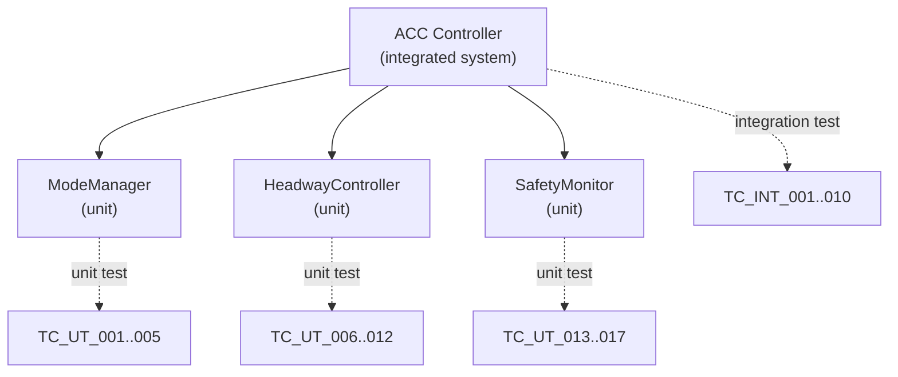

# :material-test-tube: Day 14 — Unit & Integration Testing

!!! abstract "Learning Objectives"
    - Write unit tests for individual C functions from generated code
    - Design integration tests verifying interactions between software components
    - Use test frameworks (VectorCAST, GoogleTest) for structured test management
    - Apply equivalence class partitioning and boundary value analysis
    - Map unit test results to SwRS requirements and MC/DC coverage targets

## :material-lightbulb-on: Intuition

Unit testing is surgical: you isolate a single C function, give it specific inputs, and verify it returns the correct output. This precision catches logic errors that are invisible at integration or system level because other components happen to compensate for them.

Integration testing then verifies that surgically-verified components work together correctly — because interfaces between components are one of the most common defect sources.

## :material-book: Core Concepts

!!! info "Definition — Unit Test"
    A **unit test** tests a single software unit (function or module) in isolation, replacing all dependencies with stubs or mocks. The unit receives controlled inputs and the test verifies outputs match expectations.

!!! info "Definition — Integration Test"
    An **integration test** verifies interactions between two or more software units. It checks that the interface between components (signal passing, data format, timing) works correctly when units are combined.

!!! info "Definition — Equivalence Class Partitioning"
    Divides input space into groups where the system behaves the same way for all values in the group. Testing one representative value from each class provides efficient coverage.

!!! info "Definition — Boundary Value Analysis"
    Tests values at the exact boundaries of equivalence classes, where off-by-one errors and threshold bugs most commonly occur.

## :material-vector-polyline: Diagram



## :material-code-tags: Worked Example — Unit Test for ModeManager

=== "Step 1 — Nominal Transition Test"
    ```c
    void test_standby_to_active_nominal(void) {
        mode_manager_init();
        set_inputs(SPEED_OK, HEADWAY_OK, RADAR_VALID, DRIVER_ENABLE);
        mode_manager_step();
        TEST_ASSERT_EQUAL(ACC_ACTIVE, get_current_mode());
        TEST_ASSERT_EQUAL(0, get_alert_active());
    }
    ```

=== "Step 2 — Boundary: Speed at 30 km/h"
    ```c
    void test_active_at_speed_boundary(void) {
        /* At exactly 30.0 km/h — should engage */
        mode_manager_init();
        set_speed(30.0f);
        set_inputs(HEADWAY_OK, RADAR_VALID, DRIVER_ENABLE);
        mode_manager_step();
        TEST_ASSERT_EQUAL(ACC_ACTIVE, get_current_mode());

        /* At 29.9 km/h — should NOT engage */
        mode_manager_init();
        set_speed(29.9f);
        set_inputs(HEADWAY_OK, RADAR_VALID, DRIVER_ENABLE);
        mode_manager_step();
        TEST_ASSERT_EQUAL(ACC_STANDBY, get_current_mode());
    }
    ```

=== "Step 3 — Equivalence Classes for Speed Input"
    | Class | Range | Representative | Expected Mode |
    |-------|-------|---------------|---------------|
    | Below minimum | 0..29.9 km/h | 15 km/h | STANDBY |
    | At minimum | 30.0 km/h | 30.0 km/h | ACTIVE |
    | Nominal | 30.1..130 km/h | 80 km/h | ACTIVE |
    | Above maximum | >130 km/h | 150 km/h | STANDBY (overspeeding) |
    | Invalid | <0 or NaN | -1.0 km/h | FAULT |

=== "Step 4 — Integration Test: Mode + Safety"
    ```c
    void test_integration_mode_to_safety(void) {
        system_init();
        force_mode(ACC_ACTIVE);
        set_headway(1.4f);  /* below 1.5 s safety threshold */
        system_step();

        TEST_ASSERT_EQUAL(ACC_FAULT, get_current_mode());
        TEST_ASSERT_EQUAL(1, get_max_brake_demand());
    }
    ```

## :material-alert: Pitfalls

!!! warning "Unit/Integration Testing Pitfalls"
    - **Testing implementation not behavior**: Tests referencing internal variable names break on refactoring. Test observable behavior through public interfaces.
    - **Missing negative tests**: Every function with an input range must also be tested with out-of-range inputs. The defensive guard is part of the unit contract.
    - **Shared mutable state between tests**: If test N modifies global variables and test N+1 depends on that state, tests are not independent. Use setup/teardown to reset state.

## :material-help-circle: Flashcards

???+ question "What is the difference between a stub and a mock?"
    A **stub** provides a simplified replacement for a dependency (returns fixed values). A **mock** additionally records how it was called and allows assertions on the call sequence. Use stubs for isolation; use mocks when the call sequence is part of the specification.

???+ question "What is equivalence class partitioning?"
    A test design technique that divides the input space into equivalence classes where the system is expected to behave identically. Testing one representative value per class plus boundary values provides efficient coverage.

## :material-clipboard-check: Self Test

=== "Question"
    A function `compute_headway(float range_m, float rel_speed_kmh)` returns headway in seconds. Design three test cases using equivalence class partitioning.

=== "Answer"
    **Class 1 — Nominal**: range=50 m, rel_speed=-20 km/h → expected headway = 50 / (20/3.6) = 9.0 s

    **Class 2 — Zero relative speed** (edge): range=50 m, rel_speed=0 → division-by-zero guard must return defined value (e.g., 99.9 s)

    **Class 3 — Negative range** (invalid): range=-5 m, rel_speed=-20 km/h → must return INVALID_HEADWAY sentinel value

## :material-check-circle: Summary

- Unit tests isolate individual functions; integration tests verify inter-component interfaces
- Equivalence class partitioning and boundary value analysis minimize test count
- Negative tests (invalid inputs) are as important as positive tests for safety-critical code
- Mock objects verify call sequences; stubs provide simplified dependency replacements
- Unit test results feed directly into MC/DC coverage measurement (Day 19)
