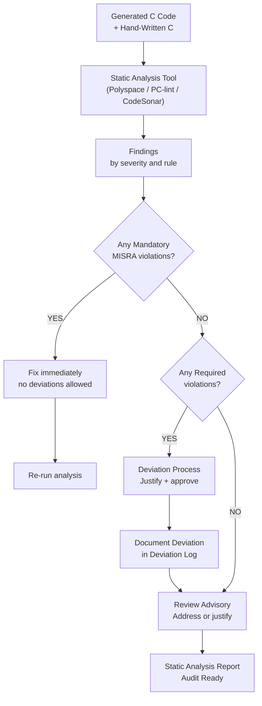

# :material-magnify-scan: Day 15 — Static Analysis

!!! abstract "Learning Objectives"
    - Understand the purpose of static analysis in safety-critical software development
    - Apply MISRA C:2012 rules to generated and hand-written C code
    - Use static analysis tools (Polyspace, CodeSonar, PC-lint) effectively
    - Classify and resolve static analysis findings by severity
    - Map static analysis obligations to ISO 26262 and DO-178C requirements

## :material-lightbulb-on: Intuition

Static analysis reads your source code without executing it and finds bugs that testing might never trigger — because they hide in error paths, integer overflow conditions, or pointer arithmetic that your tests happened not to exercise.

A MISRA C violation is not necessarily a bug today, but it is a landmine waiting for the wrong input. Standards mandate static analysis precisely because dynamic testing cannot achieve 100% path coverage of all possible input combinations.

## :material-book: Core Concepts

!!! info "Definition — Static Analysis"
    **Static analysis** examines source code without executing it, detecting potential errors, code quality issues, and violations of coding standards. It operates on the source text and reports findings by file, line number, and severity.

!!! info "Definition — MISRA C:2012"
    **MISRA C:2012** is a coding standard for safety-critical C code maintained by the Motor Industry Software Reliability Association. It defines 143 rules (mandatory, required, and advisory) designed to eliminate undefined behavior, implementation-defined behavior, and common coding errors.

!!! info "Definition — Polyspace / CodeSonar"
    **Polyspace** (MathWorks) uses abstract interpretation to prove the absence of runtime errors (orange = potential error, red = proven error, green = proven safe). **CodeSonar** (Synopsys) performs inter-procedural data flow analysis to detect security and safety defects.

!!! success "MISRA C Rule Categories"
    - **Mandatory (M)**: Must not be violated — zero tolerance
    - **Required (R)**: Must not be violated unless formally deviated
    - **Advisory (A)**: Should comply; deviations allowed with justification

## :material-vector-polyline: Diagram



## :material-code-tags: Worked Example — MISRA C Findings and Fixes

=== "Step 1 — Run Polyspace on Generated Code"
    Configure Polyspace for ISO 26262 ASIL B checking:

    - Source files: acc_controller.c, acc_controller_data.c
    - Include paths: acc_controller_ert_rtw/
    - Coding standard: MISRA C:2012
    - Target: ARM Cortex-M4 (32-bit, little-endian)

=== "Step 2 — Common Findings in Generated Code"
    | Rule | Type | Example | Fix |
    |------|------|---------|-----|
    | 10.3 | Required | `uint8_T x = -1;` (signed to unsigned) | Use `(uint8_T)0xFFU` explicitly |
    | 14.4 | Required | `while(1)` without break | Add `/* MISRA: infinite loop by design */` + deviation |
    | 15.5 | Advisory | Function with multiple return points | Refactor or add deviation |
    | 17.3 | Mandatory | Implicit function declaration | Ensure all headers included |
    | 21.3 | Required | Use of `malloc` | Remove — no dynamic allocation |

=== "Step 3 — Deviation Process"
    For Rule 14.4 (infinite main loop in RTOS task):

    ```
    Deviation ID:    DEV-MISRA-001
    Rule:            MISRA C:2012 Rule 14.4
    Location:        acc_task.c line 47
    Code:            while (1) { ... }
    Justification:   RTOS task loop — terminates only on OS signal.
                     Finite loop would require OS-specific polling,
                     introducing unnecessary complexity.
    Risk Assessment: Low — loop exit is controlled by OS scheduler
    Approved by:     [Safety Manager name]
    Date:            2024-04-15
    ```

=== "Step 4 — Polyspace Run-Time Errors"
    Polyspace also checks for runtime errors (not just MISRA):

    - GREEN (proven safe): Division is provably non-zero
    - ORANGE (potential issue): Array index may exceed bounds
    - RED (proven error): Integer overflow will occur at this line

    All RED findings must be fixed. ORANGE findings require analysis and either fix or justification.

## :material-alert: Pitfalls

!!! warning "Static Analysis Pitfalls"
    - **Suppressing findings without justification**: Blanket suppression comments (`// MISRA ignore`) without documented rationale create an audit liability. Every suppression must have a reference to a deviation record.
    - **Running static analysis too late**: Running SA for the first time on release candidate code and finding 500 violations is a project schedule disaster. Run SA from day one and integrate it into CI.
    - **Treating Advisory as optional**: For ASIL C/D and DAL A/B, project-level policies often elevate Advisory rules to Required. Check your project's MISRA compliance plan.
    - **Not checking generated code**: MISRA violations in Embedded Coder generated code must also be resolved — they are production code.

## :material-help-circle: Flashcards

???+ question "What are the three MISRA C:2012 rule categories?"
    **Mandatory**: absolute prohibition, no deviations allowed. **Required**: must comply unless a formal deviation is documented and approved. **Advisory**: should comply; deviations with justification are acceptable. For safety-critical projects, many teams elevate Advisory rules to Required in their project policy.

???+ question "What is the difference between Polyspace green, orange, and red findings?"
    **Green**: the analysis has mathematically proven the property holds — no runtime error possible. **Orange**: the property may or may not hold — requires human analysis. **Red**: the analysis has proven a runtime error will occur at that point. Red must be fixed; orange must be analyzed; green requires no action.

???+ question "When is a MISRA deviation acceptable?"
    A deviation is acceptable when: (1) the violation is documented with justification, (2) the safety and correctness impact has been assessed as acceptable, (3) an authorized safety engineer has approved the deviation, and (4) the deviation is recorded in a deviation log that is part of the compliance evidence package.

## :material-clipboard-check: Self Test

=== "Question"
    Your static analysis run on the generated code finds 47 MISRA Required violations and 12 Advisory violations. What must you do with each category, and what must you produce as evidence?

=== "Answer"
    **Required violations (47)**: For each, either: (a) fix the code and re-run analysis, OR (b) open a formal deviation record with justification, risk assessment, and authorized approval. Zero violations OR zero undeviated violations before phase gate.

    **Advisory violations (12)**: Review each. Fix if straightforward. If justified as acceptable, document a brief rationale (even informally). Check project MISRA compliance plan — some projects require Advisory to be treated as Required for high ASIL levels.

    **Evidence to produce**: Updated static analysis report (showing zero or all-deviated findings), deviation log (for each accepted Required deviation).

## :material-check-circle: Summary

- Static analysis finds bugs that testing may never reach — it is complementary to dynamic testing
- MISRA C:2012 Mandatory = zero tolerance; Required = fix or formal deviation; Advisory = fix or justify
- Polyspace colors: Green = proven safe, Orange = possible issue, Red = proven error
- Run static analysis from day one and integrate into CI — finding 500 violations at release is a crisis
- Every suppression and deviation must be documented and approved in the evidence package
