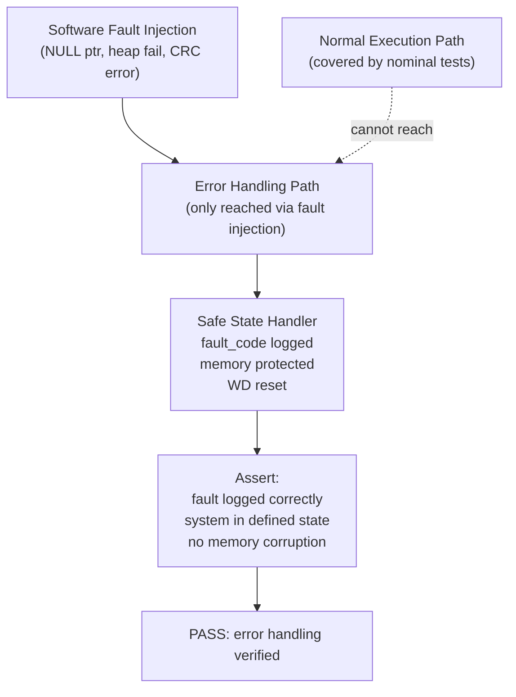

# :material-bug-check: Day 16 — SIL Fault Injection

!!! abstract "Learning Objectives"
    - Apply software-level fault injection techniques in the SIL environment
    - Verify error-handling code paths that are not reachable through normal testing
    - Design fault injection tests for NULL pointers, buffer overflows, and stack overflows
    - Map SIL fault injection to ISO 26262 Part 6 robustness requirements
    - Understand the difference between hardware fault injection (MIL) and software fault injection (SIL)

## :material-lightbulb-on: Intuition

At MIL, you injected faults at the signal level (sensor dropout, actuator failure). At SIL, you inject faults at the software level: corrupted memory, NULL pointers, function return errors, resource exhaustion. These are the faults that can occur in the real runtime environment even when hardware is functioning correctly.

The defensive code paths you wrote (NULL checks, range guards, error return handling) are only useful if they work. SIL fault injection proves they do.

## :material-book: Core Concepts

!!! info "Definition — Software Fault Injection"
    **Software fault injection** is the deliberate introduction of error conditions at the software level — corrupted memory, invalid pointer values, resource allocation failures — to verify that defensive code paths execute correctly and the system reaches a defined safe state.

!!! info "Definition — Mutation Testing"
    **Mutation testing** systematically introduces small changes (mutations) to the source code (e.g., change `>=` to `>`, flip a boolean) and verifies that at least one test case catches each mutation. Tests that catch no mutations are likely ineffective.

!!! info "Definition — Error Injection vs. Fault Injection"
    **Fault injection** introduces a root cause condition (e.g., corrupted RAM). **Error injection** introduces the observable symptom (e.g., a function returns an error code). For SIL, error injection is more practical — you can directly call a function with an error return code.

## :material-vector-polyline: Diagram



## :material-code-tags: Worked Example — SIL Software Fault Injection

=== "Step 1 — NULL Pointer Injection"
    Test that the NULL check guard in compute_headway works:

    ```c
    void test_null_radar_pointer(void) {
        /* Inject: pass NULL pointer for radar data */
        RadarData_T* null_ptr = NULL;
        float result = compute_headway(null_ptr, 80.0f);

        /* Assert: function returned error sentinel, not crashed */
        TEST_ASSERT_EQUAL_FLOAT(-1.0f, result);
        TEST_ASSERT_EQUAL(FAULT_NULL_PTR, get_last_fault_code());
    }
    ```

=== "Step 2 — Memory Allocation Failure"
    If any component uses memory pools, test allocation failure:

    ```c
    void test_memory_pool_exhaustion(void) {
        /* Exhaust the CAN message pool */
        mock_set_alloc_fail_after(3);  /* fail on 4th allocation */

        /* Try to send 5 CAN messages */
        for (int i = 0; i < 5; i++) {
            can_send_message(&test_msg);
        }

        /* Assert: system used pre-allocated fallback buffer, no crash */
        TEST_ASSERT_EQUAL(CAN_POOL_EXHAUSTED, get_can_fault_code());
        TEST_ASSERT_EQUAL(1, get_driver_alert_active());
    }
    ```

=== "Step 3 — Watchdog Test"
    Verify watchdog triggers if step function blocks:

    ```c
    void test_watchdog_trigger(void) {
        /* Simulate 200 ms execution (watchdog timeout = 100 ms) */
        mock_set_execution_delay_ms(200);

        /* Execute one controller step */
        acc_controller_step();

        /* Assert: watchdog fired and forced safe state */
        TEST_ASSERT_EQUAL(1, mock_watchdog_fired());
        TEST_ASSERT_EQUAL(0, get_pump_enable_output());
    }
    ```

=== "Step 4 — Stack Overflow Guard"
    With AddressSanitizer enabled:

    ```bash
    gcc -fsanitize=address,undefined -o sil_asan_test ./sil_test_runner.c ./acc_controller.c
    ./sil_asan_test --test fault_injection_suite
    # Any stack overflow detected by ASAN and reported
    ```

## :material-alert: Pitfalls

!!! warning "SIL Fault Injection Pitfalls"
    - **Injecting faults that cannot occur in real deployment**: Some fault conditions are theoretically possible but architecturally prevented. Focus on faults that are in the FMEA and have a realistic occurrence path.
    - **Not resetting fault state between tests**: If a fault injection leaves the system in a fault state, the next test may be corrupted. Always reset to clean state in teardown.
    - **Testing only that the system does not crash**: The requirement is not just "no crash" — it is "correct safe state with correct fault log." Assert all three: (1) system state, (2) fault code, (3) no memory corruption.

## :material-help-circle: Flashcards

???+ question "What is the key difference between MIL and SIL fault injection?"
    **MIL fault injection** operates at the signal level — sensor dropout, actuator failure, communication timeout. **SIL fault injection** operates at the software level — NULL pointers, allocation failures, watchdog expiry, CRC errors in data. Both are needed; MIL catches hardware-level response; SIL catches software defensive code paths.

???+ question "What is mutation testing and why is it useful?"
    Mutation testing introduces small source code changes (mutants) and checks that your test suite detects each mutation. If a mutant survives (no test fails), your tests have a coverage gap. It is a quality metric for the test suite itself, not for the system under test.

## :material-clipboard-check: Self Test

=== "Question"
    You inject a NULL pointer into the radar data handler and the system does not crash — but also does not log a fault code. Is this a PASS or FAIL?

=== "Answer"
    This is a **FAIL**. The safety requirements likely specify that fault conditions must be logged (for diagnostic traceability). A system that silently ignores a NULL pointer violation is dangerous — maintenance engineers will never know a fault occurred, and the fault is invisible to the diagnostic system.

    Required fix: ensure the NULL guard both returns a safe value AND logs `FAULT_NULL_PTR` with timestamp. Then re-run the test.

## :material-check-circle: Summary

- SIL fault injection verifies software defensive code paths that nominal testing cannot reach
- Test the complete fault response: safe state + fault code + no memory corruption
- AddressSanitizer and Valgrind are essential tools for memory fault detection
- Mutation testing measures the quality of your test suite, not just the system
- Every SIL fault injection test case should trace to a FMEA failure mode or a defensive requirement
