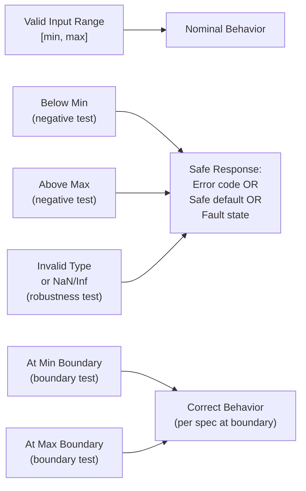

# :material-shield-check: Day 17 — Robustness & Negative Testing

!!! abstract "Learning Objectives"
    - Apply robustness testing techniques: boundary value analysis, invalid input testing, stress testing
    - Design negative test cases that verify system behavior under out-of-range conditions
    - Understand the difference between nominal, boundary, fault, and robustness test types
    - Map robustness tests to IEC 62304 Section 5.7 and ISO 26262 Part 6
    - Use fuzzing techniques for discovering unexpected input handling issues

## :material-lightbulb-on: Intuition

Every requirement specifies a valid operating range. Robustness testing asks: what happens when the system receives inputs **outside** that range? Does it handle them gracefully (safe state, error return, logged fault) or does it crash, produce garbage, or silently violate safety constraints?

The real world is messy — sensors produce out-of-range values, communication channels corrupt messages, and users press buttons in unexpected sequences. Robustness is your last line of defense before hardware.

## :material-book: Core Concepts

!!! info "Definition — Robustness Testing"
    **Robustness testing** verifies system behavior with invalid, unexpected, or extreme inputs — inputs that are outside the specification but may occur in practice due to hardware faults, noise, or adversarial conditions.

!!! info "Definition — Negative Testing"
    **Negative testing** deliberately provides invalid inputs (wrong type, out-of-range value, missing data) and verifies the system responds correctly — returning an error, raising a fault, or entering a safe state — rather than crashing or producing incorrect output.

!!! info "Definition — Fuzzing"
    **Fuzzing** automatically generates large numbers of random or semi-random inputs to discover unexpected system behavior, crashes, or hangs. For embedded software, libFuzzer and AFL++ can fuzz C functions directly in SIL.

## :material-vector-polyline: Diagram



## :material-code-tags: Worked Example — Robustness Test Suite

=== "Step 1 — Boundary Value Analysis for Speed Input"
    For speed input range [0, 200 km/h]:

    | Test | Input | Expected |
    |------|-------|----------|
    | BV-01 | speed = 0.0 | Valid: system in STANDBY (below min engage speed 30) |
    | BV-02 | speed = 30.0 | Valid: ACTIVE engagement allowed |
    | BV-03 | speed = 29.99 | Valid: STANDBY (just below threshold) |
    | BV-04 | speed = 200.0 | Valid: system at max rated speed |
    | BV-05 | speed = 200.01 | Robustness: out-of-range — fault or clamped |
    | BV-06 | speed = -1.0 | Robustness: invalid — fault or clamped to 0 |
    | BV-07 | speed = NaN | Robustness: IEEE special value — fault |
    | BV-08 | speed = +Inf | Robustness: IEEE special value — fault |

=== "Step 2 — Invalid Input Combination"
    Test logically impossible input combinations:

    ```c
    void test_contradictory_radar_inputs(void) {
        /* Contradiction: range_valid=TRUE but range=0 (physically impossible) */
        set_radar_range(0.0f);
        set_radar_valid(TRUE);
        acc_controller_step();

        /* System should detect implausible combination */
        TEST_ASSERT_EQUAL(FAULT_RADAR_IMPLAUSIBLE, get_fault_code());
    }
    ```

=== "Step 3 — Stress Test: Rapid Mode Transitions"
    Toggle driver_enable 100 times per second for 10 seconds:

    ```c
    void test_rapid_mode_toggle_stress(void) {
        for (int i = 0; i < 1000; i++) {
            set_driver_enable(i % 2);
            acc_controller_step();
            /* Assert: no memory corruption, no undefined mode */
            TEST_ASSERT(get_current_mode() <= ACC_FAULT);
            TEST_ASSERT_FALSE(detect_memory_corruption());
        }
    }
    ```

=== "Step 4 — Fuzz Testing Setup"
    ```c
    /* libFuzzer target for compute_headway */
    int LLVMFuzzerTestOneInput(const uint8_t *data, size_t size) {
        if (size < 8) return 0;
        float range = *(float*)data;
        float rel_speed = *(float*)(data + 4);

        float result = compute_headway(range, rel_speed);

        /* Assert: result is always finite and within [-1, 100] */
        assert(!isnan(result) && !isinf(result));
        assert(result >= -1.0f && result <= 100.0f);
        return 0;
    }
    ```

## :material-alert: Pitfalls

!!! warning "Robustness Testing Pitfalls"
    - **Assuming the input validation layer protects everything**: If the input validation is in the communication stack but a function can also be called from another path, robustness testing of the function itself is still required.
    - **Not specifying expected behavior for invalid inputs**: If your test just checks no crash, you may miss cases where the function returns a plausible-looking wrong value. Specify the exact expected response for each invalid input class.
    - **Fuzzing without an oracle**: A fuzzer that only checks for crashes misses silent data corruption and incorrect safe-state behavior. Define assertions that check the output is within a valid range.

## :material-help-circle: Flashcards

???+ question "What is the difference between boundary testing and robustness testing?"
    **Boundary testing** tests values at the exact boundaries of the specified valid range (min, max, min-epsilon, max+epsilon). **Robustness testing** tests values well outside the valid range and invalid data types to verify the system handles them gracefully. Boundary testing is within-spec; robustness is beyond-spec.

???+ question "What four possible responses are acceptable for invalid input in safety-critical software?"
    (1) **Clamp to valid range** and continue (document the clamping behavior as a requirement). (2) **Return an error code** and let the caller decide. (3) **Raise a fault** and enter degraded/safe mode. (4) **Use a safe default value** and log the anomaly. The choice depends on the safety analysis — but silent acceptance of invalid input is never acceptable.

## :material-clipboard-check: Self Test

=== "Question"
    Your robustness test passes a NaN value for radar range. The function returns a headway of 0.0 s without raising any fault. Why is this a problem and what is the correct behavior?

=== "Answer"
    **Problem**: A headway of 0.0 s means the lead vehicle is at zero distance — the most dangerous possible value. Returning 0.0 for an invalid input could cause the controller to apply emergency braking unnecessarily or trigger a false safety alarm. It is a plausible-looking wrong answer.

    **Correct behavior**: The function should detect `isnan(range)` at the input validation stage, set a fault code (e.g., `FAULT_INVALID_SENSOR_DATA`), and return the error sentinel value (-1.0 s) so the caller can handle it correctly.

## :material-check-circle: Summary

- Robustness testing covers inputs outside the specification that may occur in practice
- Boundary value analysis systematically tests at all input range boundaries
- Every invalid input needs a specified correct response — not just "no crash"
- Fuzzing automates discovery of unexpected behavior with random inputs
- IEC 62304 Section 5.7 and ISO 26262 Part 6 both require software robustness testing evidence
