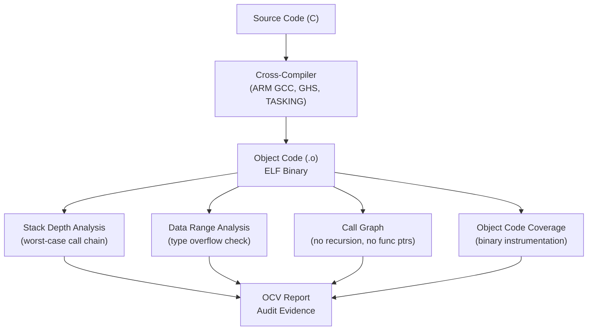

# :material-binary: Day 18 — Object Code Verification (DAL A)

!!! abstract "Learning Objectives"
    - Understand the scope of object code verification for DO-178C DAL A and ISO 26262 ASIL D
    - Perform stack depth analysis and call graph inspection
    - Verify data type ranges and value ranges in object code
    - Use tools for object code inspection (LDRA, VectorCAST, Cantata)
    - Understand the relationship between source code verification and object code verification

## :material-lightbulb-on: Intuition

For the highest integrity levels (DAL A, ASIL D), verifying the source code is not sufficient. The compiler may introduce optimizations, code reordering, or instruction selection that creates behavior not visible in the source. Object code verification closes this gap by analyzing the compiled binary directly.

Think of it as a second check: source code verification proves the algorithm is correct; object code verification proves the compiler faithfully translated that algorithm.

## :material-book: Core Concepts

!!! info "Definition — Object Code Verification"
    **Object code verification** analyzes the compiled binary (object files, ELF binary) to verify properties that cannot be confirmed from source code alone: stack depth, interrupt handling, data alignment, and absence of compiler-introduced bugs.

!!! info "Definition — Stack Depth Analysis"
    Analyzes the maximum possible call chain depth and calculates worst-case stack usage. Essential for real-time embedded systems with limited RAM. A stack overflow can corrupt memory and cause unpredictable behavior.

!!! info "Definition — Data Range Analysis"
    Verifies that data types in the compiled code have sufficient range to hold all possible values without overflow or truncation — especially important when the compiler chooses implicit type widening or truncation.

!!! success "DO-178C DAL A vs. Lower Levels"
    | Activity | DAL C | DAL B | DAL A |
    |----------|-------|-------|-------|
    | Source code reviews | Yes | Yes | Yes |
    | Test coverage (MC/DC) | Decision | Decision | MC/DC |
    | Object code verification | No | No | **Required** |
    | Structural coverage at OC level | No | No | **Required** |

## :material-vector-polyline: Diagram



## :material-code-tags: Worked Example — Stack Analysis

=== "Step 1 — Generate Call Graph"
    Using compiler map file and nm tool:

    ```bash
    arm-none-eabi-gcc -O0 -mcpu=cortex-m4 -fstack-usage acc_controller.c -c
    # Generates acc_controller.su file with stack usage per function
    # Example output:
    # acc_controller.c:47: acc_controller_step  64 static
    # acc_controller.c:89: compute_headway       32 static
    # acc_controller.c:124: mode_manager_step    48 static
    ```

=== "Step 2 — Calculate Worst-Case Stack"
    Trace the deepest call chain:

    ```
    acc_controller_step()      64 bytes
    └── mode_manager_step()    48 bytes
        └── log_fault_event()  32 bytes
            └── crc32_compute() 16 bytes

    Worst-case stack depth: 64 + 48 + 32 + 16 = 160 bytes
    Available stack: 512 bytes
    Margin: 352 bytes (68%) -- OK
    ```

=== "Step 3 — Verify No Recursion"
    Check that no function calls itself directly or indirectly:

    ```bash
    cflow acc_controller.c | grep -E "recursive|cycle"
    # If any output: fix by removing recursion
    ```

=== "Step 4 — Data Range Check"
    Verify uint8_T counters cannot overflow:

    ```
    Variable: mode_timeout_counter  type=uint8_T  range=[0..255]
    Maximum increment: 1 per 10 ms step
    Maximum timeout: 200 ms = 20 increments
    20 < 255 -- OK, no overflow possible
    ```

## :material-alert: Pitfalls

!!! warning "Object Code Verification Pitfalls"
    - **Stack analysis with dynamic call patterns**: If your code uses function pointers, static analysis cannot trace all possible call paths — you must verify that function pointer targets are constrained.
    - **Interrupt stack not included**: Interrupt service routines (ISRs) use a separate stack context. Include ISR stack usage in total worst-case calculation.
    - **Compiler optimization changes stack usage**: Inlining and optimization can significantly change stack depth. Always analyze at the final optimization level used for production builds.

## :material-help-circle: Flashcards

???+ question "When is object code verification required?"
    Object code verification is required by **DO-178C for DAL A** software, where the compiler's transformation of source code to object code must be independently verified. ISO 26262 ASIL D recommends OCV for software elements where the compiler cannot be fully qualified.

???+ question "What is a stack overflow and why is it dangerous in embedded systems?"
    A stack overflow occurs when function call nesting depth or local variable allocation exceeds the allocated stack memory. In embedded systems, the stack typically grows toward other memory regions — overflow corrupts adjacent memory (variables, return addresses), causing unpredictable behavior that is extremely difficult to debug.

## :material-clipboard-check: Self Test

=== "Question"
    Your stack analysis shows worst-case stack usage of 480 bytes against a 512-byte stack allocation — only 32 bytes margin (6%). What actions should you take?

=== "Answer"
    6% margin is insufficient for safety-critical embedded systems (typical requirement: >=20-30% margin). Actions:

    1. **Increase stack allocation** if RAM is available — simplest fix
    2. **Reduce stack usage**: convert large local arrays to static, reduce function nesting depth
    3. **Verify worst-case is truly worst**: check if there are deeper call paths not analyzed
    4. **Document and get safety sign-off**: if margin cannot be increased, document in safety case with rationale

## :material-check-circle: Summary

- Object code verification is mandatory for **DO-178C DAL A** and recommended for **ASIL D**
- Stack depth analysis must cover worst-case call chains including all ISRs
- No recursion is a fundamental requirement for MISRA and most safety standards
- Data range analysis confirms variables cannot overflow at the binary level
- Object code coverage (binary instrumentation) complements source-level MC/DC
