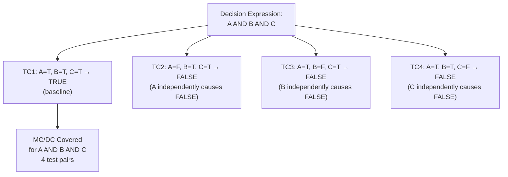

# :material-check-all: Day 19 — Coverage MC/DC

!!! abstract "Learning Objectives"
    - Understand the definition and purpose of MC/DC (Modified Condition/Decision Coverage)
    - Manually derive MC/DC test pairs for simple boolean expressions
    - Configure coverage tools (gcov, LDRA, VectorCAST) to measure MC/DC
    - Achieve and verify 100% MC/DC coverage for critical functions
    - Distinguish between statement, branch, decision, condition, and MC/DC coverage levels

## :material-lightbulb-on: Intuition

MC/DC is the crown jewel of structural coverage. It requires that every condition in every decision must independently show that it can cause the decision outcome to change. This rules out coincidental coverage where one condition dominates and others are never exercised.

DO-178C requires MC/DC for DAL A software because it is the minimum coverage level that provides mathematical confidence that all safety-relevant logic branches have been tested.

## :material-book: Core Concepts

!!! info "Definition — MC/DC"
    **Modified Condition/Decision Coverage** requires that:
    1. Every decision in the code is executed at least once with each possible outcome (TRUE and FALSE)
    2. Every condition in every decision is shown to independently affect the decision outcome
    3. Each condition has been TRUE at least once and FALSE at least once

!!! info "Definition — Coverage Levels Hierarchy"
    From weakest to strongest:

    - **Statement coverage**: every statement executed at least once (easy to achieve)
    - **Branch coverage**: every branch (if-true and if-false) taken at least once
    - **Decision coverage**: every decision (boolean expression) evaluated TRUE and FALSE
    - **Condition coverage**: every atomic condition TRUE and FALSE
    - **MC/DC**: condition coverage + each condition independently affects decision

!!! success "Standards Requirements"
    | Standard | Level | Coverage Required |
    |----------|-------|-------------------|
    | DO-178C DAL A | Highest | MC/DC (100%) |
    | DO-178C DAL B | High | Decision (100%) |
    | ISO 26262 ASIL D | Highest | Branch + MC/DC (recommended) |
    | ISO 26262 ASIL B | High | Statement + Branch |

## :material-vector-polyline: Diagram



## :material-code-tags: Worked Example — MC/DC for ACC Active Condition

=== "Step 1 — Identify the Decision"
    ```c
    /* Decision under test: (line 47 in acc_controller.c) */
    if (speed_ok && radar_valid && driver_enable && !fault_active) {
        acc_mode = ACC_ACTIVE;
    }
    ```

    This decision has 4 conditions: `speed_ok`, `radar_valid`, `driver_enable`, `!fault_active`

=== "Step 2 — Derive MC/DC Test Pairs"
    For `speed_ok AND radar_valid AND driver_enable AND NOT fault_active`:

    | TC | speed_ok | radar_valid | driver_enable | fault_active | Decision |
    |----|----------|-------------|---------------|--------------|----------|
    | 1 | T | T | T | F | **TRUE** (baseline) |
    | 2 | **F** | T | T | F | FALSE (speed_ok varies) |
    | 3 | T | **F** | T | F | FALSE (radar_valid varies) |
    | 4 | T | T | **F** | F | FALSE (driver_enable varies) |
    | 5 | T | T | T | **T** | FALSE (fault_active varies) |

    5 test cases achieve MC/DC for a 4-condition AND expression.

=== "Step 3 — Measure Coverage"
    ```bash
    # Compile with gcov
    gcc -fprofile-arcs -ftest-coverage -O0 -o sil_cov_test acc_controller.c test_mcdc.c
    ./sil_cov_test
    gcov -b acc_controller.c  # -b shows branch coverage
    # Output: Lines executed: 100.00%, Branches executed: 100.00%
    ```

=== "Step 4 — Report Coverage Gaps"
    Coverage report shows uncovered branch at line 89:

    ```
    Line 89: if (headway < MIN_HEADWAY_FAULT)  -- TRUE branch: not covered
    ```

    Action: add a test case where headway < MIN_HEADWAY_FAULT and verify it reaches line 90.

## :material-alert: Pitfalls

!!! warning "MC/DC Coverage Pitfalls"
    - **Confusing condition and decision**: A decision is the entire boolean expression; a condition is one atomic boolean sub-expression. MC/DC requires per-condition independence — not just per-decision TRUE/FALSE.
    - **Inactive code masquerading as missed coverage**: If a function is called only from an interrupt handler that is never triggered in SIL, the coverage tool shows 0% for that function. This requires a separate test or justification (it will be covered in HIL).
    - **Short-circuit evaluation traps**: In C, `A && B` short-circuits — if A is false, B is never evaluated. This means you need a test where A is true and B varies, to cover B independently.

## :material-help-circle: Flashcards

???+ question "Why does MC/DC require 'independence' of conditions?"
    Independence ensures that each condition is individually tested for its contribution to the decision outcome. Without independence, one dominant condition could always determine the outcome, leaving other conditions completely untested. MC/DC prevents this coincidental coverage.

???+ question "How many test cases are needed for MC/DC on an N-condition decision?"
    At minimum **N+1** test cases: one baseline case (all conditions cause TRUE) and one case per condition where that condition alone changes the decision to FALSE, while all others remain the same. For a 4-condition AND expression: 5 test cases minimum.

???+ question "What does DO-178C require for DAL A software coverage?"
    **MC/DC coverage at 100%** for all safety-relevant code. Additionally, structural coverage analysis must cover object code (not just source), and any coverage gaps must be either closed by adding tests or justified as unreachable code.

## :material-clipboard-check: Self Test

=== "Question"
    Decision: `if (sensor_valid OR override_active)`. Write the minimum MC/DC test pairs showing each condition independently affects the decision.

=== "Answer"
    For `sensor_valid OR override_active`:

    | TC | sensor_valid | override_active | Decision |
    |----|-------------|-----------------|----------|
    | 1 | **T** | F | TRUE (sensor_valid = TRUE causes TRUE) |
    | 2 | F | **T** | TRUE (override_active = TRUE causes TRUE) |
    | 3 | F | F | FALSE (both FALSE → baseline FALSE) |

    3 test cases. TC1 vs TC3: sensor_valid varies, decision changes → sensor_valid is independent. TC2 vs TC3: override_active varies, decision changes → override_active is independent. MC/DC achieved.

## :material-check-circle: Summary

- MC/DC is the strongest practical structural coverage criterion — required for DO-178C DAL A
- Minimum test cases for N-condition decision: N+1
- Short-circuit evaluation in C requires careful test design to cover all conditions
- Coverage gaps must be addressed by adding tests or justified as unreachable (dead code)
- Coverage measurement requires -O0 compilation to avoid instrumentation artifacts
