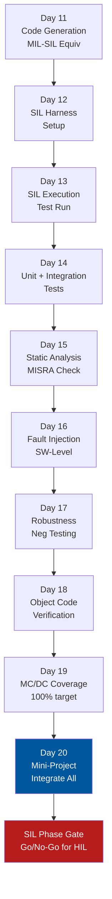

# :material-flag-checkered: Day 20 — SIL Mini-Project

!!! abstract "Learning Objectives"
    - Integrate all SIL phase skills into a complete, audit-ready deliverable package
    - Demonstrate MIL-SIL equivalence for the selected domain scenario
    - Achieve target MC/DC coverage and resolve all static analysis findings
    - Produce a complete SIL Test Report ready for phase gate review
    - Identify any open items to carry forward to HIL phase

## :material-lightbulb-on: Intuition

The SIL mini-project is your **software-level dress rehearsal** for HIL. Everything from Days 11-19 converges: code generation quality, test harness reliability, unit test completeness, static analysis compliance, fault injection coverage, and MC/DC achievement.

A SIL phase gate review is more rigorous than MIL — the artifacts you produce here will be scrutinized by safety assessors who know exactly what DO-178C and ISO 26262 require.

## :material-book: Core Concepts

!!! info "SIL Phase Exit Criteria"
    | Criterion | Target | Method |
    |-----------|--------|--------|
    | MIL-SIL equivalence | max_diff <= 1e-5 | Back-to-back comparison |
    | Static analysis | Zero MISRA Cat A/B violations | Polyspace/PC-lint |
    | Statement coverage | 100% | gcov |
    | Branch coverage | 100% | gcov -b |
    | MC/DC coverage | 100% (DAL A/ASIL D) or per project | LDRA/VectorCAST |
    | Fault injection | All FMEA-driven faults exercised | Manual + automated |
    | Open defects | Zero critical/high open | Defect tracker |
    | Object code analysis | Stack < 70% of allocation | cflow + .su files |

!!! info "SIL Deliverable Package"
    | Artifact | Description |
    |----------|-------------|
    | SIL Test Report | Executive summary + per-requirement verdicts |
    | Coverage Report | HTML report from lcov/LDRA |
    | Static Analysis Report | Polyspace run results + deviation log |
    | MIL-SIL Equivalence Report | Comparison plots + max difference |
    | Defect Log | All defects found in SIL with status |
    | Stack Analysis | Worst-case stack depth per task/ISR |

## :material-vector-polyline: Diagram



## :material-code-tags: Worked Example — SIL Phase Gate Checklist

=== "Coverage Verification"
    Run full test suite and check coverage:

    ```bash
    ./sil_test_runner --suite all
    gcov -b acc_controller.c

    acc_controller.c:
      Lines executed: 100.00% of 247
      Branches executed: 100.00% of 184
      Taken at least once: 100.00% of 184
    ```

=== "Static Analysis Final Run"
    Final Polyspace run should show:

    ```
    MISRA C:2012 Mandatory violations:  0
    MISRA C:2012 Required violations:   0 (or all deviated)
    MISRA C:2012 Advisory violations:   3 (all justified)
    Polyspace RED findings:             0
    Polyspace ORANGE findings:          7 (all analyzed and documented)
    ```

=== "MIL-SIL Equivalence Summary"
    ```
    MIL-SIL Comparison Summary (acc_controller, v1.0):
    Test cases compared: 47
    Max absolute difference: 8.3e-8
    Tolerance: 1e-5
    All comparisons within tolerance: YES
    MIL-SIL Equivalence: PASS
    ```

=== "Phase Gate Decision"
    | Check | Status | Action |
    |-------|--------|--------|
    | MIL-SIL equivalence | PASS | None |
    | MISRA Mandatory | PASS (0 violations) | None |
    | MC/DC coverage | PASS (100%) | None |
    | Open HIGH defects | FAIL (1 open) | Must resolve before gate |
    | Stack margin | PASS (45% margin) | None |

    One open HIGH defect: fix and re-run before phase gate approval.

## :material-alert: Pitfalls

!!! warning "SIL Mini-Project Pitfalls"
    - **Declaring coverage complete without checking unreachable code**: 100% statement coverage with 15 lines of dead code that were excluded — this is not 100% honest coverage. Document all exclusions.
    - **Signing off with ORANGE Polyspace findings uninvestigated**: Each ORANGE finding needs a documented analysis conclusion. "Reviewed — not an error because [specific reason]" is acceptable. "Unreviewed" is not.
    - **Not including object code analysis for DAL A**: SIL sign-off for DO-178C DAL A without the object code analysis report is incomplete. This will fail a DER audit.

## :material-help-circle: Flashcards

???+ question "What is the SIL phase exit condition regarding defects?"
    All **Critical and High severity defects must be closed** (fixed and retested) before the SIL phase gate. Medium and Low defects may be carried forward with owner and planned fix date. No defect can be silently ignored — each must have a status and next action.

???+ question "What is the difference between statement and MC/DC coverage at 100%?"
    **100% statement coverage**: every line of code was executed at least once. **100% MC/DC**: every condition in every decision was independently shown to affect the decision outcome. MC/DC is much stronger — you can achieve 100% statement coverage with tests that never flip individual conditions in a multi-condition expression.

## :material-clipboard-check: Self Test

=== "Question"
    You have 100% MC/DC coverage but still have 5 Polyspace ORANGE findings. Can you close the SIL phase? What must you do?

=== "Answer"
    You cannot close the phase with uninvestigated ORANGE findings. For each ORANGE:

    1. **Analyze the finding**: Is this a genuine potential error or a Polyspace false positive?
    2. **If genuine potential error**: raise a defect, fix the code, re-run Polyspace
    3. **If false positive**: document the analysis conclusion clearly (e.g., "Array index i is bounded by loop condition i < 5 and array size is 10 — no overflow possible") and get a reviewer signature
    4. Once all 5 are documented and approved: the phase can be closed

## :material-check-circle: Summary

- SIL phase integration requires evidence across code generation, testing, coverage, and static analysis
- 100% MC/DC + zero MISRA Mandatory violations + zero Polyspace RED = the SIL quality bar
- Object code analysis (Day 18) is mandatory for DO-178C DAL A phase closure
- Every ORANGE Polyspace finding needs a documented human analysis conclusion
- The SIL phase gate is your last chance to catch code-level issues before expensive HIL testing
