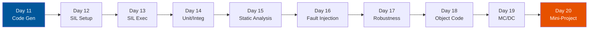

# :material-code-braces: Phase 2 — Software-in-Loop (SIL)

!!! abstract "Phase Overview"
    **Days 11–20** bridge the gap between model and code. You generate production C code from Simulink models, build SIL test harnesses, apply unit and integration testing, perform static analysis, measure MC/DC coverage, and produce a SIL Test Report — all before any hardware is involved.

## :material-map-marker-path: Learning Path

## :material-list-box: Days at a Glance

| Day | Topic | Key Skill | Standards Hook |
|-----|-------|-----------|----------------|
| 11 | Code Generation | Verify Embedded Coder output | ISO 26262 Pt6 Sec10, DO-178C Sec11 |
| 12 | SIL Setup | Build SIL test harness | ASPICE SWE.4 |
| 13 | SIL Execution | Run SIL test suite vs. MIL baseline | ISO 26262 Pt6 Sec9 |
| 14 | Unit & Integration Testing | GoogleTest / VectorCAST harnesses | DO-178C Sec6.4 |
| 15 | Static Analysis | MISRA C, Polyspace, CodeSonar | ISO 26262 Pt6 Sec9, DO-178C Sec6.3 |
| 16 | SIL Fault Injection | Software-level fault injection | ISO 26262 Pt9 |
| 17 | Robustness & Negative Testing | Boundary value, invalid input testing | IEC 62304 Sec5.7 |
| 18 | Object Code Verification | Stack analysis, data flow, binary checks | DO-178C Sec6.4.4, DAL A |
| 19 | Coverage MC/DC | Modified Condition/Decision Coverage | DO-178C Annex A, ISO 26262 Pt6 |
| 20 | SIL Mini-Project | Complete SIL deliverable package | All SIL standards |

## :material-check-circle: SIL Phase Exit Criteria

- [ ] All MIL test cases ported to SIL (MIL-SIL equivalence verified)
- [ ] Code generation configured with Embedded Coder production settings
- [ ] Static analysis: zero MISRA C:2012 Category A violations
- [ ] Unit test coverage: MC/DC >= 100% for ASIL D, >= 90% for DO-178C DAL A
- [ ] All fault injection tests pass (detection timings verified in code)
- [ ] Object code analysis complete (stack depth, data range, call graph)
- [ ] SIL Test Report generated and signed off
